# OneNet物联网云平台物模型配置
MQTT 服务端可以是云平台，OneNET、阿里云、华为云、腾讯云等；也可以自己搭建服务端，用 EMQ 或 Mosquitto 。

本次我们使用 OneNET，接下来我们来配置一下 OneNET。

点开 OneNET 官方网址：中移坤灵 - 中国移动物联网开放平台 (10086.cn)

有账号的登录，没账号的注册一下。

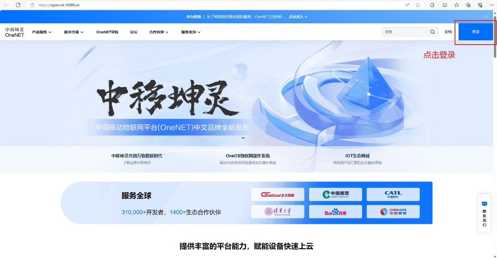

登录好后点击「开发者中心」。

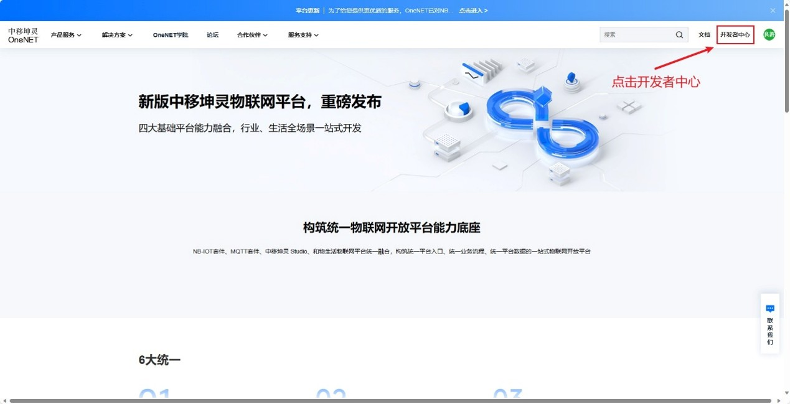

## 4.1 创建产品
接下来我们先创建一个产品，之后再创建具体的设备。

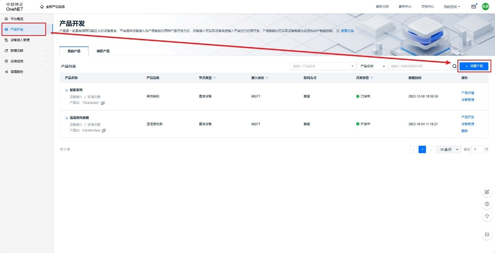

可按照下图参数创建产品。

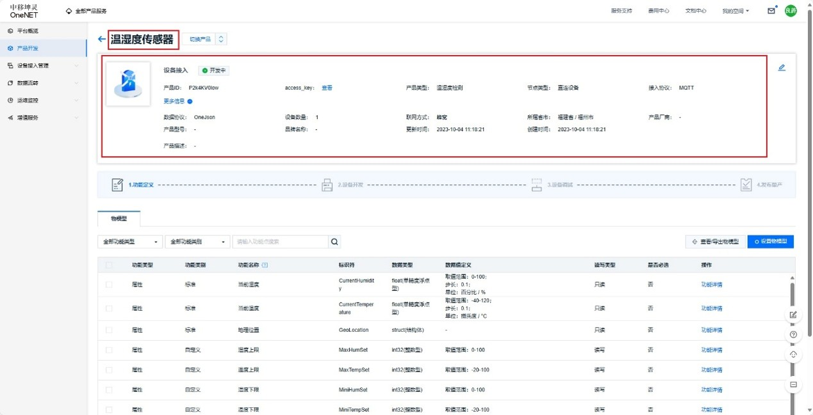

## 4.2 创建物模型
通过物模型我们可以定义设备的属性、服务和事件功能。我们需要创建几个物模型，用于上传数据和事件告警。

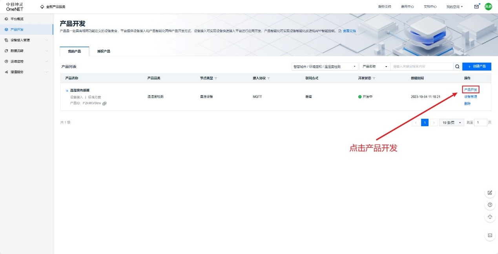

创建两个物模型：
- 当前湿度，用于存储实时湿度数据。
- 当前温度，用于存储实时温度数据。

本教程只用到「当前湿度」和「当前温度」，剩下的物模型是下篇教程使用的。

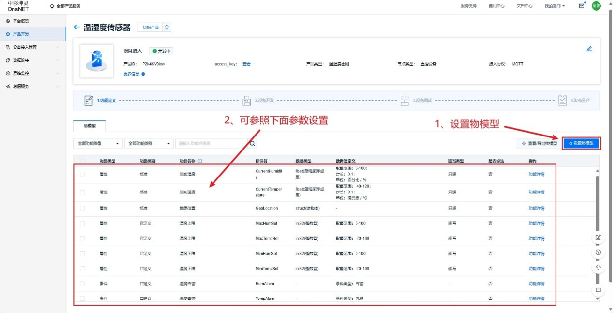

## 4.3 创建设备
接下来就开始创建产品下的具体设备。

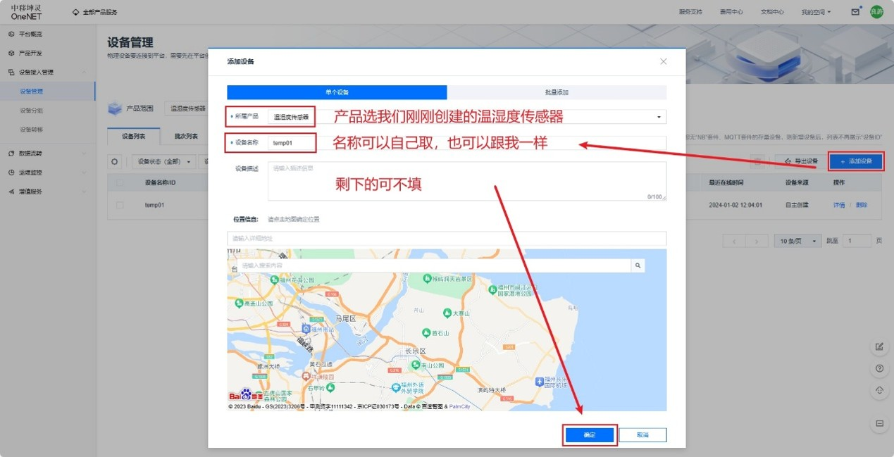

## 4.4 生成MQTT三元组
**MQTT 三元组**是 MQTT 协议中至关重要的，就像去考试的时候，一定要带上准考证、身份证才能进考场，要有「MQTT 三元组」才能连接 MQTT 服务端。

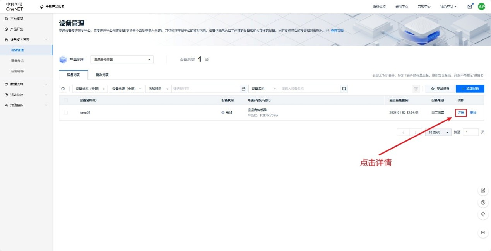

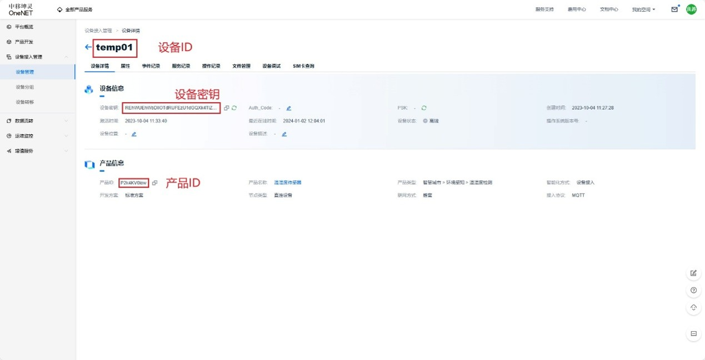

得到初步**MQTT 三元组**：
- 设备 ID：temp01
- 产品 ID：P2k4KV0low
- 设备密钥：REhWUEhWbDlIOTdRUFEzU1dGQXk4TlZKZ25oQ0N4S3M=

设备密钥需要经过加密，加密需要用 OneNET 官方的 token 生成工具。

官网下载地址：OneNET - 中国移动物联网开放平台 (10086.cn)
也可以拿文章开头提供的，也是官网下载的。

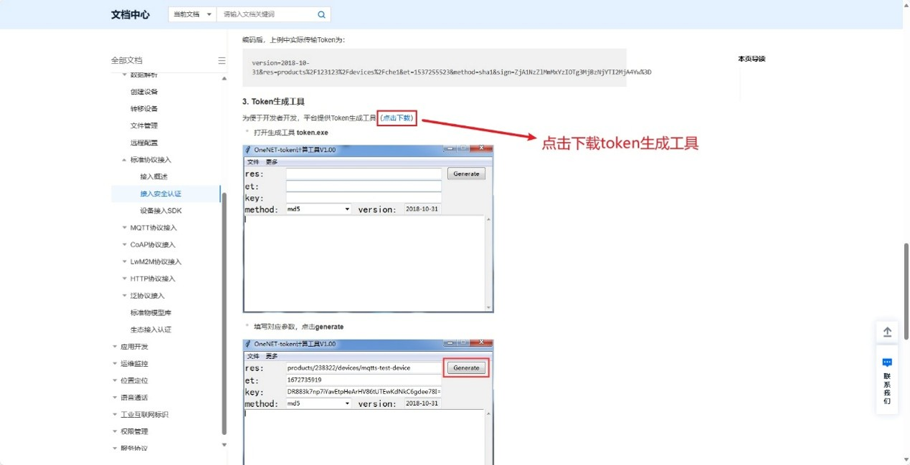

下载好 token 生成工具，打开界面如下。

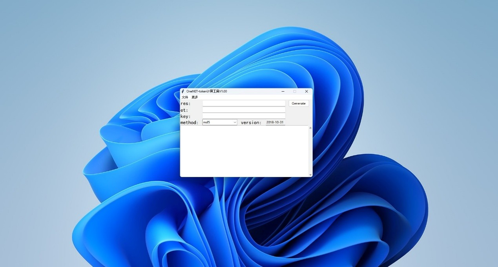

各个参数介绍如下表：

|名称|类型|参数说明|参数示例|
|---|---|---|---|
|res|string|访问资源 resource 格式为：`products/{产品id}/devices/`|`products/P2k4KV0low/devices/temp01`|
|et|int|访问过期时间，单位秒，unix 时间。当一次访问参数中的 et 时间小于当前时间时，平台会认为访问参数过期从而拒绝该访问|2017881776 表示：北京时间 2033-12-11 10:42:56|
|key|string|MQTT 三元组的设备密钥|`REhWUEhWbDlIOTdRUFEzU1dGQXk4TlZKZ25oQ0N4S3M=`|
|method|string|加密方式，支持 hmacmd5、hmacsha1、hmacsha256|md5（代表使用hmacmd5算法） sha1（代表使用hmacsha1算法） sha256（代表使用hmacsha256 算法）|
|version|string|参数组版本号，日期格式，目前仅支持`"2018-10-31"`|`2018-10-31`|

et 的时间戳可以用这个在线工具转换，网页地址：时间戳(Unix timestamp)转换工具 - 在线工具 (tool.lu)

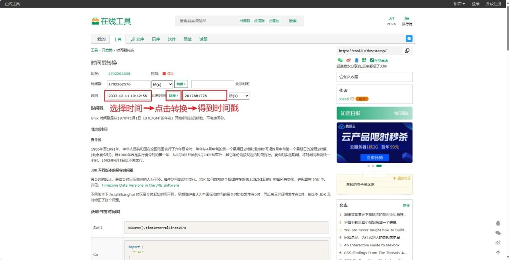

根据介绍，填好各个参数的空，我们选择 sha1 的加密方式，大家可以选择自己喜欢的。填好如下操作：

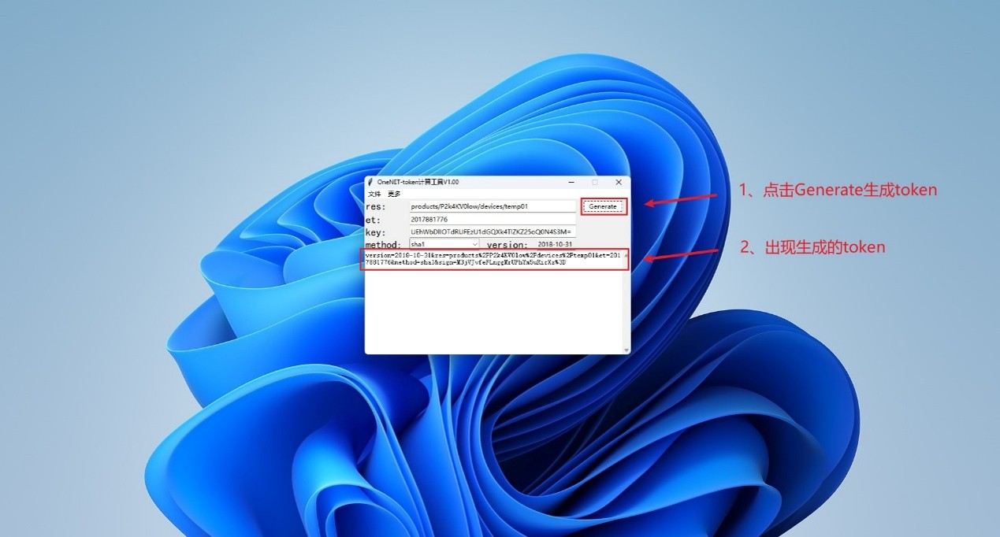

得到最终**MQTT 三元组**：
- 设备 ID：temp01
- 产品 ID：P2k4KV0low
- token：`version=2018-10-31&res=products%2FP2k4KV0low%2Fdevices%2Ftemp01&et=2017881776&method=sha1&sign=M3jVJvfeFLnggMrUPhYm5uRirXs%3D`

## 4.5 主题订阅格式
### 4.5.1 OneNET地址
OneNET 服务器地址是 `mqtts.heclouds.com : 1883`，地址是从 OneNET 文档中心得到的。

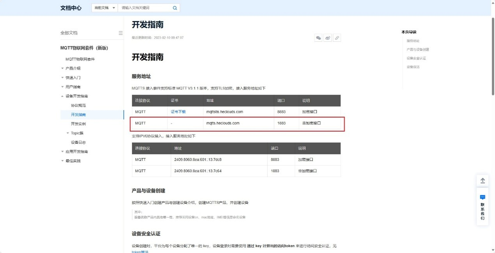

### 4.5.2 订阅主题
选择设置直连设备属性：
`{device-name}` 是设备ID，比如我们的就是 temp01。

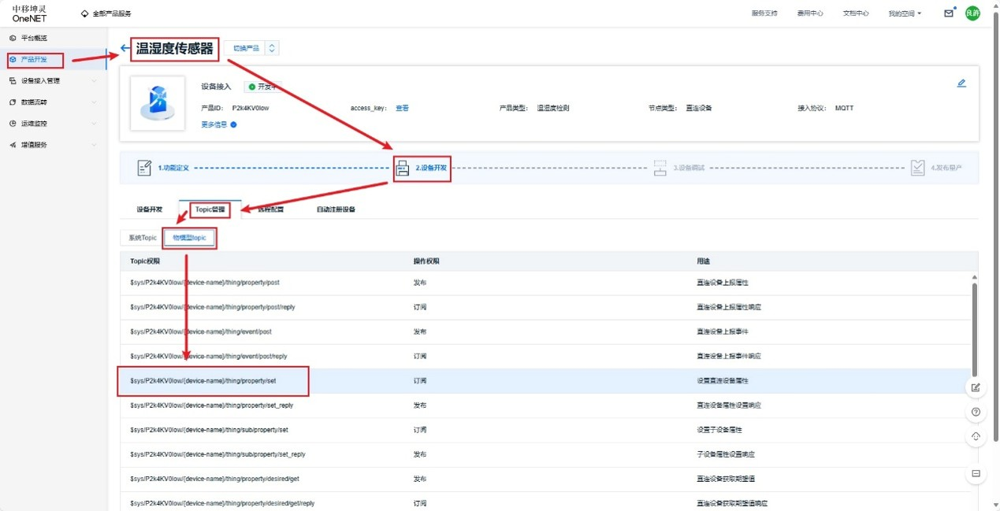

### 4.5.3 上报主题
选择直连设备上报属性：
`{device-name}` 是设备ID，比如我们的就是 temp01。

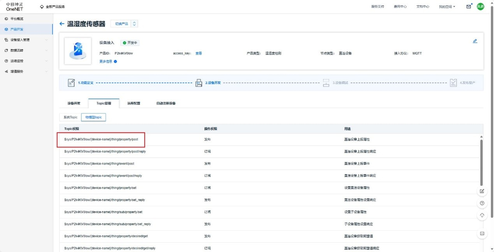

---

