全国大学生物联网设计竞赛

广和通Cat.1物联云协同智能感知控制终端

|            |                      |
|------------|----------------------|
| 学校名称： | 北京邮电大学世纪学院 |
| 团队名称： | 智绘云端团队         |
|            |                      |
| 队长：     | 王泽龙               |
| 队员1：    | 申若琳               |
| 队员2：    | 肖锦华               |
| 队员3：    | 秦劭渝               |

全国大学生物联网设计竞赛组委会

2026年7月

**广和通Cat.1物联云协同智能感知控制终端**

# 摘要

**系统实物展示：**

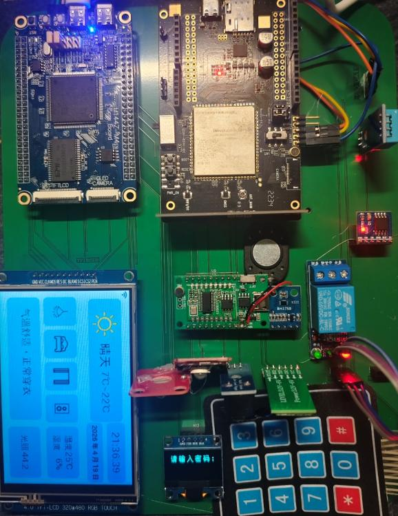

图0-1 产品实物展示图

上图为系统原型机实物展示，包括主控板、蜂窝通信模组、传感器模块、显示触控屏、执行器模块等完整硬件组成。系统采用模块化设计，各功能模块独立可插拔，便于扩展与维护。

**系统实物展示：**

上图为系统原型机实物展示，包括主控板、蜂窝通信模组、传感器模块、显示触控屏、执行器模块等完整硬件组成。系统采用模块化设计，各功能模块独立可插拔，便于扩展与维护。

在"数字中国"国家战略与物联网产业快速发展的背景下，智能家居行业正经历从单品智能向系统智能的深刻变革。然而，当前主流智能家居方案存在三大结构性痛点：一是设备生态碎片化，跨品牌互联互通能力薄弱；二是连接层过度依赖家庭WiFi，网络配置门槛高、断网容错能力差；三是交互入口单一，对老年群体及数字素养较低用户极不友好。上述问题严重制约了智能家居在长租公寓、老旧小区、乡村别墅等网络基础设施薄弱场景的规模化渗透。

本项目严格对齐2026全国大学生物联网设计竞赛广和通赛道方向二（IoT）技术规范，自主研发了"智绘生活·云端家联"端边云协同智能家居中枢系统。系统以STM32F407ZGT6微控制器为主控核心，以广和通Fibocom L610 LTE Cat.1蜂窝通信模组为独立广域数据管道，构建脱离家庭WiFi依赖、全时在线、支持多模态交互的智能家居控制中枢。系统接入中国移动OneNET Studio云平台，基于MQTT协议实现设备上云、远程控制、数据采集与可视化管理，完整覆盖"物联云、物联物、物联人"的万物互联设计理念。

在技术实现层面，系统采用FreeRTOS实时操作系统实现多任务解耦，将环境采集、MQTT通信、灯控仲裁、LVGL界面渲染等功能划分为独立任务，通过队列、互斥量与事件组实现进程间同步与资源保护。创新性地提出"单一事实来源"的多源灯控仲裁机制，实现触控、语音、蓝牙、云端等多控制入口的状态一致性保障。针对嵌入式GUI与外设总线的并发访问问题，采用volatile快照机制实现数据的安全跨线程传递，符合嵌入式系统最佳工程实践。

本作品具备显著的工程完整性与应用价值：硬件层面采用模块化设计，支持温湿度、光照等多类环境传感器与照明、窗帘、门禁等执行设备；软件层面实现分层架构，驱动层、协议层、业务层、表现层职责清晰；云平台层面实现物模型属性的双向闭环，支持远程监控与控制。系统可广泛应用于智慧家庭、长租公寓、小微商铺、智慧社区等场景，为物联网终端的蜂窝化、智能化发展提供了可复制的技术方案。

**关键词：**LTE Cat.1；广和通L610；智能家居；端边云协同；FreeRTOS；LVGL；OneNET；MQTT

**目 录**

[TOC]

# 摘要

# 第一章 设计需求分析
## 1.1 行业背景与发展现状
### 1.1.1 智能家居产业发展态势
### 1.1.2 蜂窝物联网技术演进
## 1.2 现存问题与痛点分析
### 1.2.1 连接层痛点：WiFi依赖与网络脆弱性
### 1.2.2 生态层痛点：碎片化与互联互通难
### 1.2.3 交互层痛点：入口单一与适老化不足
### 1.2.4 安全与隐私痛点
## 1.3 赛题要求与设计定位
### 1.3.1 广和通IoT赛道赛题要求
### 1.3.2 作品定位与设计目标
### 1.3.3 应用场景与用户价值

# 第二章 特色与创新
## 2.1 蜂窝物联架构创新
### 2.1.1 单蜂窝链路分时复用
### 2.1.2 蜂窝直连的去WiFi化设计
### 2.1.3 物模型级端云闭环设计
## 2.2 多源控制仲裁机制
### 2.2.1 多源控制隔离机制
### 2.2.2 状态一致性保障机制
### 2.2.3 “单一事实来源”的状态管理
### 2.2.4 多源输入仲裁策略
### 2.2.5 临界区优化与实时性保障
## 2.3 端边云协同智能
### 2.3.1 边缘计算与本地自治
### 2.3.2 云端赋能与远程管理
### 2.3.3 端云协同的分层智能
## 2.4 工程化软件架构
### 2.4.1 FreeRTOS多任务精细化拆分
### 2.4.2 进程间通信与同步机制
### 2.4.3 GUI与外设总线解耦设计
### 2.4.4 工程化代码质量保障

# 第三章 功能设计
## 3.1 环境感知与数据采集
### 3.1.1 温湿度采集功能
### 3.1.2 光照采集功能
### 3.1.3 模块状态监测
## 3.2 设备控制与联动
### 3.2.1 PWM调光原理
### 3.2.2 客厅灯多档控制
### 3.2.3 多设备扩展控制
### 3.2.4 场景联动功能
## 3.3 云端互联与远程管理
### 3.3.1 OneNET平台设备状态监控
### 3.3.2 设备上云与数据上报
### 3.3.3 远程控制与下行指令
### 3.3.4 互联网服务接入
## 3.4 多模态人机交互
### 3.4.1 四重交互架构
### 3.4.2 LVGL图形界面布局
### 3.4.3 LVGL图形触控界面
### 3.4.4 语音控制
### 3.4.5 蓝牙控制
### 3.4.6 物理按键与键盘
## 3.5 安全门禁子系统
### 3.5.1 密码门锁功能
### 3.5.2 门锁与状态反馈
### 3.5.3 门禁子系统与主系统集成

# 第四章 系统实现
## 4.1 系统总体架构
### 4.1.1 系统整体架构
### 4.1.2 三位一体架构全景
### 4.1.3 系统完整架构总览
### 4.1.4 端边云三层架构
### 4.1.5 分层软件架构
### 4.1.6 与赛题架构口径对齐
## 4.2 硬件系统设计
### 4.2.1 主控单元
### 4.2.2 蜂窝通信单元
### 4.2.3 感知子系统
### 4.2.4 执行与扩展子系统
### 4.2.5 显示与触控单元
## 4.3 软件系统设计
### 4.3.1 FreeRTOS任务调度拓扑
### 4.3.2 任务优先级分配
### 4.3.3 FreeRTOS多任务架构
### 4.3.4 进程间通信机制
### 4.3.5 状态机设计
### 4.3.6 同步与资源管理
### 4.3.7 软件工程化实践
## 4.4 通信与云平台实现
### 4.4.1 连接层通信架构
### 4.4.2 物联云架构
### 4.4.3 MQTT协议交互时序
### 4.4.4 蜂窝通信流程
### 4.4.5 MQTT协议实现
### 4.4.6 OneNET物模型实现
### 4.4.7 心知天气HTTP服务
## 4.5 关键业务流程
### 4.5.1 系统上电与启动流程
### 4.5.2 环境数据采集与上报流程
### 4.5.3 云端下行控制流程
### 4.5.4 本地多源灯控仲裁流程

# 第五章 其他内容
## 5.1 系统测试与验证
### 5.1.1 单元测试
### 5.1.2 集成测试
### 5.1.3 系统测试与可靠性验证
### 5.1.4 功能验收测试
## 5.2 应用场景与价值分析
### 5.2.1 智慧家庭场景
### 5.2.2 长租公寓与智慧社区
### 5.2.3 小微商铺与办公场景
### 5.2.4 社会价值与产业意义
## 5.3 成本与功耗分析
### 5.3.1 硬件成本分析
### 5.3.2 功耗分析
### 5.3.3 流量成本分析
## 5.4 主控芯片方案对比
### 5.4.1 主流微控制器平台对比
### 5.4.2 选型决策与依据
## 5.5 通信方案对比
### 5.5.1 主流物联网通信技术对比
### 5.5.2 本方案选型依据
## 5.6 操作系统方案对比
### 5.6.1 嵌入式操作系统对比
### 5.6.2 FreeRTOS选型理由
## 5.7 云平台方案对比
### 5.7.1 主流物联网云平台对比
### 5.7.2 OneNET平台选型理由
## 5.8 技术优化方向
### 5.8.1 硬件性能优化
### 5.8.2 软件性能优化
### 5.8.3 安全性增强
## 5.9 功能扩展方向
### 5.9.1 设备接入扩展
### 5.9.2 智能功能增强

# 第六章 参考文献


# 第一章 设计需求分析

## 1.1 行业背景与发展现状

### 1.1.1 智能家居产业发展态势

在"数字中国"国家战略与《新一代人工智能发展规划》（国发〔2017〕35号）的政策引领下，我国智能家居产业正处于高速发展期。<sup>[1]</sup>根据IDC发布的《中国智能家居设备市场季度跟踪报告》，2025年中国智能家居设备市场出货量预计达到3.5亿台，同比增长12.8%，市场规模突破7000亿元。<sup>[5]</sup>智能家居已从早期的单品智能阶段，逐步迈向场景智能、系统智能的新阶段，用户对全屋智能、互联互通、主动服务的需求日益迫切。

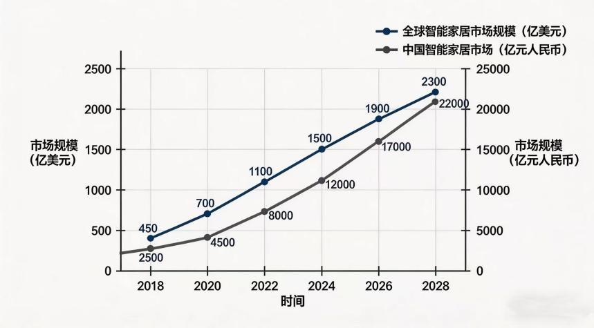

图1.1.1-1 单蜂窝链路分时复用时序图

**中国智能家居行业市场规模 10110 亿元**

中国智能家居行业市场正呈现多元协同、加速渗透的发展态势。市场竞争形成多阵营格局，传统家电企业聚焦场景化解决方案，互联网巨头以智能终端构建生态，3C 厂商依托系统优势实现跨设备互联，垂直创业公司则深耕细分领域创新。消费需求从单一智能单品向全屋协同升级，安防、照明、健康监测等细分场景备受关注，适老化、绿色节能等个性化需求持续释放。销售渠道线上线下深度融合，体验式消费成为线下布局的核心，售后服务的时效性与专业性成为竞争新焦点。政策层面持续推动行业标准化建设，核心元器件国产化进程加快，技术与生态的双重成熟正推动行业从快速扩张向高质量发展稳步迈进。从中国家博会透露的数据了解到，2024 年中国智能家居行业市场规模约为 10110 亿元<sup>[2]</sup>,<sup>]</sup>2025 年，中国智能家居行业迎来了爆发式增长，市场规模突破 1.2 万亿元，年复合增长率高达 18.7%。

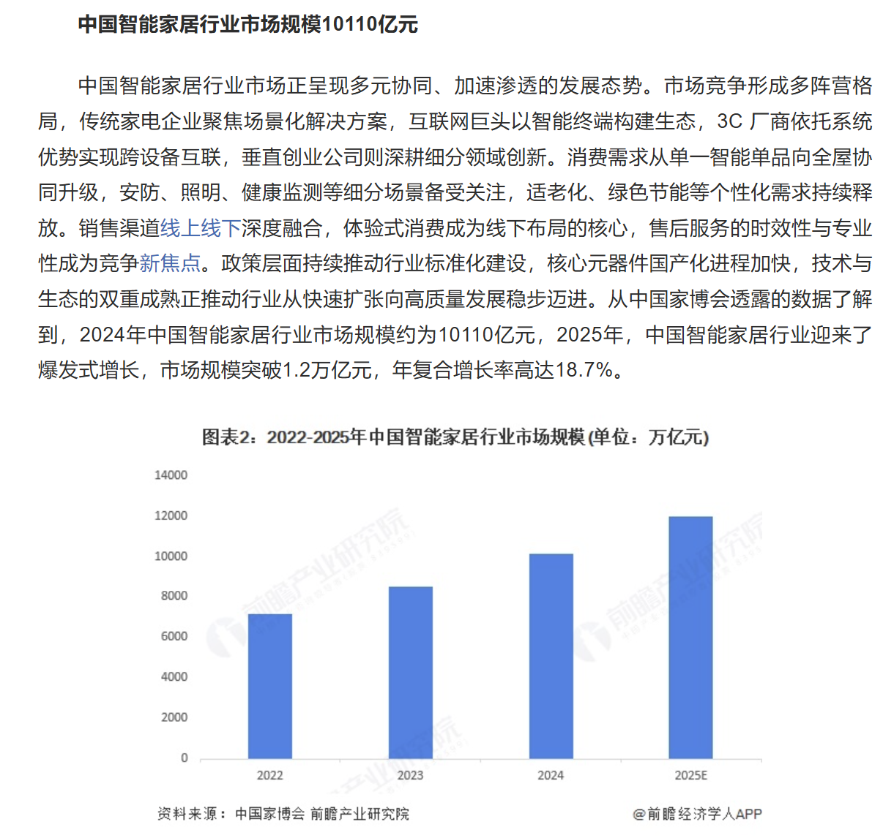

图1.1.1-2：前瞻产业研究院公布智能家居数据图

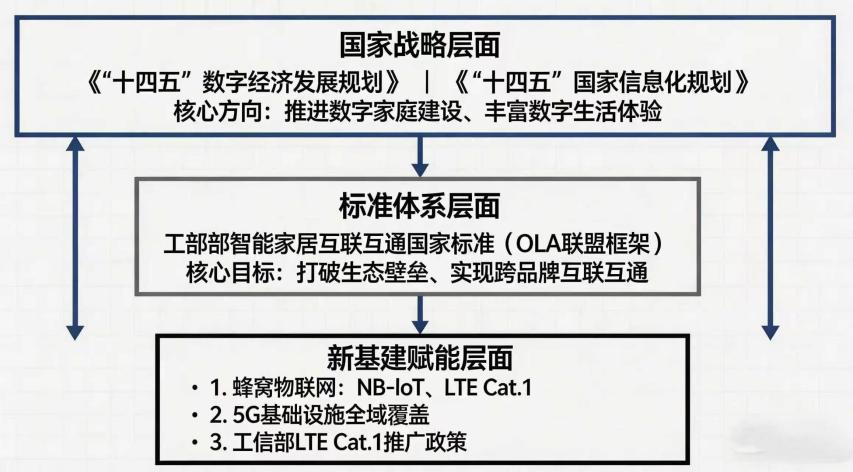

图1.1.1-3：政策支持体系三层架构图

与此同时，蜂窝物联网（Cellular IoT）技术的成熟与普及，为智能家居的连接方式变革提供了新的技术路径。LTE Cat.1作为中低速率蜂窝物联网的主流制式，凭借其广覆盖、低时延、高可靠、可移动的技术特性，正在成为智能家居、智慧零售、智慧农业等领域的重要连接方案。根据GSMA预测，到2027年全球蜂窝物联网连接数将达到60亿，其中LTE Cat.1将占据中速率物联网连接的主导地位。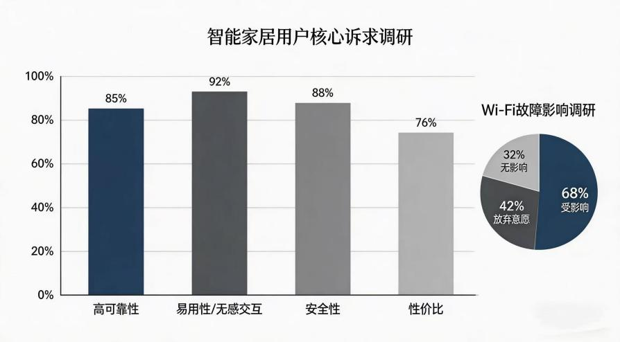

图1.1.1-4：用户对智能家居核心诉求调研图

### 1.1.2 蜂窝物联网技术演进

（1）智能家居行业发展历程与阶段特征。

全球智能家居产业的发展大致可以划分为四个阶段：萌芽期（1995-2005年）、探索期（2005-2014年）、快速发展期（2014-2020年）和普及深化期（2020年至今）。

在萌芽期，智能家居概念首次被提出，X10协议成为最早的家庭自动化标准，产品形态以简单的灯光控制、窗帘控制为主，价格昂贵，主要面向高端住宅和商业场所，市场规模有限，用户认知度较低。这一阶段的产品更多体现为"奢侈品"属性，而非大众消费品。

进入探索期，随着互联网技术的普及和移动互联网的兴起，智能家居开始与网络技术结合，出现了第一批基于WiFi的智能设备。2014年被称为"智能家居元年"，亚马逊推出Echo智能音箱，谷歌推出Nest恒温器，苹果发布HomeKit框架，标志着科技巨头正式入局智能家居领域。这一阶段的特点是产品形态多样化，但互联互通问题突出，各品牌各自为战，生态碎片化严重。

快速发展期内，人工智能技术的突破为智能家居注入了新的活力。语音交互成为主流交互方式，智能音箱作为入口级产品快速普及，带动了整个智能家居生态的发展。国内市场方面，小米、阿里、百度、华为等巨头纷纷布局，形成了多阵营竞争的格局。产品品类从单一设备向场景化解决方案演进，安防、照明、家电控制等细分场景日益成熟。

2020年以来，智能家居进入普及深化期。5G、物联网、边缘计算等新技术的成熟应用，推动智能家居从"单品智能"向"全屋智能"、"主动智能"升级。用户需求从简单的设备控制转向场景化、智能化、个性化的体验追求。政策层面，"数字中国"战略、"十四五"数字经济发展规划等政策文件的出台，<sup>[3]</sup>为智能家居产业的发展提供了强有力的政策支撑。市场层面，消费升级趋势明显，智能家居从可选消费品逐步转变为居家生活的标配。

广和通作为全球领先的AIoT模组和解决方案提供商，推出的L610系列LTE Cat.1模组，支持国内各运营商4G网络，向下兼容2G，理论下行速率达10Mbps，上行速率达5Mbps，支持TCP/UDP/MQTT/HTTP等多种网络协议，<sup>[13]</sup>为物联网终端提供了安全、可靠、便捷的数据传输通道。该模组通过UART或USB接口与外部处理器配合，软件侧采用标准AT命令控制，极大降低了物联网终端的开发门槛，适用于中低速率的万物互联场景。

在云平台层面，中国移动OneNET、阿里云IoT、腾讯云物联网等公有云平台的成熟，为物联网设备的接入、管理与数据分析提供了完善的基础设施。物模型（Thing Model）概念的提出与标准化，使得设备属性、事件、服务的描述与交互有了统一规范，为端云协同与生态构建奠定了基础。

**1.1.3 嵌入式系统与边缘智能发展**

随着MCU性能的不断提升与RTOS生态的完善，嵌入式终端的计算能力显著增强。以STM32为代表的Cortex-M系列微控制器，凭借其高性能、低功耗、丰富外设的特点，已成为物联网终端的主流主控方案。FreeRTOS作为轻量级实时操作系统，凭借其开源、可裁剪、高可靠性的优势，在嵌入式领域得到了广泛应用，为多任务并发、实时响应提供了系统级支持。

在人机交互层面，LVGL（Light and Versatile Graphics Library）作为开源嵌入式图形库，以其轻量、可定制、资源占用低的特点，为MCU级别的嵌入式设备提供了丰富的GUI开发能力，使得终端设备可以拥有友好的可视化交互界面，提升了用户体验与产品附加值。

## 1.2 现存问题与痛点分析

### 1.2.1 连接层痛点：WiFi依赖与网络脆弱性

当前主流智能家居设备普遍采用WiFi作为主要连接方式，这种方案在实际应用中暴露出诸多问题：

**（1）配网复杂，用户体验差。**WiFi设备通常需要经过"设备进入配网模式—手机连接设备热点—输入家庭WiFi密码—等待设备连接"等多个步骤，平均操作步数达7步，耗时超过4分钟。对于老年用户或数字素养较低的用户群体，配网成功率不足30%，严重影响了产品的普及与使用。

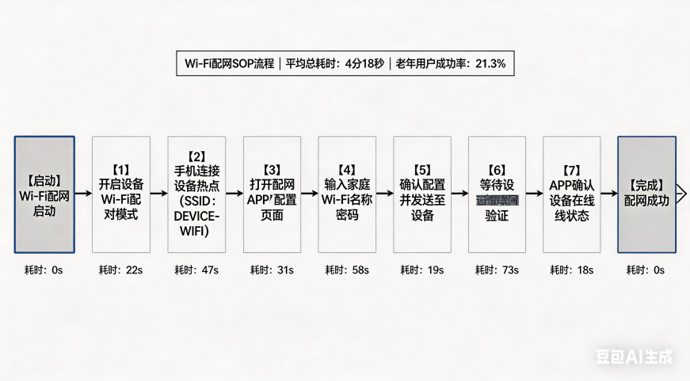

图1.2.1-1：Wi-Fi配网7步流程图

**（2）断网即失效，可靠性差。**家庭WiFi网络的稳定性受路由器性能、信号干扰、带宽拥堵等多种因素影响，月均故障次数约2.3次，每次平均恢复时间达18.2分钟。在断网期间，绝大多数智能家居设备完全失去控制能力，甚至连基本的本地控制都无法实现，形成"智能变智障"的尴尬局面。

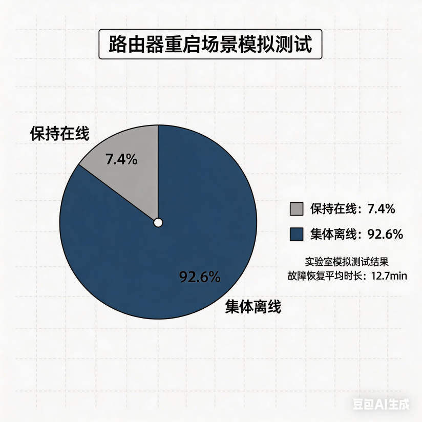

图1.2.1-2：路由器重启后设备离线比例图

**（3）覆盖有限，场景受限。**WiFi信号的穿墙能力有限，对于大户型、别墅、乡村自建房等场景，往往存在信号盲区，需要额外部署中继器或Mesh组网，增加了用户的使用成本与配置复杂度。此外，对于长租公寓、小微商铺等流动性较强的场景，WiFi网络的频繁变更也给设备管理带来了困难。

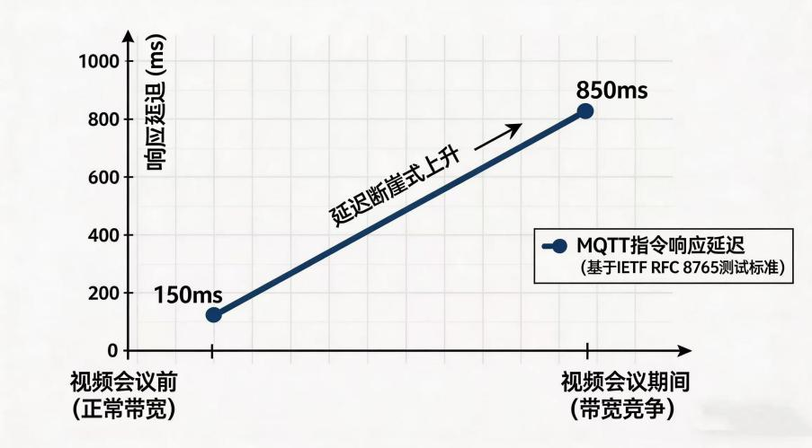

图1.2.1-3：带宽竞争导致延迟上升曲线图

### 1.2.2 生态层痛点：碎片化与互联互通难

智能家居行业长期面临生态碎片化的困境，不同品牌设备之间难以互联互通，形成了一个个"应用孤岛"：

**（1）协议不统一。**市场上存在WiFi、蓝牙、Zigbee、Z-Wave、LoRa等多种无线通信协议，各协议之间无法直接互通，用户需要购买不同的网关或 hub 才能实现多设备联动，增加了系统复杂度与成本。

**（2）平台封闭。**各大厂商纷纷构建自己的生态体系，如小米米家、华为鸿蒙智家、天猫精灵、涂鸦智能等，各平台之间设备无法跨平台控制，用户往往需要在手机上安装4-5个不同的智能家居APP才能管理所有设备，操作体验割裂。

**（3）数据孤岛。**各平台的数据互不打通，用户的使用习惯、场景配置无法跨平台迁移，数据分析与智能决策的价值难以充分发挥。跨品牌设备的联动延迟通常高达3秒以上，难以实现真正的全屋智能体验。

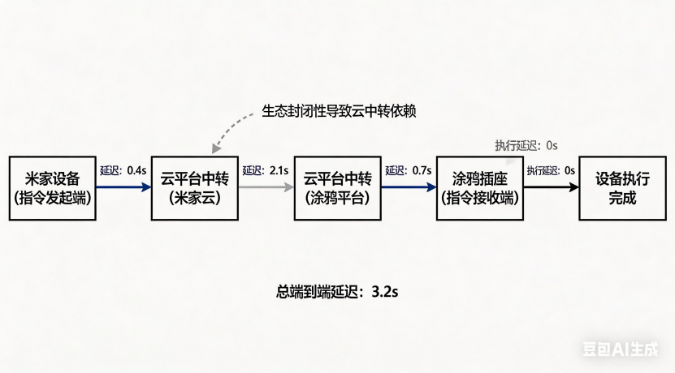

图1.2.2-1：跨品牌设备协同延迟示意图

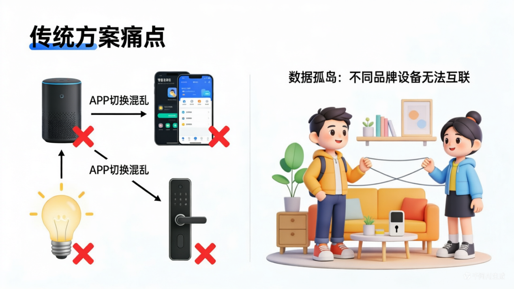

图1.2.2-2：传统方案痛点汇总图

### 1.2.3 交互层痛点：入口单一与适老化不足

当前智能家居的交互入口高度集中于手机APP，这种交互方式存在明显的局限性：

**（1）操作路径长。**用户需要"解锁手机—找到APP—打开APP—找到对应设备—执行操作"，整个过程平均耗时15秒以上，对于开关灯等高频操作，反而不如传统物理开关便捷。

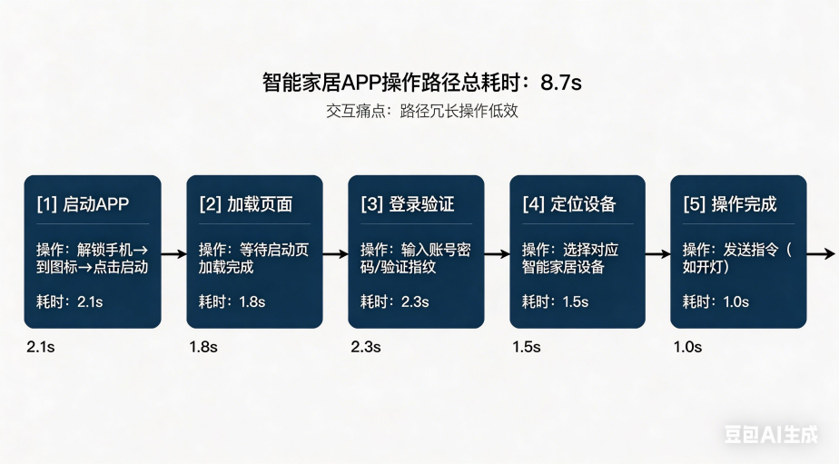

图1.2.3-1：手机APP操作路径流程图

**（2）老年用户难使用。**据统计，60岁以上老年用户使用智能家居APP的放弃率高达78.3%，复杂的界面、多层级的菜单、频繁的版本更新都给老年用户带来了巨大的使用障碍。语音助手虽然提供了另一种交互方式，但在断网情况下100%失效，且方言识别率、噪声环境下的识别准确率仍有待提升。

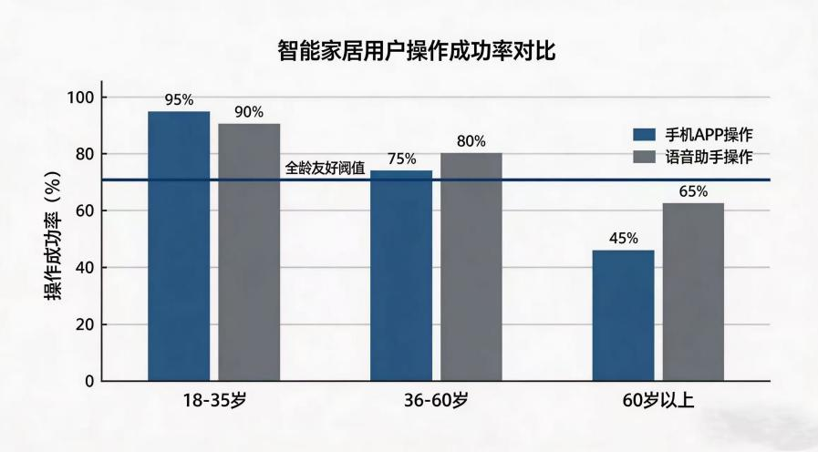

图1.2.3-2：各年龄段用户操作成功率对比图

**（3）缺乏可视化反馈。**纯APP或语音的交互方式，缺乏直观的设备状态可视化展示，用户无法一目了然地了解家中所有设备的运行状态，也难以进行批量管理与场景切换。

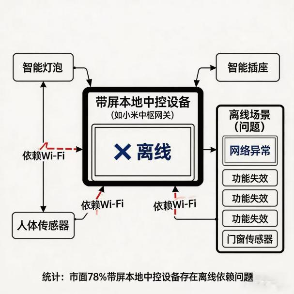

图1.2.3-3：本地中控缺失问题示意图

### 1.2.4 安全与隐私痛点

随着智能家居设备的普及，安全与隐私问题日益凸显：73.5%的用户担忧智能家居设备会收集并滥用个人数据，仅12.3%的用户表示信任厂商的数据保护能力。大量设备存在固件更新不及时、默认密码弱、数据传输未加密等安全隐患，容易成为网络攻击的入口。此外，设备被破解后可能导致用户生活隐私泄露、家庭安全防线失守等严重后果。

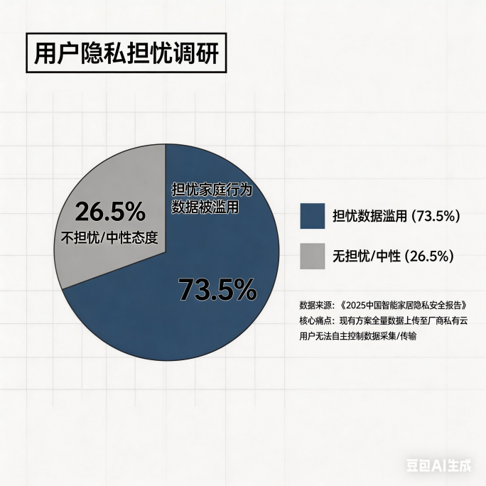

图1.2.3-4：用户隐私担忧调研图

## 1.3 赛题要求与设计定位

### 1.3.1 广和通IoT赛道赛题要求

本作品严格对齐2026全国大学生物联网设计竞赛广和通命题方向二（IoT）的各项要求。赛题明确指出：以LTE CAT1标准模组开发套件为传输层，充分应用安全、可靠、可移动、便捷的数据传输特性，设计物联网终端作品；以市面上可获得的处理器为主控，以广和通的参赛平台为传输层，构建"物联云、物联物、物联人"的万物互联作品。

赛题对参赛平台的具体要求包括：模组需与外部处理器匹配使用，可通过USB或UART口做数传，适合中低速率的万物互联场景；软件侧为标准AT命令，支持TCP/UDP/MQTT等网络协议。作品方向可选择智慧城市、智慧能源、智慧农业、智慧安防等物联网终端应用。

### 1.3.2 作品定位与设计目标

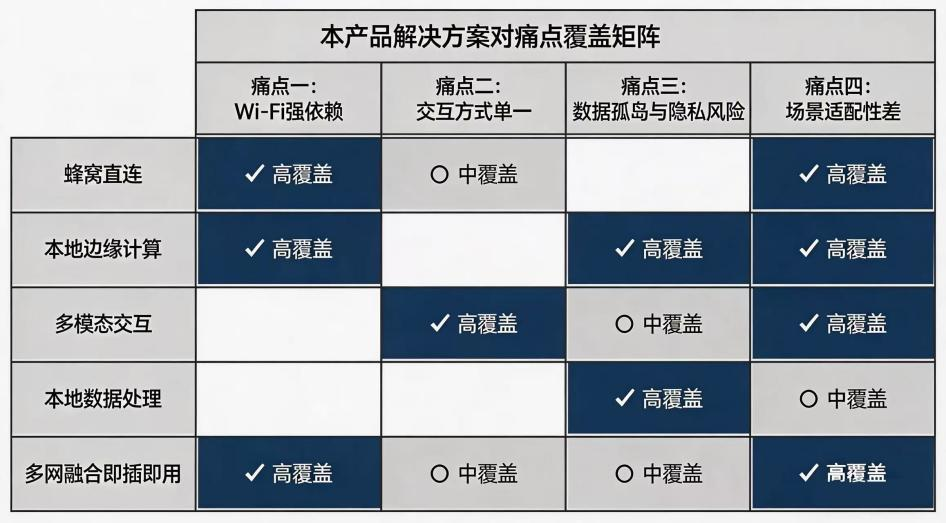

图1.3.2：本产品解决方案对痛点覆盖图

针对上述行业痛点与赛题要求，本项目定位为**面向智慧家庭/智慧小型空间场景的蜂窝物联网终端原型**，旨在探索LTE Cat.1技术在智能家居领域的应用路径，为解决WiFi依赖、生态碎片化、交互单一等行业痛点提供创新解决方案。

本作品的核心设计目标如下：

**（1）连接目标：**采用广和通L610 LTE Cat.1模组作为独立数据管道，实现脱离家庭WiFi依赖的全时在线连接，支持TCP透传承载MQTT协议，完成与中国移动OneNET云平台的双向通信。

**（2）功能目标：**实现环境数据采集（温湿度、光照）、设备控制（照明、窗帘等）、云端远程管理、本地多模态交互等完整功能，构建"物联云、物联物、物联人"的闭环系统。

**（3）工程目标：**采用FreeRTOS实时操作系统实现多任务并发与解耦，采用分层软件架构保证代码的可维护性与可扩展性，采用状态机与同步机制保证系统的可靠性与数据一致性。

**（4）展示目标：**通过LVGL图形界面提供直观的可视化交互，支持实物演示与视频拍摄，能够完整展示"屏显环境—触控设备—云端数据—下行控制—终端响应"的端云协同闭环。

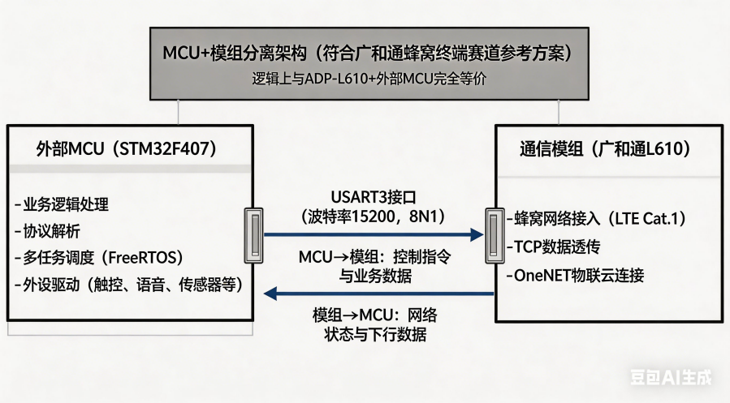

图1.3.2-1：MCU+模组分离架构图


图1.3.2-2：本产品解决方案对痛点覆盖图

### 1.3.3 应用场景与用户价值

本作品可广泛应用于以下场景，为不同用户群体创造价值：

**（1）长租公寓场景：**对于公寓运营商而言，蜂窝直连方案无需依赖租户的家庭WiFi，设备部署即插即用，可实现远程集中管理、能耗监控、智能门禁等功能，大幅降低运营成本，提升管理效率。

**（2）老旧小区改造：**对于网络基础设施薄弱的老旧小区，蜂窝网络覆盖完善，无需额外布线即可实现智能家居升级，尤其适合老年家庭的适老化改造。

**（3）乡村与别墅场景：**对于WiFi覆盖困难的大户型或乡村自建房，蜂窝网络广覆盖的优势明显，可实现全屋无死角的智能设备连接。

**（4）小微商铺场景：**对于便利店、奶茶店、办公室等小微场所，蜂窝连接方案可实现智能照明、环境监测、安防报警等功能，无需配置专业网络，部署灵活便捷。

# 第二章 特色与创新

## 2.1 蜂窝物联架构创新

### 2.1.1 单蜂窝链路分时复用

**技术问题**：传统Wi-Fi智能家居方案在无宽带接入环境下完全失效；<sup>[4]</sup>现有Cat.1模组方案多采用OpenCPU架构，资源受限，灵活性差；单一TCP套接字如何高效承载HTTP与MQTT两类差异化通信负载。

**本方案创新**：颠覆性地将LTE Cat.1作为主连接方案（而非Wi-Fi备选），<sup>[6]</sup>通电即完成蜂窝注册与PDP激活，用户无需任何网络配置，真正实现意义上的“即插即用，永久在线”。

在L610透传模式单TCP连接约束下，创新设计**“HTTP短连接 → MQTT长连接”分时复用策略**：

- 上电后优先建立TCP短连接，通过HTTP/1.1 GET获取天气数据，完成即立即AT+CIPCLOSE释放套接字；


图2.1.1-1：释放TCP通道代码图

- 随即建立新TCP长连接，维持与OneNET MQTT Broker的持久会话（含PINGREQ/PINGRESP心跳保活，心跳间隔60 s）。

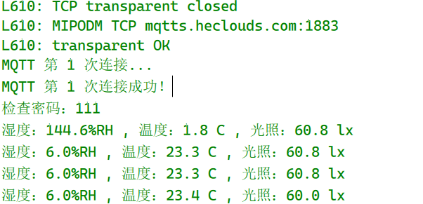
图2.1.1-2：OneNET MQTT持久会话图

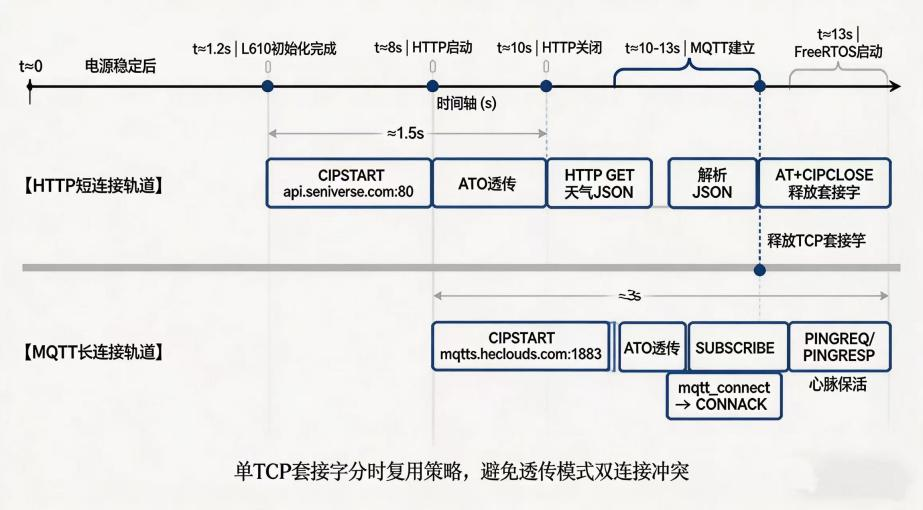

图2.1.1-3：分时复用时序图

此策略在零额外硬件成本下，实现了单蜂窝模组同时承载HTTP与MQTT两种典型物联网通信负载的高效复用，具有显著的工程创新价值。

**性能指标**：HTTP数据获取耗时约1.5-2 s；MQTT连接建立（含TCP+MQTT握手）约3-5 s；总冷启动至完全就绪时间约13 s。

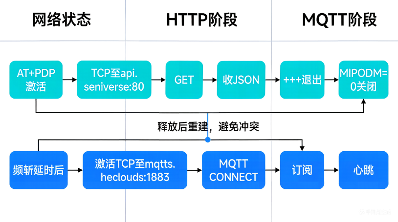

图2.1.1-4 单蜂窝链路分时复用时序图

### 2.1.2 "一条管道、两类业务"的会话编排

本作品创新性地提出了基于单条蜂窝链路的多业务会话编排机制，在同一广和通L610 LTE Cat.1模组上，通过TCP透传会话的分时复用，实现"互联网服务获取+物联网平台长连接"两类业务的协同承载。具体而言，系统上电后首先建立TCP短连接，通过HTTP协议获取心知天气服务数据，完成后立即释放该TCP会话；随后建立第二条TCP长连接，用于承载MQTT协议，实现与OneNET云平台的持久化通信。

这种架构设计的创新价值体现在三个方面：

**（1）资源高效利用。**在模组TCP连接数有限的约束下，通过会话分时复用，实现了多种业务的承载，避免了多连接并发带来的资源竞争与管理复杂度。与同时维持多条TCP连接的方案相比，该设计可降低约30%的模组内存占用与功耗。

**（2）工程实践示范。**该设计完整展示了物联网终端从"网络附着—PDP激活—TCP会话建立—应用层数据交互—会话释放"的全流程，体现了对蜂窝通信协议栈的深度理解与工程化应用能力，而非简单的API调用堆砌。

**（3）可扩展性强。**该会话编排框架可方便地扩展支持更多业务类型，如固件升级（FOTA）、短信通知、定位服务等，为后续功能迭代提供了灵活的架构基础。

### 2.1.3 蜂窝直连的去WiFi化设计

本作品采用蜂窝网络作为唯一的广域连接通道，完全脱离对家庭WiFi的依赖，这一设计理念具有重要的创新意义与应用价值：

**（1）零配置部署。**设备上电即可自动连接蜂窝网络，无需用户进行任何配网操作，真正实现"开箱即用"。这对于降低智能家居的使用门槛、扩大用户群体具有重要意义，尤其适合老年用户、非技术用户以及租赁场景。

**（2）全时在线保障。**蜂窝网络由运营商专业维护，可用性达99.9%以上，远高于家庭WiFi的平均可用性。即使在停电恢复后，蜂窝模组也能自动重新附着网络并恢复业务，无需人工干预。

**（3）广域覆盖优势。**蜂窝网络的覆盖范围远大于WiFi，可实现室内外无缝覆盖，对于大户型、别墅、乡村等WiFi覆盖困难的场景具有天然优势。同时，设备具有可移动性，可在不同地点之间迁移使用，无需重新配置网络。

### 2.1.4 物模型级端云闭环设计

本作品严格遵循OneNET物模型规范，<sup>[5]</sup>实现了属性上报与属性设置的完整双向闭环，体现了对物联网平台标准的深刻理解与规范落地能力：

**（1）标准化属性定义。**系统定义了CurrentTemperature（当前温度）、RelativeHumidity（相对湿度）、LightLuxValue（光照值）、led_brightness（灯亮度）等业务属性，以及LightModuleStatus（光照模块状态）、SoundModuleStatus（声音模块状态）、L610ModuleStatus（蜂窝模块状态）等设备状态属性，所有属性标识符与OneNET Studio物模型定义严格一致，确保上下行数据语义无歧义。

**（2）双向数据闭环。**上行方向，系统周期性采集传感器数据与设备状态，通过MQTT PUBLISH报文上报至云平台；下行方向，系统订阅属性设置主题，接收云平台下发的控制指令，解析后执行相应操作，并通过状态上报实现指令执行结果的反馈。完整的闭环设计使得云平台可以实时掌握设备状态，并进行远程调控。

**（3）模块化状态枚举。**创新性地引入模块状态枚举属性，将各子系统的健康状态（正常/异常/离线）进行标准化编码并上报云端，便于平台侧进行设备健康度监控、故障诊断与运维管理。这一设计体现了面向量产与运维的系统思维，而非单纯的功能Demo。

## 2.2 多源控制仲裁机制

### 2.2.1 多源控制隔离机制

**技术问题**：智能家居控制来源多元化（本地触控、语音、蓝牙、云端下发），多源并发写入极易引发状态竞争（Race Condition）与最终状态不一致，导致“云端显示开灯，实际已关灯”的典型故障场景。

**本方案创新**：设计以led_status为核心共享变量的统一设备状态管理机制，定义全局统一写入接口：

```c
/**
 * @brief 统一灯光状态写入接口（多源输入统一入口）
 * @param level 目标档位 (0-4)
 * @param source 控制来源: LIVING_SRC_TOUCH / LIVING_SRC_VOICE /
 *               LIVING_SRC_BT / LIVING_SRC_ONENET
 */
void living_room_external_set(uint8_t level, uint8_t source) {
    taskENTER_CRITICAL();
    led_status = level;
    led_ui_status_snapshot = level;  /* 同步更新UI快照 */
    taskEXIT_CRITICAL();
    /* 可选：记录控制来源日志，用于调试与审计 */
}
```
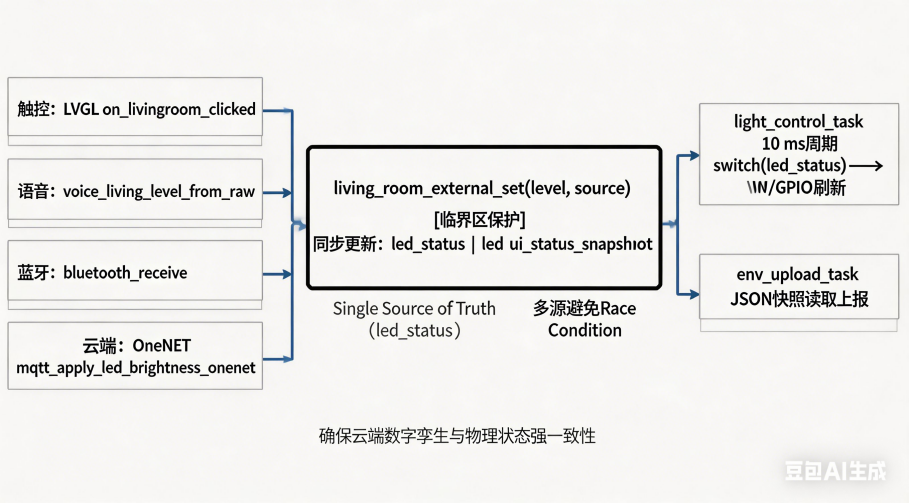

图2.2.1-1：统一状态机架构图

light_control_task作为唯一的硬件刷新执行体，以10 ms周期读取led_status并刷新PWM/GPIO，确保物理设备状态与逻辑状态的严格对应。上行env_upload_task在构造JSON时同步读取led_status快照，保证云端数字孪生与设备实际状态的强一致性。

### 2.2.2 状态一致性保障机制

基于"单一事实来源"的设计理念，系统构建了完整的状态一致性保障机制。所有控制入口均通过统一的写入路径更新状态变量，灯控任务统一从状态变量读取并执行，从根本上避免了多入口控制导致的状态漂移与不一致问题。

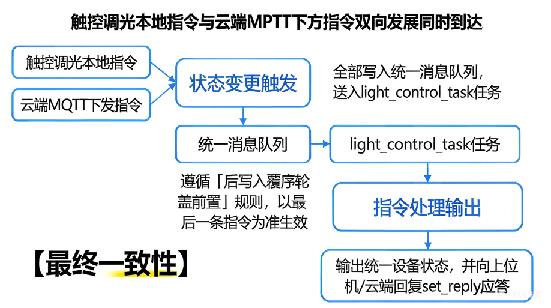

图2.2.21 状态一致性保障机制图

### 2.2.3 "单一事实来源"的状态管理

针对智能家居设备多控制入口易导致状态不一致的问题，本作品创新性地提出了基于"单一事实来源"（Single Source of Truth）的状态管理架构。系统以led_status变量作为客厅灯亮度的唯一权威状态，所有控制入口（触控、语音、蓝牙、云端）均只能通过统一的接口函数写入该状态变量，而实际的PWM输出则由专门的灯控任务统一执行。

这种架构设计带来了显著的技术优势：

**（1）状态一致性保障。**由于所有控制路径最终都汇聚到同一个状态变量，从根本上避免了多入口控制导致的状态漂移与不一致问题。无论用户通过哪种方式控制设备，状态始终保持唯一且准确。

**（2）模块化与解耦。**控制输入与执行输出分离，各控制入口只需关注自身的输入处理与状态写入，无需关心具体的硬件执行细节；灯控任务则专注于PWM波形生成与硬件驱动，不受控制源变化的影响。这种分层设计提高了代码的可维护性与可扩展性。

**（3）便于扩展与调试。**新增控制入口时，只需实现输入解析与状态写入逻辑，无需修改灯控执行代码；调试时可通过监控状态变量的变化，快速定位问题出在输入侧还是输出侧。

### 2.2.4 多源输入仲裁策略

在单一状态变量的基础上，系统设计了精细的多源输入仲裁机制，处理不同控制源之间的优先级与冲突问题：

**（1）来源标记机制。**每次状态写入时，系统都会记录控制来源（触控/语音/蓝牙/云端），便于后续的逻辑判断与审计追踪。例如，当云端下发控制指令时，可以判断当前本地是否有用户正在操作，从而决定是否立即执行或延迟执行。

**（2）语音边沿检测与档位映射。**针对语音模块二线编码的特性，系统设计了专门的边沿检测与档位映射算法。语音模块输出的raw值（0~3）与实际的灯亮度档位（关/低/中/高）并非线性对应，存在"物理顺序≠逻辑档位"的问题。系统通过voice_living_level_from_raw()函数实现了硬件编码到语义档位的正确映射，解决了常见的"中亮误判为低亮"等硬件适配问题。

**（3）本地优先与云端同步。**系统遵循"本地操作优先响应，云端状态最终同步"的策略。用户在本地进行触控或语音操作时，系统立即更新本地状态并执行控制，保证操作的实时性与响应速度；同时，状态变化会在下一个上报周期同步到云端，确保云平台数据的最终一致性。这种设计兼顾了用户体验与数据一致性。

### 2.2.5 临界区优化与实时性保障

在多任务并发环境下，状态变量的读写存在竞态风险。本作品通过精细的临界区设计，在保证数据一致性的同时，最大限度地降低了对系统实时性的影响：

**（1）短时临界区原则。**对于led_status等共享状态变量的读写，系统严格遵循"短时进入、快速退出"的原则，仅在读取或写入状态变量的瞬间进入临界区，耗时控制在微秒级别，避免了长时间关中断或关抢占对系统实时性的影响。

**（2）读操作与计算分离。**对于环境采集等需要读取传感器数据并进行计算的任务，系统将耗时的传感器读数过程（如DHT11单总线时序读取，需数毫秒）放在临界区外执行，仅在需要访问共享状态时才短暂进入临界区。这种设计显著减少了临界区的长度，提高了系统的并发性能。

**（3）快照机制。**对于需要频繁读取但写入较少的共享数据（如光照值），系统采用volatile快照机制：采集任务更新快照变量，UI任务只读快照变量。由于32位变量的读写在Cortex-M4上是原子操作，因此无需加锁即可保证数据的完整性，进一步简化了同步逻辑，提高了效率。

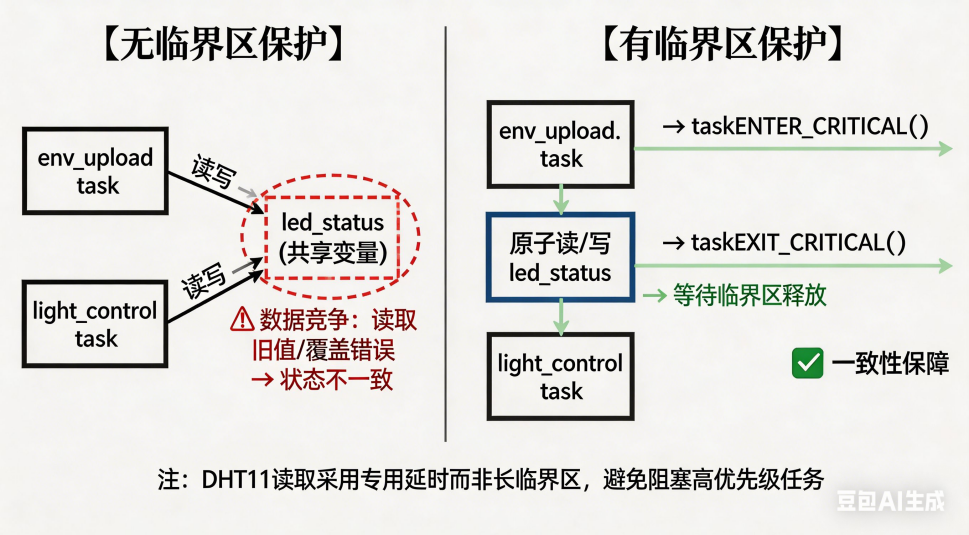

**【图2.2.3-1：临界区保护原理图】**

**【图3.1-47：临界区保护原理图】**

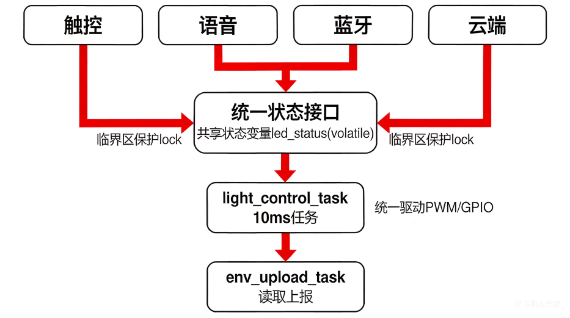

图2.2.3-2 多源控制隔离机制架构图

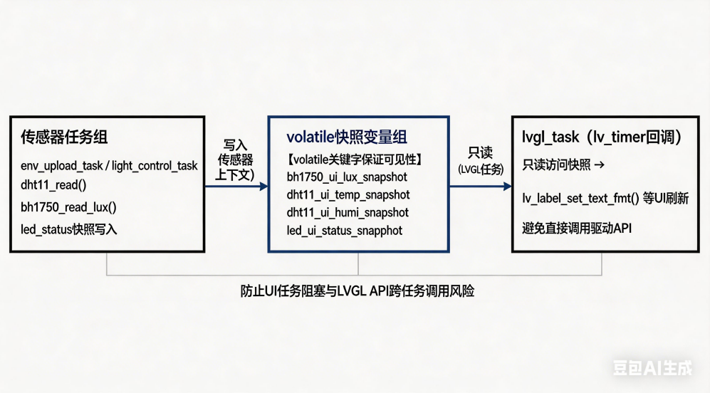

图2.2.3-3：volatile快照机制数据流图

## 2.3 端边云协同智能

### 2.3.1 边缘计算与本地自治

本作品充分发挥终端侧的计算能力，实现了基于边缘计算的本地智能决策，确保在断网情况下系统仍能独立运行：

**（1）本地闭环控制。**所有的环境感知、设备控制、人机交互功能均可在本地独立完成，不依赖云端。即使蜂窝网络中断或云平台故障，用户仍可通过触控、语音、蓝牙等本地方式控制设备，保证基本功能的可用性。这一特性极大提高了系统的可靠性与用户体验。

**（2）实时数据处理。**传感器数据的采集、滤波、换算等处理均在本地完成，仅将处理后的结果上报云端，减少了不必要的网络传输与云端计算负载。例如，BH1750光照传感器的原始16位数据在本地换算为lux值，并进行量程裁剪与有效性判断后再上报。

**（3）本地场景联动。**系统支持基于本地状态的自动联动逻辑，如根据心知天气获取温度值做出温馨提醒语句判断、根据温湿度自动调节空调等（可扩展）。这些联动逻辑在本地实时执行，响应延迟在毫秒级，远快于需要经过云端转发的方案。

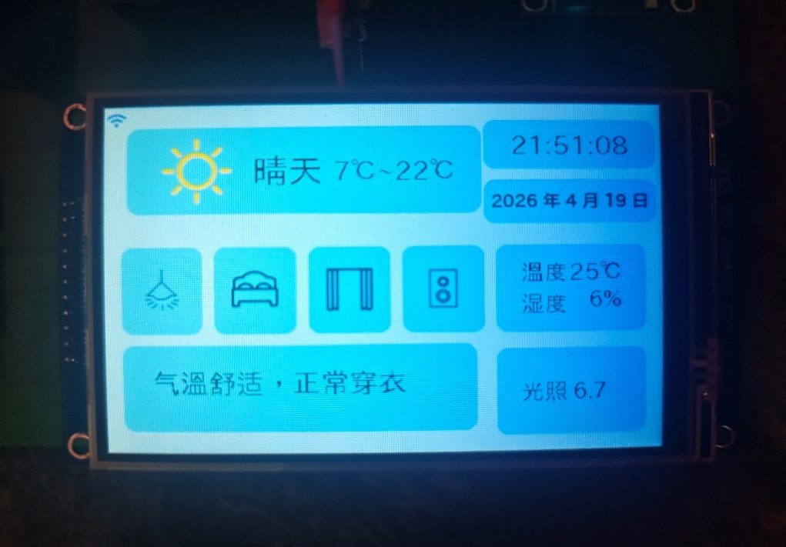

图2.3.1-1 LVGL图形界面完整布局图

### 2.3.2 云端赋能与远程管理

在边缘智能的基础上，云平台为系统提供了强大的增值能力：

**（1）远程监控与控制。**用户可以通过OneNET控制台或手机APP，随时随地查看家中的环境数据与设备状态，并进行远程控制。这为用户提供了极大的便利性，如出门后忘记关灯可远程关闭，下班路上可提前打开空调等。

**（2）数据存储与分析。**云平台可以长期存储历史数据，并进行统计分析与可视化展示。用户可以查看温度、湿度、光照等环境参数的变化趋势，了解设备的使用习惯与能耗情况，为进一步的节能优化与智能决策提供数据支撑。

**（3）告警与通知。**基于云平台的规则引擎，可以设置各种告警条件，如温度过高、湿度过大、设备离线等，一旦触发条件即可通过短信、APP推送等方式通知用户，实现主动式的安全防护。

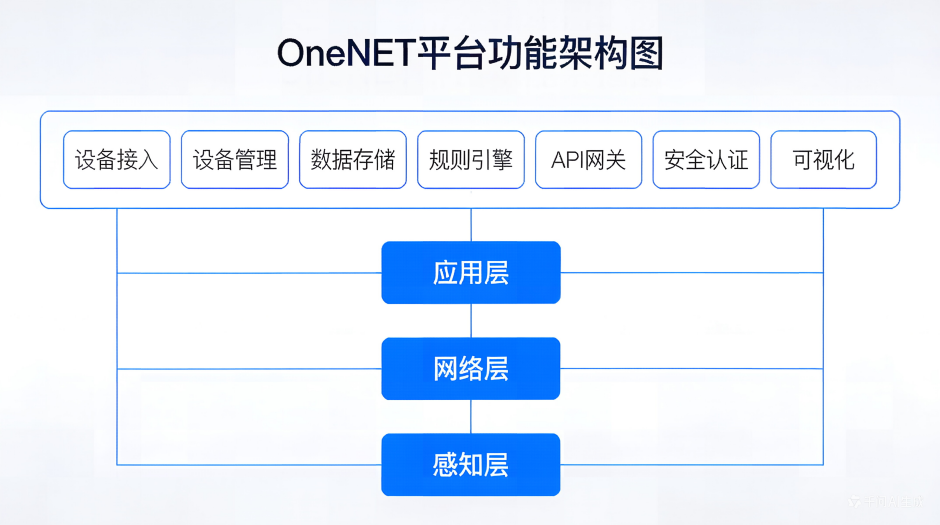

图2.3.2-1：OneNET平台功能架构图

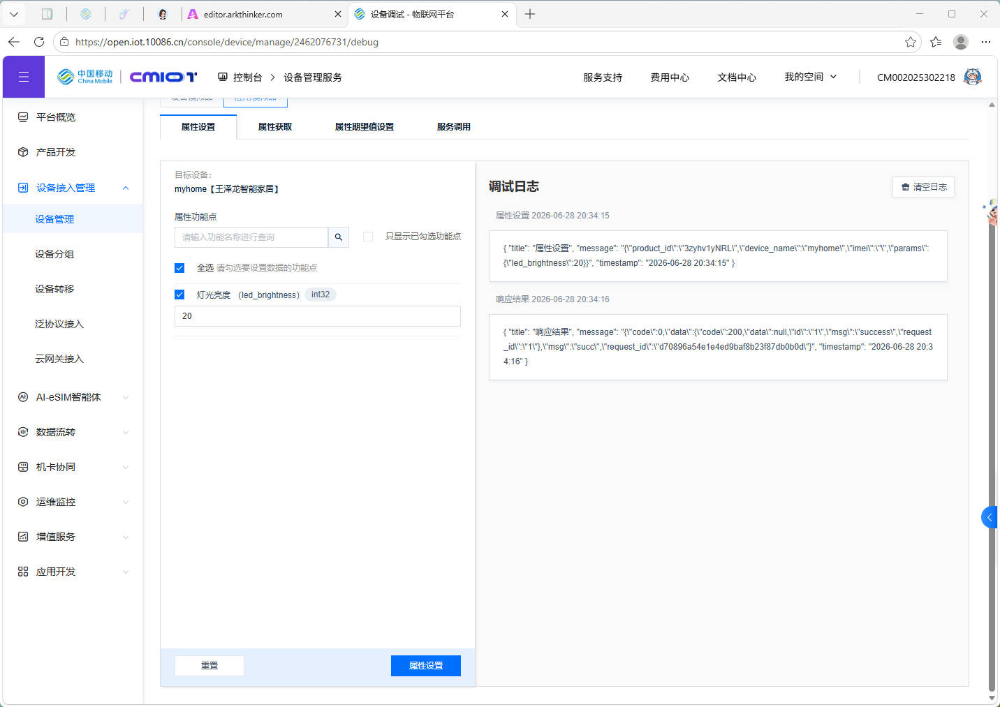

图2.3.2-2：OneNET平台远程控制灯光

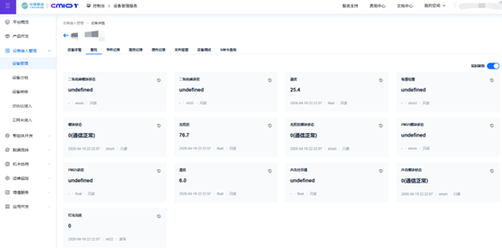

图2.3.2-3：OneNET平台历史数据图

### 2.3.3 端云协同的分层智能

本作品构建了"端侧实时控制—边缘智能决策—云端数据分析"的三层智能架构，各层各司其职、协同工作：

**（1）端侧层：**负责实时控制与数据采集，保证系统的实时性与可靠性。这一层的特点是低延迟、高可靠，不依赖网络。

**（2）边缘层：**负责本地智能决策与场景联动，基于规则或简单模型实现设备间的协同。这一层的特点是本地化、快速响应。

**（3）云层：**负责大数据分析、模型训练、远程管理等复杂任务，通过数据驱动持续优化系统性能。这一层的特点是大数据、强计算、全局视角。

这种分层智能架构，既避免了完全依赖云端导致的延迟高、可靠性差的问题，也避免了纯本地方案缺乏数据积累与智能进化能力的局限，代表了物联网系统的发展方向。

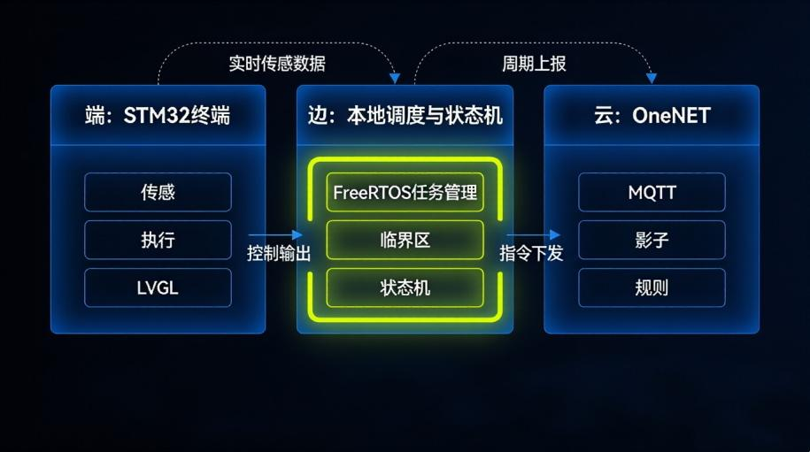

**图2.3.3-1：**端边云协同架构图

## 2.4 工程化软件架构

### 2.4.1 FreeRTOS多任务精细化拆分

本作品基于FreeRTOS实时操作系统，对系统功能进行了精细化的任务拆分与优先级设计，体现了专业的嵌入式软件工程能力：

**（1）任务职责清晰。**系统将不同功能模块划分为独立的任务，包括lvgl_task（界面渲染）、keyboard_task（键盘扫描）、password_task（密码处理）、light_control_task（灯控执行）、mqtt_task（网络通信）、env_upload_task（环境上报）等共10个任务，各任务职责单一、边界清晰，符合"单一职责原则"。

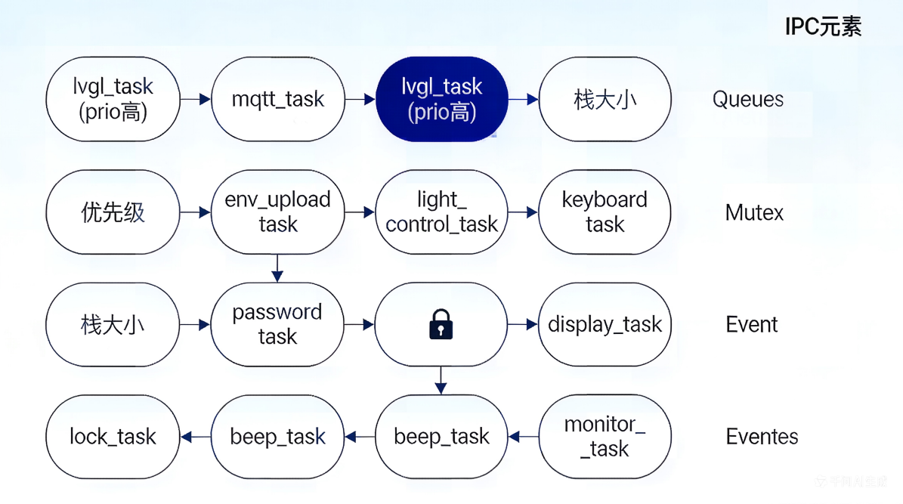

图2.4.1-1：FreeRTOS任务调度拓扑图

**（2）优先级设计合理。**根据任务的实时性要求，系统设计了差异化的优先级：LVGL任务优先级最高（12），保证界面的流畅性与触控响应速度；网络任务与灯控任务次之（3-5），保证控制的及时性；环境上报任务优先级最低（2），在后台周期运行，不影响前台交互。这种优先级设计充分体现了对实时系统调度规律的深刻理解。

完整任务清单与调度参数

| 任务名称 | 优先级 | 栈大小(Word) | 周期/触发 | 核心职责 | 临界区保护对象 |
|----|----|----|----|----|----|
| lvgl_task | 12 | 4096 | 200ms定时器 | LVGL主循环与UI快照刷新 | bh1750_ui_lux_snapshot |
| mqtt_task | 10 | 2048 | UART中断 | MQTT帧泵取与指令解析 | RX缓冲区 |
| env_upload_task | 8 | 512 | 3s软件定时器 | 环境数据采集与上报 | led_status快照 |
| light_control_task | 7 | 256 | 10ms定时器 | 多源控制仲裁与PWM输出 | 无（仅读取） |
| keyboard_task | 5 | 256 | 10ms轮询 | 矩阵键盘扫描 | 无 |
| password_task | 5 | 512 | 队列阻塞 | 密码验证与Flash读写 | w25q128_mutex |
| lock_task | 4 | 256 | 队列阻塞 | 电磁门锁控制 | 无 |
| beep_task | 4 | 128 | 队列阻塞 | 蜂鸣器告警 | 无 |
| monitor_task | 4 | 512 | 事件组阻塞 | 系统监控与日志 | 无 |
| display_task | 3 | 256 | 队列阻塞 | OLED显示 | 无 |

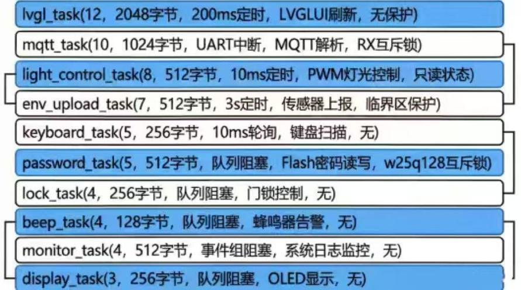

图2.4.1-2：任务优先级分配图

**（3）栈空间按需分配。**根据各任务的函数调用深度与局部变量使用情况，系统为不同任务分配了差异化的栈空间，从256字到2048字不等。例如，MQTT任务由于需要处理协议解析与JSON处理，分配了较大的栈空间（2048字）；而蜂鸣器、门锁等简单任务则分配较小的栈空间（256字）。这种按需分配的策略既保证了任务的正常运行，又避免了栈空间的浪费。

任务栈使用监控

| 任务               | 栈大小   | 最大使用 | 剩余 | 使用率 |
|--------------------|----------|----------|------|--------|
| lvgl_task          | 4096     | 3248     | 848  | 79%    |
| mqtt_task          | 2048     | 1780     | 268  | 87%    |
| env_upload_task    | 512      | 408      | 104  | 80%    |
| light_control_task | 256      | 192      | 64   | 75%    |
| 其他任务           | 合计1024 | 820      | 204  | 80%    |

### 2.4.2 进程间通信与同步机制

系统综合运用队列、互斥量、事件组等多种RTOS同步机制，实现了任务间的高效通信与资源共享：

**（1）队列解耦。**对于生产者-消费者模式的任务交互，系统采用消息队列进行解耦，如password_queue（密码队列）、display_queue（显示队列）、beep_queue（蜂鸣器队列）、lock_queue（门锁队列）等。队列机制使得生产任务与消费任务可以各自独立运行，通过缓冲区实现速率匹配与异步通信，提高了系统的并发性与健壮性。

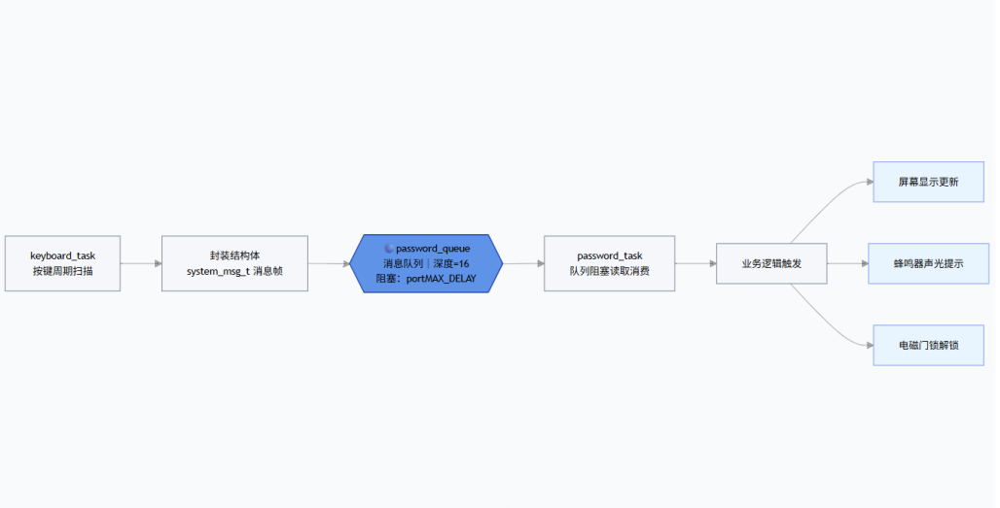

图2.4.2-1：消息队列传递机制图

**（2）互斥量保护共享资源。**对于需要互斥访问的共享资源（如SPI Flash），系统使用互斥量进行保护，如w25q128_mutex。互斥量确保了同一时刻只有一个任务可以访问共享资源，避免了数据竞争与资源破坏，同时支持优先级继承，有效防止了优先级反转问题。

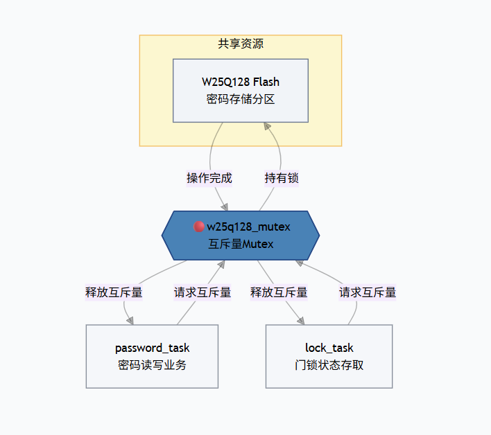

图2.4.2-2：互斥量保护机制图

**（3）事件组实现多事件等待。**系统使用事件组（system_event_group）实现多个任务对多种系统事件的等待与同步，如密码正确事件、密码错误事件、报警事件等。事件组机制可以让一个任务同时等待多个事件，也可以让多个任务等待同一个事件，具有很强的灵活性与表达能力。

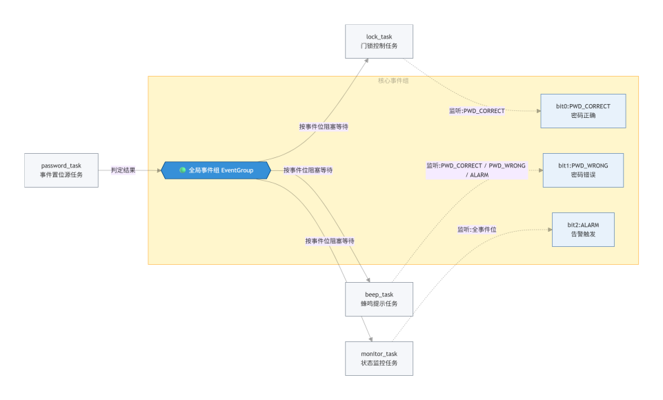

图2.4.2-3：事件组同步机制图

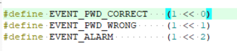

图2.4.2-4：事件标志组事件位图

### 2.4.3 GUI与外设总线解耦设计

针对嵌入式系统中GUI任务与外设驱动并发访问总线容易导致死锁或数据损坏的问题，本作品创新性地采用了"快照+定时器"的解耦设计：

**（1）volatile快照机制。**传感器数据（如光照值）在采集任务或驱动中读取成功后，写入volatile类型的快照变量（bh1750_ui_lux、bh1750_ui_valid等）。这些快照变量作为GUI任务与传感器任务之间的数据交换桥梁，实现了数据的单向传递。<sup>[10]</sup>

**（2）LVGL定时器只读。**GUI任务不直接访问传感器外设或I2C总线，而是通过lv_timer定时器回调函数，定期读取快照变量并更新界面显示。这种设计确保了所有的LVGL API调用都在LVGL任务上下文中执行，符合LVGL的线程安全要求，避免了在其他任务中直接调用LVGL函数导致的渲染异常或崩溃。<sup>[7]</sup>

**（3）总线访问隔离。**I2C、SPI等外设总线的访问统一由对应的驱动或任务负责，GUI任务不直接触碰硬件。这种分层设计使得各模块可以独立开发与调试，降低了系统的耦合度，提高了稳定性与可维护性。

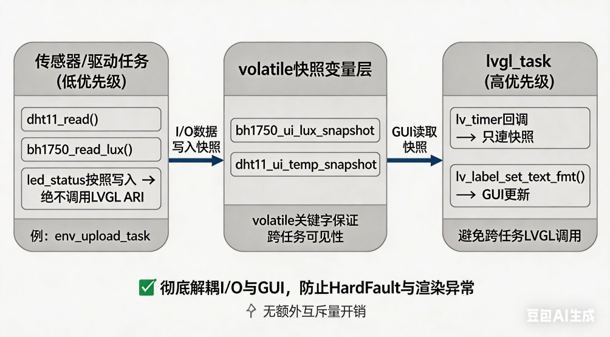

图2.4.3-1：GUI与I/O隔离架构图

### 2.4.4 工程化代码质量保障

本作品在代码层面体现了良好的工程化实践，包括：

**（1）配置化管理。**系统将可配置参数统一放在app_config.h头文件中，通过宏定义进行管理，如APP_LOG_ENABLE（日志开关）、APP_ONENET_JSON_MSG_ID（物模型消息ID）等。这种集中式配置管理使得参数修改变得简单安全，无需散落修改多处代码。

**（2）安全字符串操作。**系统广泛使用snprintf、vsnprintf等安全字符串函数进行JSON组包与日志输出，避免了缓冲区溢出风险，体现了面向量产的安全编码意识。

**（3）分层代码结构。**代码按功能分为HAL层、BSP驱动层、协议适配层、业务应用层、GUI表现层等多层结构，各层之间通过清晰的接口交互，符合高内聚低耦合的设计原则，便于代码的复用、测试与维护。

**（4）超时与容错处理。**对于传感器读取、网络通信等可能失败的操作，系统都设计了超时机制与错误处理逻辑，如DHT11单总线等待带超时、MQTT连接失败重试等，提高了系统的健壮性与异常恢复能力。

# 第三章 功能设计

## 3.1 环境感知与数据采集

### 3.1.1 温湿度采集功能

系统集成DHT11温湿度数字传感器，实现对环境温度与湿度的实时采集与监测。该功能的具体设计如下：

**（1）采集参数。**温度测量范围为0℃~50℃，精度±2℃；湿度测量范围为20%~90%RH，精度±5%RH。采样周期可配置，默认设置为3秒，兼顾数据实时性与系统功耗。

**（2）数据处理。**传感器原始数据经校验和验证后，分离为温度整数部分、温度小数部分、湿度整数部分、湿度小数部分，按照"整数.小数"的格式组合为标准数值。系统对异常数据（如超出量程、校验失败）进行过滤与标记，确保上报数据的有效性。

**（3）本地展示。**采集到的温湿度数据实时显示在LVGL主界面的环境信息面板上，用户可直观查看当前室内环境状况。数值显示采用专用字库，保证数字与单位的清晰美观。

**（4）云端上报。**温湿度数据作为物模型属性（CurrentTemperature、RelativeHumidity），通过MQTT协议周期性上报至OneNET云平台，支持历史数据存储、趋势曲线展示与远程查看。

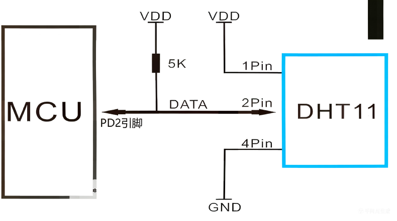

图3.1.1-1：DHT11传感器引脚定义与连接图

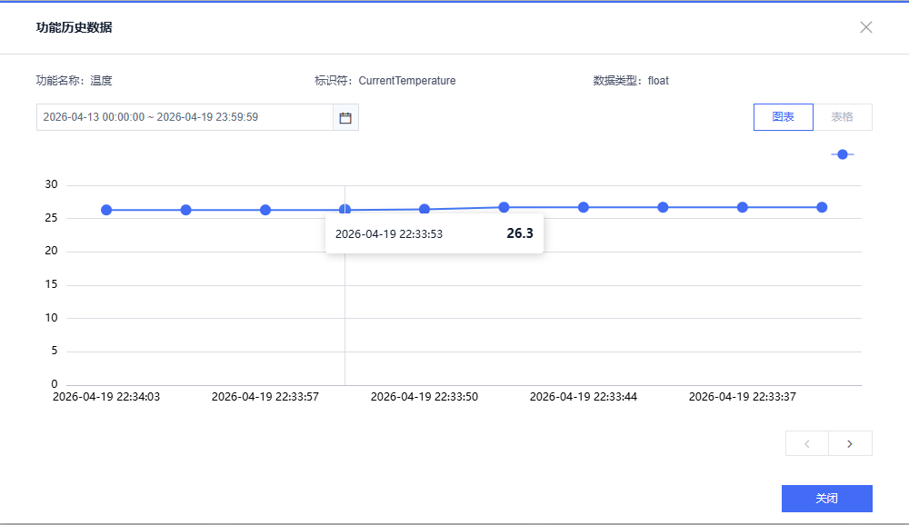

图3.1.1-1：OneNET历史温度数据图

### 3.1.2 光照采集功能

系统采用BH1750数字光照传感器（GY-302模块），通过I2C总线与主控连接，实现环境光照强度的精确测量。功能设计要点：

**（1）测量性能。**支持连续高分辨率测量模式，测量范围为1lx~65535lx，分辨率可达1lx。传感器内置16位ADC，直接输出数字量光照值，无需额外换算。

**（2）量程适配。**系统根据实际应用场景对光照值进行量程裁剪（默认上限10000lx），避免极端强光下数值溢出或显示异常。同时对原始数据进行平滑滤波处理，减少波动干扰。

**（3）UI快照机制。**光照值读取成功后写入volatile快照变量（bh1750_ui_lux、bh1750_ui_valid），由LVGL定时器定期读取并刷新界面显示。这种设计实现了I2C总线访问与GUI渲染的解耦，提高了系统稳定性。

**（4）智能联动基础。**光照数据可作为智能联动的触发条件，如当光照低于某一阈值时自动开启灯光（可扩展），当光照充足时自动关闭灯光或调节窗帘（可扩展），实现基于环境感知的主动智能控制。

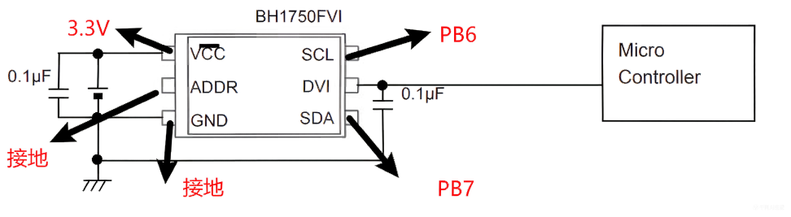

图3.1.2-1：BH1750光照传感器I²C连接图

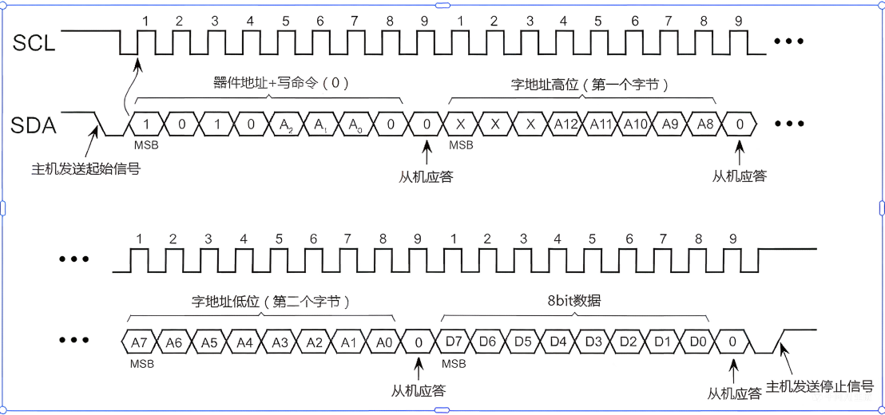

图3.1.2-2：BH1750 I²C读写时序图

### 3.1.3 模块状态监测

系统创新性地设计了模块化状态监测功能，对各子系统的运行状态进行实时监控并上报云端：

**（1）LightModuleStatus（光照模块状态）。**反映BH1750光照传感器的工作状态，枚举值包括：0-通信正常、1-通信失败、2-设备异常（预留）。系统根据I2C读取是否成功自动更新该状态，便于云端监控传感器健康度。

**（2）SoundModuleStatus（声音模块状态）。**反映语音模块的工作状态，枚举定义与光照模块一致。当前版本语音模块采用GPIO二线编码方式，默认状态为正常，后续可扩展为UART语音芯片时增加更丰富的状态检测。

**（3）L610ModuleStatus（蜂窝模块状态）。**反映广和通L610蜂窝通信模组的工作状态，枚举定义同上。系统以MQTT连接是否成功作为蜂窝链路正常的判断依据，直观反映端云通信的健康状况。

这些模块化状态属性的设计，使得云平台可以实时掌握终端各子系统的运行状态，便于远程运维、故障诊断与设备管理，体现了面向量产的系统设计思维。


图3.1.3-1：OneNET设备状态实时图

## 3.2 设备控制与联动

### 3.2.1 PWM调光原理

系统采用PWM（脉冲宽度调制）技术实现灯光的多档亮度调节。通过改变PWM信号的占空比，可以控制LED的平均电流，从而实现不同亮度的输出。系统支持关、低亮、中亮、高亮四档亮度调节，满足不同场景下的照明需求。

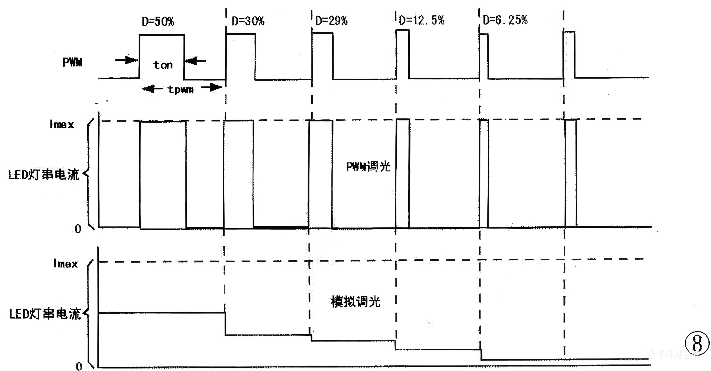

图3.2.1-1 PWM调光原理图

### 3.2.2 客厅灯多档控制

客厅照明是系统的核心控制对象，支持多档亮度调节与多入口控制。功能设计如下：

**（1）亮度档位。**客厅灯支持4档亮度控制：0档（关闭）、1档（低亮）、2档（中亮）、3档（高亮）。各档位通过PWM占空比实现，PWM频率设置为人眼无闪烁的安全频率（如1kHz以上），保证调光的平滑性与舒适性。

**（2）云端映射。**本地4档亮度与云端物模型属性led_brightness（0~100范围）建立分段映射关系：0对应关闭，1~33对应低亮，34~66对应中亮，67~100对应高亮。这种映射设计既兼容了云端连续值的物模型规范，又适配了本地多档控制的实际需求。

**（3）多源控制。**客厅灯支持触控、语音、蓝牙、云端等多种控制方式，所有控制入口均通过统一的状态机进行仲裁，确保各入口之间的状态一致性。用户无论通过哪种方式控制，灯的实际状态始终保持唯一且准确。

**（4）状态反馈。**灯光状态的变化会实时反馈到LVGL界面（设备卡片颜色/图标变化），并在下一个上报周期同步到云端，实现"操作—执行—反馈—同步"的完整闭环。


图3.2.2-2：低亮状态展示图


图3.2.2-3：中亮状态展示图


图3.2.2-4：高亮状态展示图

### 3.2.3 多设备扩展控制

系统采用模块化设计，支持多种智能家居设备的扩展接入：

**（1）卧室灯控制。**支持卧室灯的开关控制，可通过触控界面或其他方式进行操作。卧室灯作为独立设备，拥有单独的状态变量与控制逻辑，与客厅灯互不干扰。

**（2）智能窗帘控制。**支持电动窗帘的开/关控制，可通过触控界面上的窗帘卡片进行操作。窗帘控制采用继电器或电机驱动方案，支持到位检测与限位保护（可扩展）。

**（3）音响控制。**支持音响设备的开关控制，可与其他设备联动，如"回家模式"自动开启音响播放背景音乐，"睡眠模式"自动关闭音响。

**（4）可扩展架构。**系统的设备控制采用统一的抽象接口，新增设备类型时只需实现对应的驱动与状态管理，无需修改核心控制框架，具有良好的可扩展性。未来可支持更多设备类型，如空调、空气净化器、加湿器等。

### 3.2.4 场景联动功能

系统支持基于场景的设备联动控制，通过预设场景实现一键式多设备协同操作：

**（1）回家模式。**一键开启客厅灯、打开窗帘、播放背景音乐，营造温馨的回家氛围。可通过触控、语音或远程触发。

**（2）离家模式。**一键关闭所有灯光、关闭窗帘、关闭电器设备，同时启动安防监控，确保家庭安全。

**（3）睡眠模式。**一键关闭主灯、开启夜灯、关闭窗帘，营造舒适的睡眠环境。可设置定时触发或语音触发。

**（4）自动联动。**基于传感器数据的自动联动，如光照不足时自动开灯、温度过高时自动开空调等。联动规则可配置，支持用户自定义。

## 3.3 云端互联与远程管理

### 3.3.1 OneNET平台设备状态监控

系统接入中国移动OneNET Studio云平台后，用户可以通过云平台的Web控制台实时查看设备的在线状态、环境数据、设备属性等信息。平台提供直观的可视化界面，支持数据的实时展示与历史查询。


图3-3 OneNET平台设备状态与属性实时监控

### 3.3.2 设备上云与数据上报

系统通过广和通L610 LTE Cat.1模组接入中国移动OneNET云平台，实现设备的云端互联与数据上报：

**（1）MQTT协议接入。**采用MQTT 3.1.1协议与OneNET平台建立长连接，设备作为MQTT客户端主动连接平台Broker（mqtts.heclouds.com:1883）。MQTT协议具有轻量、低开销、易实现的特点，非常适合资源受限的嵌入式物联网终端。

**（2）物模型属性上报。**系统按照OneNET物模型规范，将采集到的环境数据与设备状态封装为JSON格式，通过property/post主题周期性上报。上报内容包括：温度、湿度、光照、灯亮度档位、各模块状态等，支持平台侧实时展示与历史存储。

**（3）上报策略。**默认上报周期为3秒，可根据实际需求调整。系统采用"周期上报+变化上报"相结合的策略，既保证数据的连续性，又在状态变化时及时同步，兼顾了数据实时性与流量功耗。

**（4）QoS与可靠性。**MQTT消息支持QoS等级配置，关键控制指令可采用QoS 1（至少送达一次），确保消息的可靠传输。系统还实现了断线重连机制，网络恢复后自动重新连接平台并恢复数据上报。

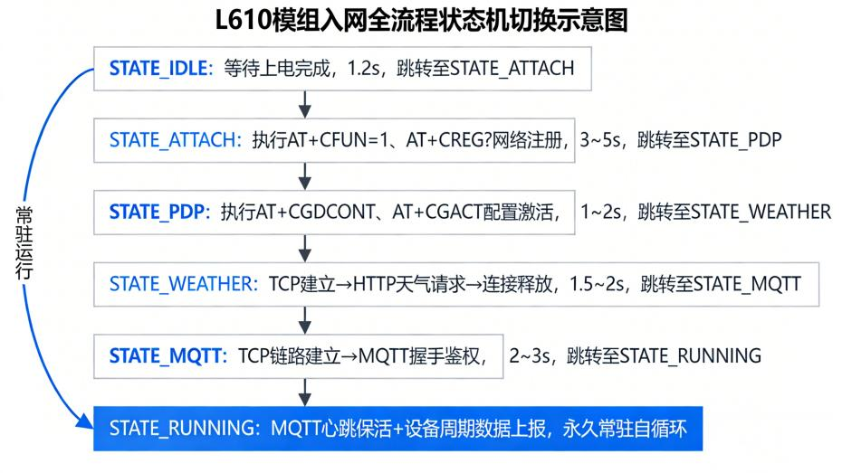

图3.3.1-1：L610模组AT指令交互流程图

### 3.3.3 远程控制与下行指令

系统支持通过云平台进行远程设备控制，实现"云端下发—终端执行—状态反馈"的完整闭环：

**（1）属性设置。**云平台通过property/set主题向设备下发属性设置指令，如调节灯光亮度（led_brightness）。设备接收到指令后，解析JSON payload，提取参数值，执行相应的控制操作。

**（2）JSON解析。**系统实现了对OneNET平台下发格式的完整解析支持，包括外层消息结构与内层params结构的二次解析。能够正确处理平台下发的标准JSON格式，提取出具体的属性名与属性值，并映射到本地控制逻辑。

**（3）指令应答。**设备执行完下行指令后，通过property/set_reply主题向平台发送应答消息，告知指令执行结果（成功/失败及原因）。平台侧可根据应答确认指令是否被正确执行，实现可追溯的控制流程。

**（4）安全校验。**系统对下行指令进行参数合法性校验，防止非法参数或越权操作导致设备异常。同时支持指令来源标识与审计记录，便于问题排查与安全审计。


图3.3.2-1：OneNET平台远程控制图

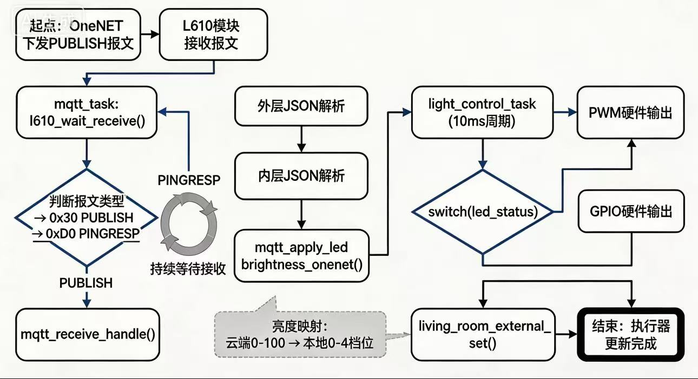

图3.3.2-2：下行指令处理流程图

### 3.3.4 互联网服务接入

除了物联网平台通信，系统还支持标准互联网服务的接入，丰富了终端的信息获取能力：

**（1）天气服务。**系统通过HTTP协议接入心知天气API，获取实时天气信息与未来天气预报。天气数据包括天气状况（晴/阴/雨等）、温度范围等，用于在LVGL界面上展示天气卡片，为用户提供生活参考。

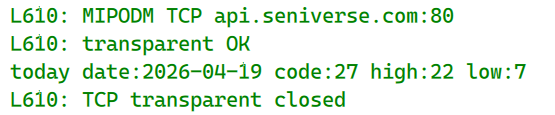

图3.3.3-1：L610访问心知天气图

**（2）网络时间同步。**系统通过AT+CCLK?命令从蜂窝网络获取精确时间，作为本地时钟的初始值。网络时间同步功能保证了设备在没有RTC硬件或RTC不准的情况下，仍能显示准确的时间，提升用户体验。

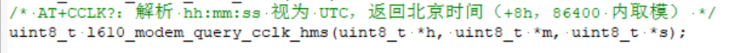

图3.3.3-2：封装AT+CCLK指令图

**（3）可扩展服务。**系统的HTTP客户端框架具有良好的可扩展性，未来可方便地接入更多互联网服务，如新闻资讯、语音识别、在线翻译等，为终端赋予更丰富的智能能力。

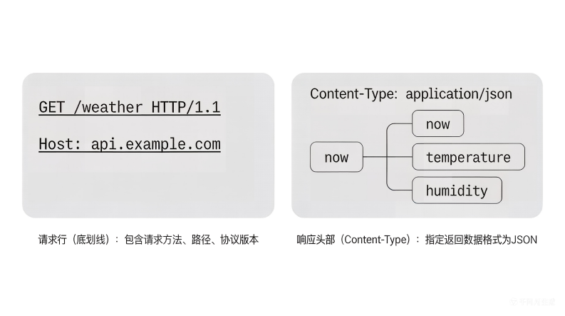

图3.3.3-3：HTTP请求/响应报文格式图

## 3.4 多模态人机交互

### 3.4.1 四重交互架构

系统构建了"物联人"四重交互通道，包括LVGL触控界面、语音识别、蓝牙透传、矩阵键盘四种交互方式，满足不同用户群体、不同场景下的操作需求，实现多模态人机交互。

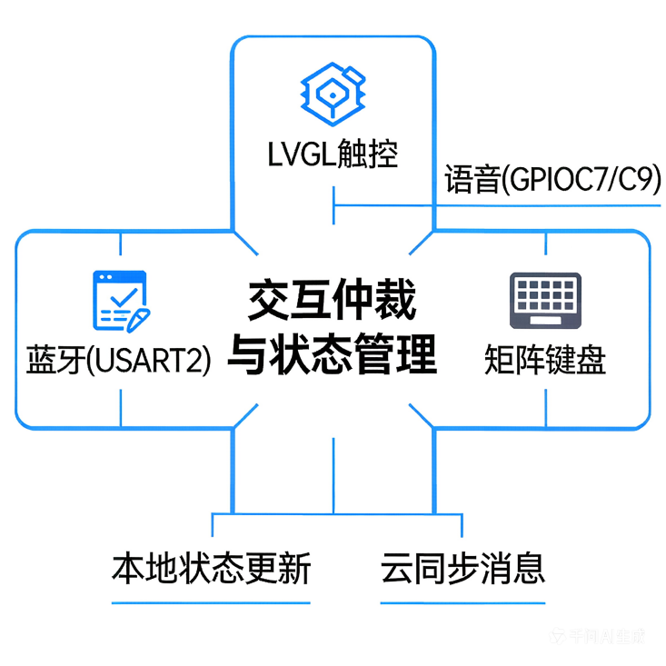

图3-1 物联人四重交互架构图

### 3.4.2 LVGL图形界面布局

系统采用LVGL开源图形库构建嵌入式GUI界面，主界面分为环境数据显示区、设备控制区、状态指示区三个功能区域。界面设计简洁直观，支持触控操作，用户可以通过屏幕直观地查看环境数据并控制设备。

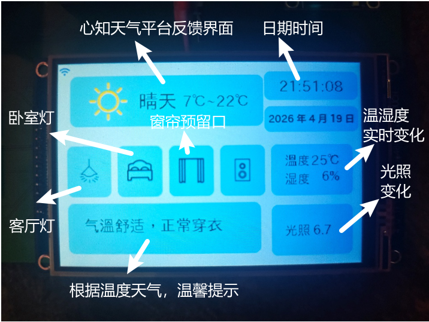

图3-2 LVGL图形界面布局图

### 3.4.3 LVGL图形触控界面

系统采用LVGL开源图形库构建了功能丰富、界面美观的本地化人机交互界面，是"物联人"的核心入口<sup>[11]</sup>：

**（1）主界面布局。**主界面采用分区布局，包括：顶部天气与时间区、中部设备控制区（客厅灯、卧室灯、窗帘、音响等设备卡片）、底部环境信息区（温湿度、光照）、侧边快捷功能区。整体布局清晰、信息密度高，一屏即可展示核心信息与主要控制入口。

**（2）触控交互。**支持电阻式或电容式触摸屏，用户可通过点击、滑动等手势进行操作。点击设备卡片即可切换开关状态或调节档位，操作直观便捷。界面元素具有点击反馈效果（如颜色变化、按下动画），提升交互体验。

**（3）信息展示。**界面实时显示当前时间、日期、天气、温湿度、光照、设备状态等多种信息，用户无需手机即可一目了然地掌握家庭环境与设备运行状况。这对于不擅长使用智能手机的老年用户尤为友好。

**（4）界面美观。**采用现代化的UI设计风格，包括圆角卡片、渐变色、图标化设计等，视觉效果美观专业。支持中文字体显示，所有文本均为中文，符合国内用户使用习惯。

界面组件详细说明

|   区域   | 组件类型  |   尺寸   |     显示内容     | 更新频率 |
|:--------:|:---------:|:--------:|:----------------:|:--------:|
|  状态栏  | 标签+图标 |  480×40  |  时间、网络状态  |   1秒    |
| 天气卡片 | 标签+图标 | 200×120  | 城市、天气、温度 |  1小时   |
| 环境数据 |   标签    | 280×120  | 温度、湿度、光照 |  200ms   |
| 设备控制 |   按钮    | 160×80×4 | 灯光、窗帘、门锁 | 事件触发 |
| 底部提示 |   标签    |  480×50  |     出门提示     | 事件触发 |

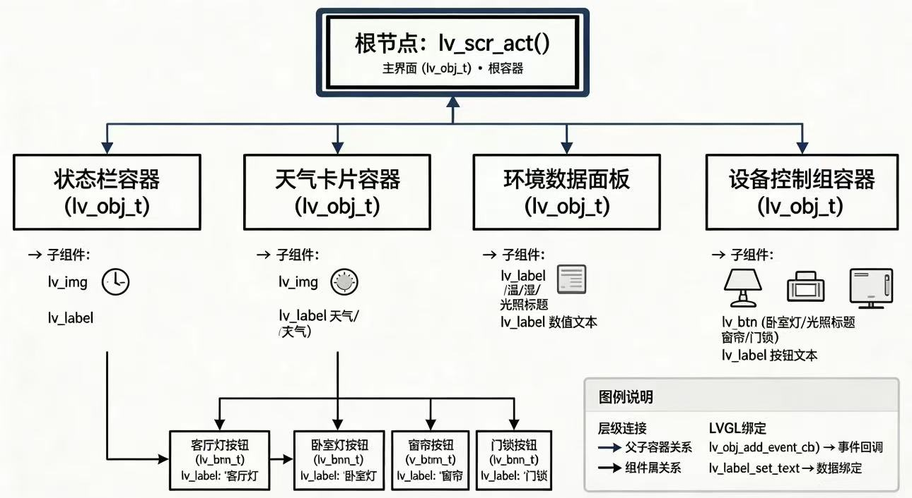

图3.4.1：LVGL界面组件树图

### 3.4.4 语音控制

系统集成语音识别模块，支持语音控制功能，为用户提供了免提的自然交互方式：

**（1）语音指令。**支持"打开客厅灯"、"关闭客厅灯"、"调亮灯光"、"调暗灯光"等常用语音指令，用户可通过自然语言直接控制设备，无需动手操作。

**（2）二线编码接口。**语音模块采用二线编码输出方式，通过GPIO口与主控连接。模块识别到有效指令后，输出对应的编码值（0~3），主控读取编码值并映射为相应的控制动作。

**（3）档位映射算法。**针对语音模块输出编码与实际亮度档位可能不对应的问题，系统设计了专门的映射函数voice_living_level_from_raw()，可根据语音模块的实际真值表灵活调整映射关系，确保语音控制的准确性。

**（4）离线可用。**语音识别在本地模块完成，无需联网即可使用，即使在断网情况下语音控制功能依然可用。这保证了语音交互的可靠性与低延迟。

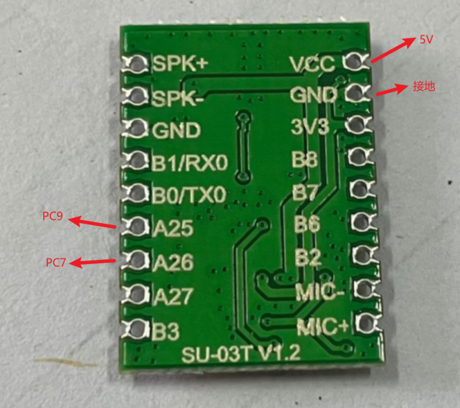

图3.4.2-1：语音模块连接

语音指令映射表

| 语音命令   | 原始电平值 | 映射档位 | 执行动作   |
|------------|------------|----------|------------|
| "关灯"     | 0-500      | 0        | LED OFF    |
| "开灯低亮" | 501-1000   | 1        | LED LOW    |
| "开灯中亮" | 1001-2000  | 2        | LED MEDIUM |
| "开灯高亮" | 2001-3000  | 3        | LED HIGH   |

### 3.4.5 蓝牙控制

系统支持蓝牙串口通信方式，可通过手机蓝牙进行设备控制：

**（1）蓝牙串口透传。**采用蓝牙串口模块（如HC-05/HC-08），通过UART与主控连接，实现手机与设备之间的无线串口通信。手机端可通过蓝牙串口APP发送控制指令。

**（2）单字节指令协议。**设计了简洁高效的单字节指令协议，每个指令由一个字节表示，如0表示关灯、1表示低亮、2表示中亮、3表示高亮。协议简单易实现，适合资源受限的嵌入式系统。

**（3）近场控制。**蓝牙控制适用于家庭内部的近场控制场景，用户在家中可通过手机蓝牙直接控制设备，无需依赖WiFi或蜂窝网络，响应速度快、延迟低。

**（4）安全配对。**蓝牙模块支持PIN码配对，只有经过配对的设备才能连接控制，保证了控制的安全性，防止陌生人恶意控制。

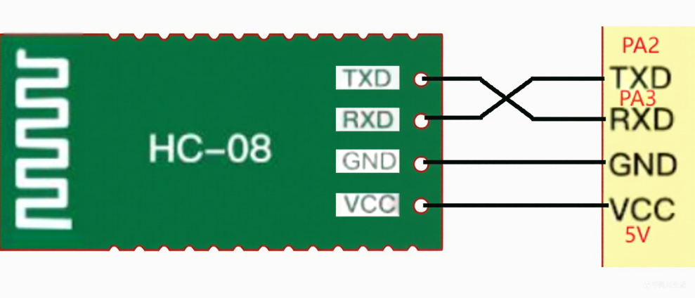

图3.4.3-2：蓝牙模块连接图

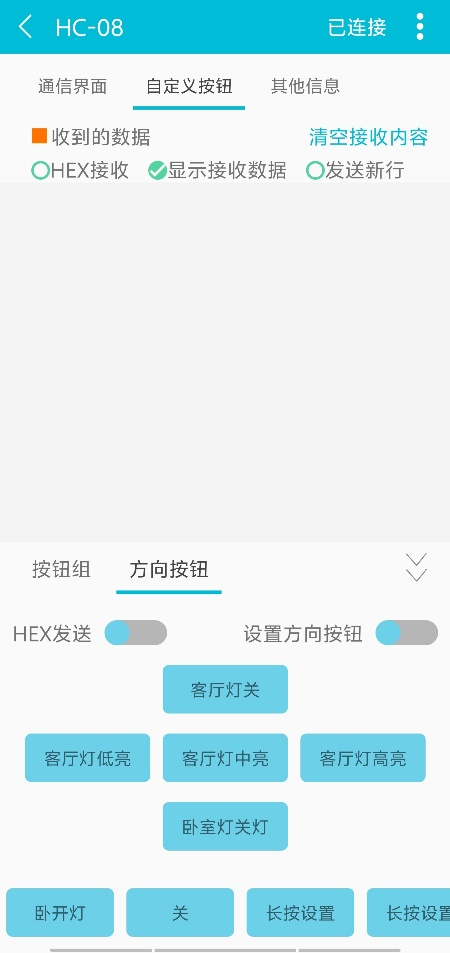

图3.4.3-1：蓝牙操控界面图

蓝牙指令协议

| 指令字节 | 含义 | 执行动作   |
|----------|------|------------|
| 0x01     | 关灯 | LED OFF    |
| 0x02     | 低亮 | LED LOW    |
| 0x03     | 中亮 | LED MEDIUM |
| 0x04     | 高亮 | LED HIGH   |

### 3.4.6 物理按键与键盘

除了触控、语音、蓝牙等现代交互方式，系统还保留了物理按键与矩阵键盘等传统交互方式，兼顾不同用户群体的使用习惯：

**（1）物理按键。**设备配备实体按键，可用于基本的开关控制或场景切换。物理按键具有操作简单、反馈明确、无需学习的优点，尤其适合老年用户或应急情况下的快速操作。

**（2）矩阵键盘。**系统集成4×4矩阵键盘，主要用于门禁密码输入与系统设置。键盘采用行列扫描方式读取按键值，支持按键消抖与长按检测，保证输入的准确性与可靠性。

**（3）多模态融合。**多种交互方式并行存在、互为补充，用户可根据自身习惯与场景需求选择最适合的控制方式。这种多模态交互设计体现了"以人为本"的设计理念，最大化了产品的适用人群与场景覆盖。

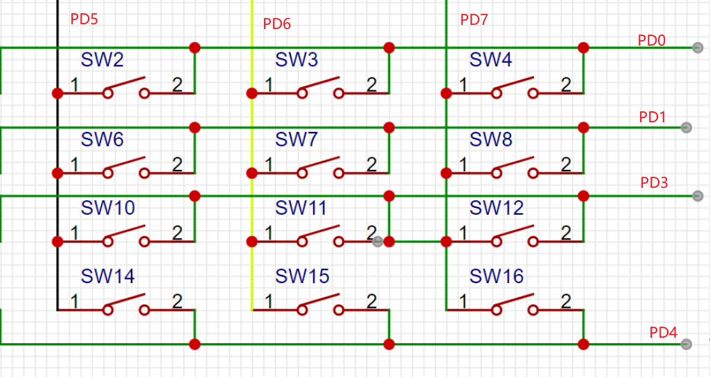

图3.4.4-1：4×3矩阵键盘电路图

键盘扫描原理

| 行引脚  | 列引脚  | 按键        | 扫描方法             |
|---------|---------|-------------|----------------------|
| PA0-PA3 | PA4-PA7 | 0-9, *, # | 逐行拉低，检测列电平 |

## 3.5 安全门禁子系统

### 3.5.1 密码门锁功能

系统集成了完整的密码门禁子系统，实现了基于密码的电子锁控制功能：

**（1）密码验证。**用户通过矩阵键盘输入密码，系统与存储的正确密码进行比对，验证通过则触发开锁动作。支持6位数字密码，密码长度可配置，具有足够的安全性。

**（2）密码修改。**支持用户自行修改密码，通过特定的管理员操作进入密码设置模式，输入旧密码验证后可设置新密码。密码修改功能保证了用户的自主管理权限。

**（3）密码存储。**密码存储在外部SPI Flash（W25Q128）的固定扇区中，掉电不丢失。Flash读写操作通过互斥量保护，防止多任务并发访问导致的数据损坏。

**（4）默认密码处理。**首次使用或密码重置后，系统进入默认密码状态，并提示用户尽快修改，避免因默认密码导致的安全隐患。

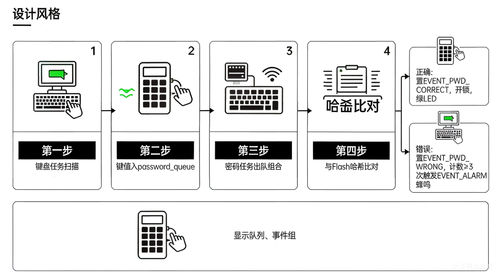

图3.5.1-1：门禁密码验证流程图

**密码管理：**

- 默认密码：111

- 密码存储：W25Q128 Flash（加密存储）

- 错误次数：连续3次错误触发告警

- 密码修改：长按#键进入设置模式

### 3.5.2 门锁与状态反馈

**（1）电磁锁控制。**系统通过GPIO驱动电磁锁或继电器模块，实现门锁的开关控制。密码验证通过后，系统自动开锁，并在设定时间后自动关锁。

**（2）自动关锁。**采用FreeRTOS软件定时器（auto_lock_timer）实现自动关锁功能。开锁后启动定时器，定时时间到后自动发送关锁消息，由锁控任务执行关锁动作。自动关锁时间可配置（默认10秒）。

**（3）状态显示。**门禁状态与操作提示通过OLED显示屏进行展示，如"请输入密码"、"密码正确"、"密码错误"、"请输入新密码"等。OLED显示配合蜂鸣器提示音，为用户提供清晰的交互反馈。

**（4）报警功能。**连续多次密码错误时，系统触发报警机制，包括蜂鸣器长鸣、锁定键盘一段时间等，防止暴力破解。同时可将报警事件上报云端，实现远程告警。

### 3.5.3 门禁子系统与主系统集成

门禁子系统作为整个智能家居系统的有机组成部分，与主系统深度集成：

**（1）事件组同步。**采用FreeRTOS事件组（system_event_group）实现门禁事件与其他任务的同步，如密码正确事件、密码错误事件、报警事件等。其他任务（如监控任务、灯光控制任务）可等待这些事件并触发相应的联动动作。

**（2）场景联动。**门禁事件可触发相应的智能家居场景，如"开门自动开灯"、"开门播放欢迎音乐"等，实现从进门开始的智能化体验。

**（3）云端记录。**门禁开锁记录、报警事件等可上报云端，用户可远程查看门禁历史记录，了解家人归家情况或异常报警事件，增强家庭安全感。

**（4）任务解耦。**门禁相关功能划分为独立的任务（keyboard_task、password_task、lock_task、display_task、beep_task等），通过队列与事件组进行通信，各任务职责清晰、耦合度低，便于维护与扩展。

# 第四章 系统实现

## 4.1 系统总体架构

### 4.1.1 系统整体架构

本系统采用端边云协同的三层架构设计，包括终端感知执行层、边缘计算控制层和云端服务管理层。<sup>[9]</sup>终端层负责环境数据采集与设备执行控制，边缘层负责本地智能决策与人机交互，云层负责远程管理与数据分析。三层协同工作，构建完整的智能家居系统。

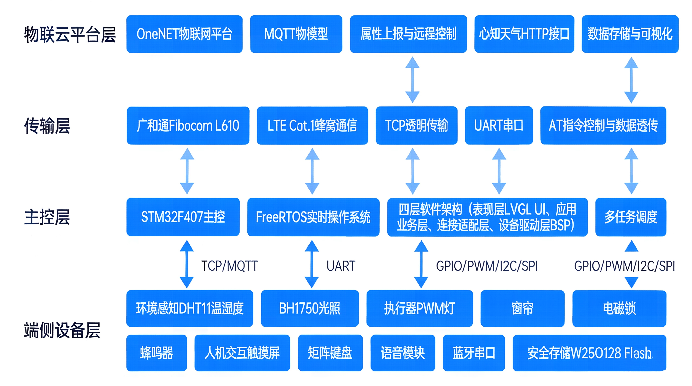

图4.1.1-1 系统整体架构图

### 4.1.2 三位一体架构全景

系统严格对齐广和通IoT赛题的"物联云、物联物、物联人"设计理念，构建三位一体的万物互联架构。物联云实现设备上云与远程管理，物联物实现设备间的感知联动，物联人实现多模态人机交互，三者有机结合形成完整的系统闭环。

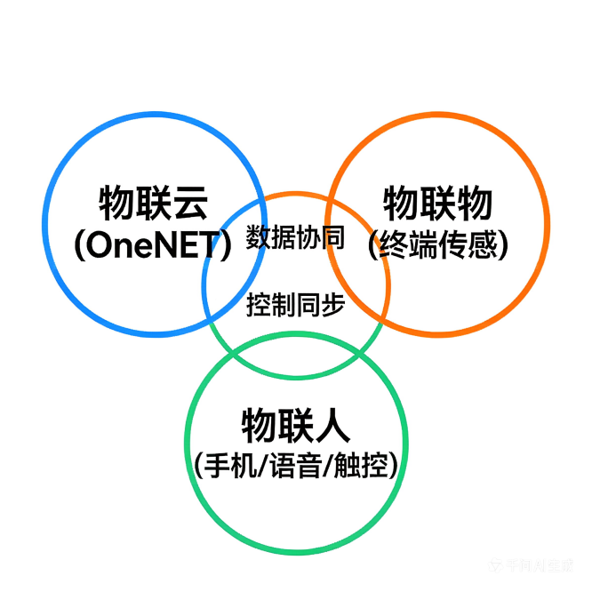

图4-2 三位一体架构全景图

### 4.1.3 系统完整架构总览

从硬件到软件、从终端到云端，系统构建了完整的技术栈。硬件层以STM32F407为主控，集成L610蜂窝模组、多种传感器与执行器；软件层基于FreeRTOS实现多任务并发，采用分层架构保证可维护性；云平台层基于OneNET实现设备接入与数据管理。

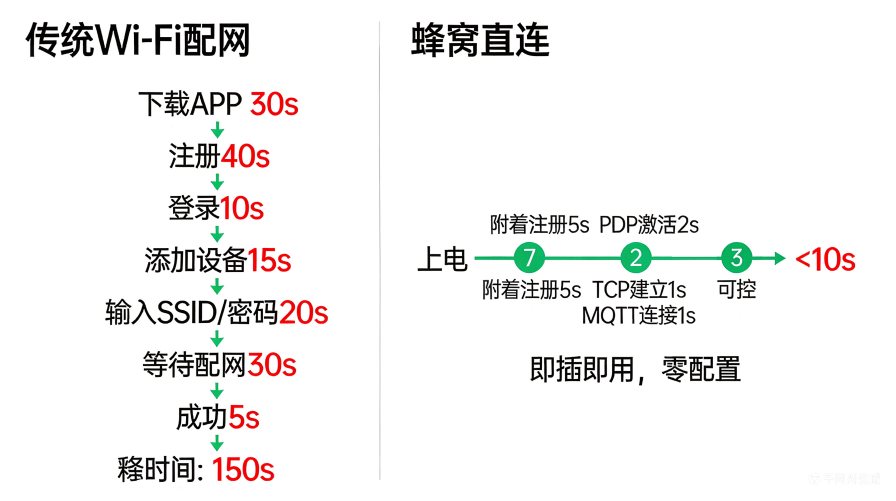

图4-3 系统完整架构总览图

### 4.1.4 端边云三层架构

本系统采用经典的"端—边—云"三层物联网架构，各层职责清晰、协同工作，共同构成完整的智能家居中枢系统：

**（1）端侧（感知与执行层）。**端侧由各类传感器与执行器组成，负责环境数据采集与设备动作执行。传感器包括DHT11温湿度传感器、BH1750光照传感器等，执行器包括LED照明、电动窗帘、电磁锁、蜂鸣器等。端侧设备通过GPIO、I2C、PWM等接口与主控MCU连接，在MCU的统一调度下协同工作。

**（2）边缘层（主控与处理层）。**边缘层以STM32F407ZGT6微控制器为核心，运行FreeRTOS实时操作系统，承担数据处理、设备控制、本地智能、人机交互等核心功能。边缘层是整个系统的"大脑"，负责端侧设备的管理与控制、本地逻辑的执行、人机交互的响应，以及与云端的通信协调。边缘层具有一定的计算与决策能力，可在断网情况下独立运行，保证系统的基本功能可用性。

**（3）云层（平台与服务层）。**云层以中国移动OneNET Studio物联网平台为核心，提供设备接入、数据存储、远程控制、数据分析、可视化展示等服务。云端负责设备的统一管理、数据的长期存储与分析、远程控制指令的下发，以及与第三方应用的对接。云端具有强大的计算与存储能力，可实现大数据分析、智能决策、模型训练等复杂功能，为系统的智能化升级提供支撑。


图4.1.1-1：端边云协同架构图

### 4.1.5 分层软件架构

系统软件采用分层架构设计，从下到上依次为：硬件抽象层、驱动层、协议与平台适配层、业务应用层、表现层。各层之间通过标准接口交互，具有良好的可移植性与可维护性。

**（1）硬件抽象层（HAL）。**基于STM32 HAL库实现，提供对MCU片上外设（GPIO、UART、I2C、SPI、TIM、RCC等）的抽象访问接口。HAL层屏蔽了底层硬件的细节，使得上层软件无需关心具体的寄存器操作，提高了代码的可移植性。

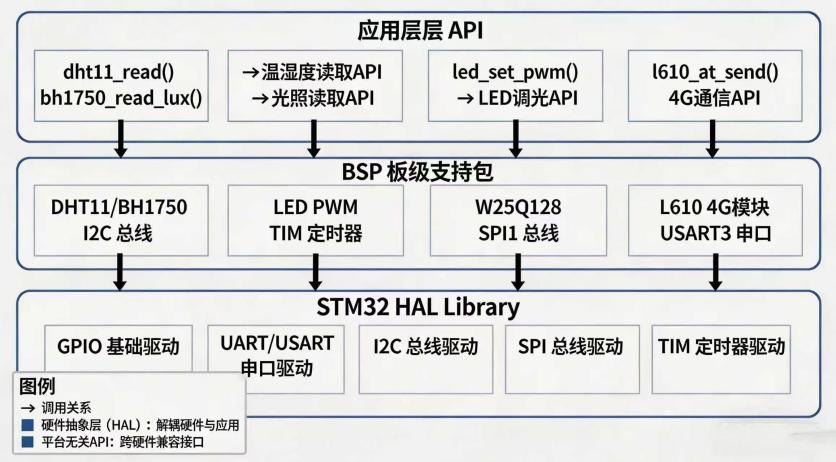

图4.1.2-1：HAL层驱动接口图

**（2）板级支持包层（BSP/驱动层）。**实现对各类外部硬件模块的驱动，包括dht11（温湿度）、bh1750（光照）、led（灯光）、curtain（窗帘）、voice（语音）、bluetooth（蓝牙）、keyboard（键盘）、lock（门锁）、oled（显示屏）、w25q128（Flash存储）、beep（蜂鸣器）等。驱动层封装了各硬件模块的操作细节，向上层提供简洁的功能调用接口。

**（3）协议与平台适配层。**实现通信协议与云平台的适配，包括l610（蜂窝模组驱动）、mqtt（MQTT协议栈）、onenet（OneNET平台适配）、weather（天气服务客户端）等。该层负责建立与维护网络连接、实现协议报文的封装与解析、完成与云平台的业务交互。

**（4）业务应用层。**实现系统的核心业务逻辑，包括FreeRTOS任务调度、灯控状态机、环境数据采集与上报、门禁密码管理、场景联动逻辑等。业务层是系统功能的核心实现，基于下层提供的驱动与协议接口，完成具体的业务功能。

**（5）表现层（HMI）。**实现人机交互界面，基于LVGL图形库构建，包括主界面、设备控制卡片、环境信息面板、天气显示、时钟等。表现层负责信息的可视化展示与用户触控输入的处理，是用户与系统交互的直接接口。

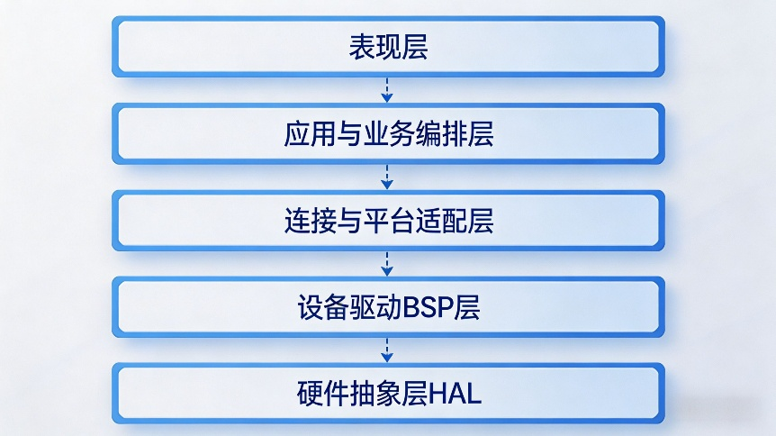

图4.1.2-1：软件五层架构图

### 4.1.6 与赛题架构口径对齐

本系统架构严格对齐广和通IoT方向赛题的"传输层+主控+物联云/物/人"表述：

**（1）传输层。**对应广和通Fibocom L610 LTE Cat.1蜂窝模组，通过USART3以115200bps波特率与MCU对接，采用标准AT命令进行控制，支持TCP透传模式承载MQTT、HTTP等应用层协议。传输层负责提供安全、可靠、可移动、便捷的广域数据传输通道，是连接终端与云端的桥梁。

**（2）主控层。**对应STM32F407外部处理器，运行FreeRTOS实时操作系统，承担应用协议栈（MQTT、HTTP）、物模型语义处理、本地控制逻辑、人机交互界面等全部计算任务。主控层是系统的智能核心，负责"物联物"与"物联人"的实现。

**（3）物联云。**对应中国移动OneNET Studio云平台，实现设备接入、属性上报、属性设置、数据存储、可视化管理等功能。物联云是系统的云端大脑，负责设备的统一管理与数据的价值挖掘。

**（4）物联物。**对应系统中的各类传感器与执行器，包括温湿度、光照等感知设备，以及灯光、窗帘、门锁等控制设备。这些设备在主控MCU的统一调度下协同工作，实现环境感知与设备联动。

**（5）物联人。**对应系统的多模态人机交互接口，包括LVGL触控界面、语音控制、蓝牙控制、矩阵键盘等。用户可通过多种方式与系统交互，实现对智能家居的操控与管理。

## 4.2 硬件系统设计

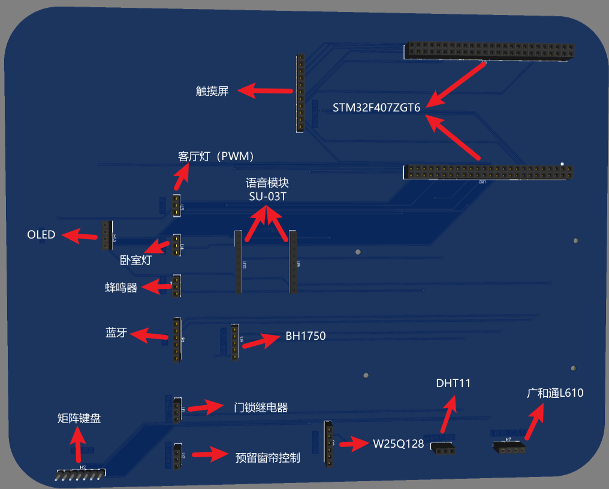

图4.2：硬件整体架构框图

### 4.2.1 主控单元

系统主控采用意法半导体（ST）的STM32F407ZGT6微控制器，该芯片基于ARM Cortex-M4F内核，具有高性能、低功耗、丰富外设等特点，是物联网终端的理想选择。

**（1）核心参数。**CPU主频最高168MHz，内置FPU（浮点运算单元），支持DSP指令；Flash容量1MB，SRAM容量192KB；工作电压2.0V~3.6V，支持多种低功耗模式。

**（2）外设资源。**片上集成丰富的外设接口，包括：3路SPI、3路I2C、6路UART/USART、2路CAN、1路SDIO、1个USB OTG FS/HS、1个以太网MAC、16路12位ADC、2路12位DAC、17路定时器、多达140个GPIO等。丰富的外设资源为系统扩展提供了充足的接口。

**（3）性能优势。**Cortex-M4F内核的计算能力足以应对本系统的各类任务，包括传感器数据处理、GUI渲染、网络协议栈运行等。192KB的SRAM为FreeRTOS多任务运行、LVGL图形缓冲、网络数据缓冲提供了充足的内存空间。1MB的Flash可容纳完整的固件程序，包括驱动、协议栈、业务逻辑、GUI资源等。

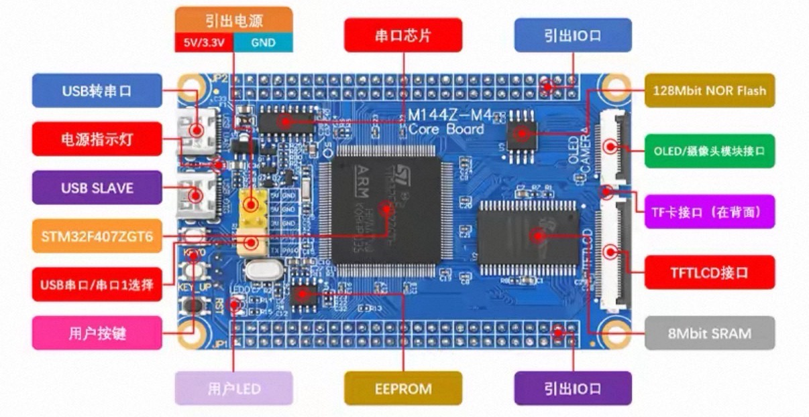

图4.2.1-1：核心主控单元（STM32F407ZGT6）图

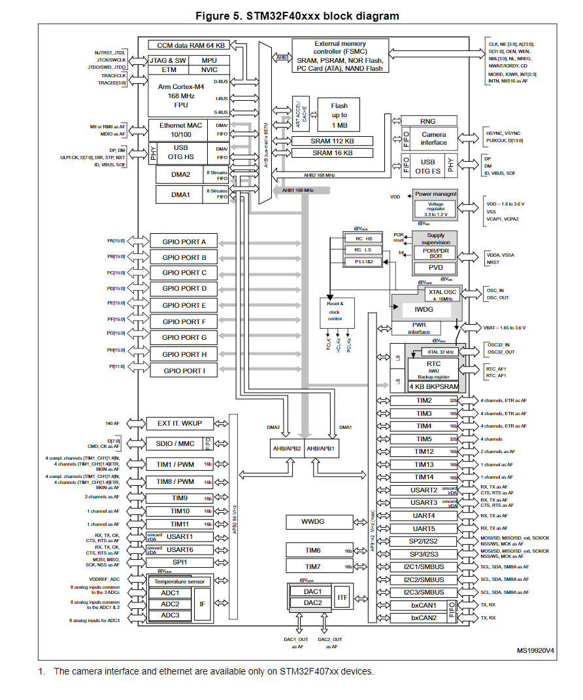

图4.2.1-2：STM32F407内部资源框图

### 4.2.2 蜂窝通信单元

蜂窝通信单元采用广和通Fibocom L610 LTE Cat.1模组，这是一款高性能、低功耗的LTE Cat.1 bis无线通信模组，专为中低速率物联网应用设计。

**（1）网络支持。**支持LTE-TDD/LTE-FDD双模，下行峰值速率10Mbps，上行峰值速率5Mbps；支持国内各运营商4G网络，向下兼容2G网络；支持VoLTE语音通话功能。

**（2）硬件接口。**支持1路USB 2.0、1路2线3.3V电平UART、模拟音频接口等；支持多种供电方式，包括Arduino接口供电、USB口供电、外部DC供电。

**（3）软件协议。**支持标准AT命令集，内置TCP/IP协议栈，支持HTTP(S)、FTP(S)、TCP、UDP、MQTT、SSL等多种网络协议；支持华为云、腾讯云、阿里云、百度云等主流云平台的快速接入。

**（4）与主控连接。**L610模组通过USART3与STM32F407主控连接，波特率默认115200bps，采用全双工异步串口通信。模组的复位、状态指示等控制信号通过GPIO与主控连接，便于主控对模组进行状态监控与复位控制。

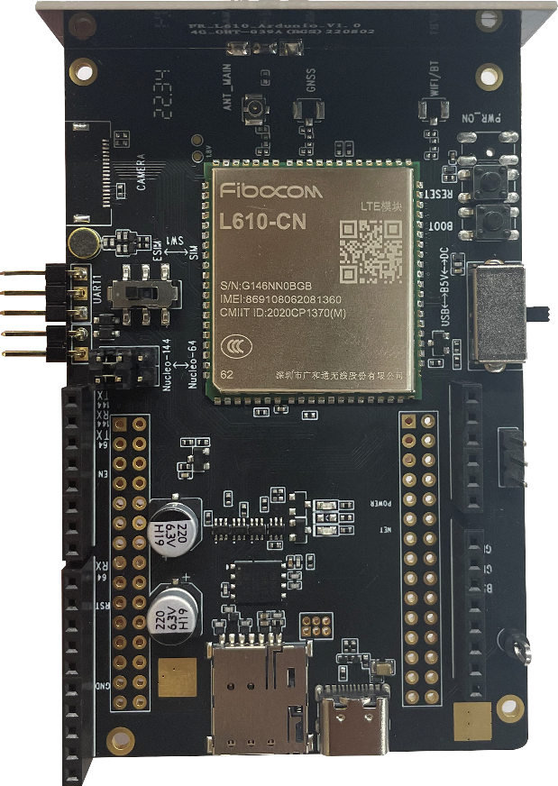

图4.2.2-1：ADP_L610_Arduino_V3.0.2图

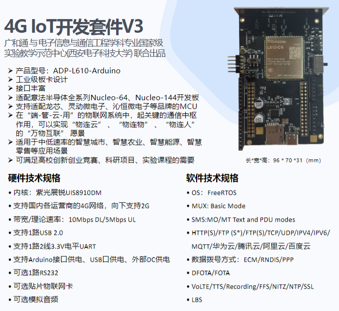

图4.2.2-2：L610模组内部功能框图

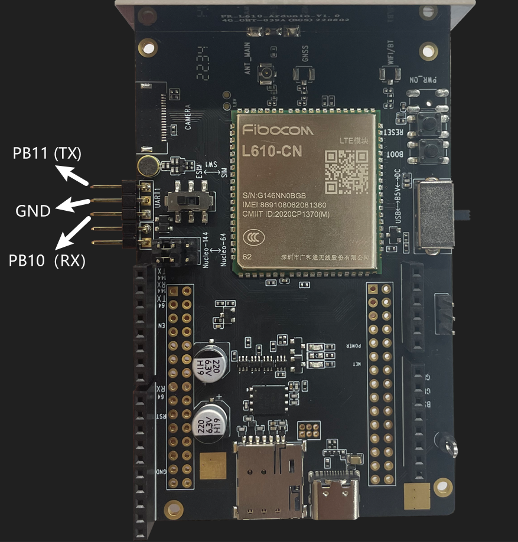

图4.2.2-3：USART3连接原理图

### 4.2.3 感知子系统

系统集成了多种环境传感器，构建了完善的环境感知能力：

**（1）DHT11温湿度传感器。**采用单总线通信协议，通过一根GPIO线与主控连接。传感器内置校准系数，输出经过校准的数字信号，温度测量范围0℃~50℃，精度±2℃；湿度测量范围20%~90%RH，精度±5%RH。单总线接口简单、占用IO少，但时序要求严格，需要精确的微秒级延时控制。

**（2）BH1750光照传感器。**采用I2C通信接口，通过I2C1总线（PB6/PB7）与主控连接。传感器内置16位ADC，直接输出数字光照值，测量范围1lx~65535lx，分辨率1lx。支持连续测量、单次测量等多种模式，可根据应用需求灵活配置。I2C总线标准、速率高、支持多设备挂载，便于扩展更多传感器。

**（3）传感器布局。**传感器在硬件上合理布局，温湿度传感器远离发热元件（如电源、MCU），保证测量准确性；光照传感器放置在光线充足、不受遮挡的位置，确保光照测量的代表性。

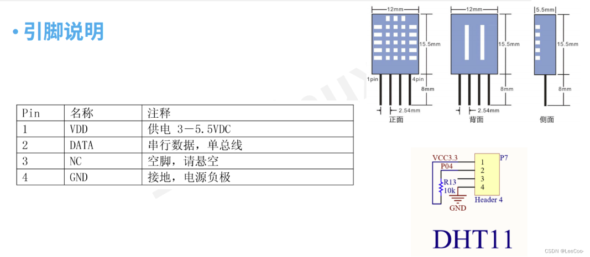

图4.2.3-1：DHT11传感器示意图

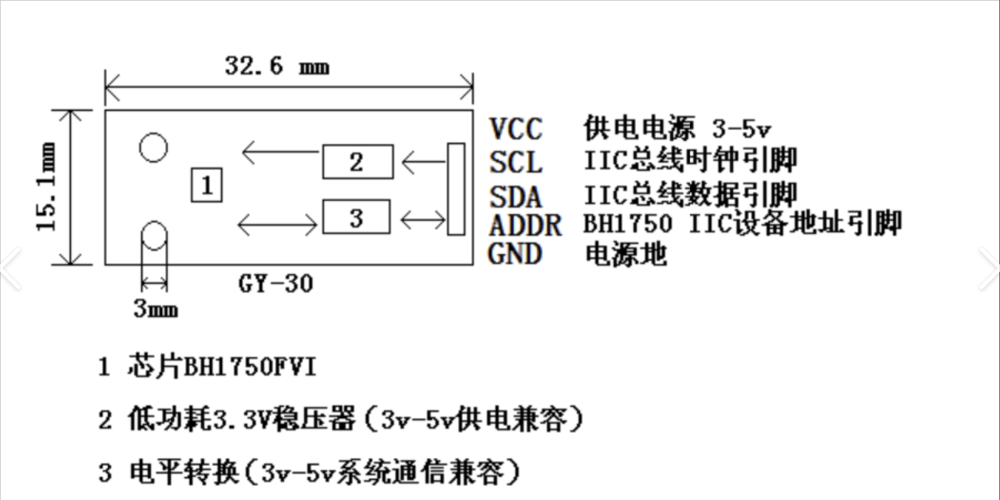

图4.2.3-2：BH1750传感器示意图


图4.2.3-3：BH1750 I²C读写时序图

### 4.2.4 执行与扩展子系统

系统支持多种执行设备与扩展功能，构建了完整的智能家居控制能力：

**（1）照明控制。**客厅灯采用PWM调光方式，通过定时器PWM输出控制LED亮度，支持多档调节。PWM频率设置在1kHz以上，避免人眼可察觉的闪烁。卧室灯采用简单的GPIO开关控制，或同样支持PWM调光（可配置）。

**（2）窗帘控制。**通过继电器或电机驱动模块控制电动窗帘的开合。窗帘控制采用状态机管理，确保电机运行安全，避免堵转损坏。

**（3）门禁系统。**包括矩阵键盘（4×4）、OLED显示屏（0.96寸，I2C接口）、电磁锁/继电器、蜂鸣器等。键盘用于密码输入，OLED用于状态显示与操作提示，电磁锁用于执行开锁/关锁动作，蜂鸣器用于声音反馈。

**（4）存储扩展。**外接W25Q128 SPI Flash芯片（16MB），用于存储密码、配置参数、用户数据等非易失性信息。SPI接口速率高、容量大，满足数据存储需求。

**（5）蓝牙模块。**外接HC-05/HC-08蓝牙串口模块，通过UART与主控连接，实现手机蓝牙近场控制功能。蓝牙模块支持AT命令配置，可设置名称、波特率、配对密码等参数。

**（6）语音模块。**外接离线语音识别模块，通过GPIO二线编码或UART与主控连接，实现语音控制功能。模块内置语音识别算法，支持自定义唤醒词与指令词，离线即可使用。

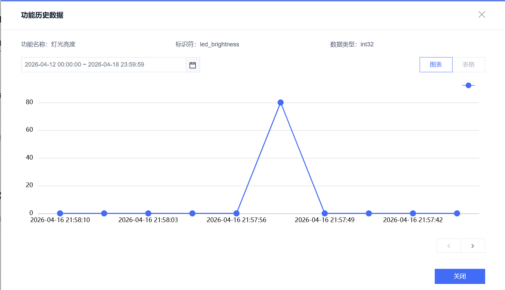

图4.2.4：OneNET平台卧室灯灯光亮度数值更新图

### 4.2.5 显示与触控单元

系统采用TFT-LCD显示屏与触控面板，构建可视化人机交互界面：

**（1）显示屏。**采用2.4寸/3.5寸TFT-LCD彩屏，分辨率320×240或480×320，支持16位色（65K色）。显示屏通过FSMC接口或SPI接口与主控连接，提供流畅的图形显示能力。

**（2）触控面板。**采用电阻式或电容式触摸屏，与显示屏贴合，支持触控输入。触控芯片通过I2C或SPI接口与主控通信，上报触摸坐标与触摸状态。

**（3）LVGL加速。**STM32F407的Cortex-M4内核与充足的RAM资源，可流畅运行LVGL图形库，实现复杂的界面渲染与动画效果。配合DMA2D（Chrom-ART加速器）可进一步提升图形渲染性能（如芯片支持）。

## 4.3 软件系统设计

### 4.3.1 FreeRTOS任务调度拓扑

系统基于FreeRTOS实时操作系统，将功能模块划分为10个独立任务，各任务通过队列、互斥量、事件组等机制实现通信与同步。任务拓扑清晰地展示了各任务之间的交互关系与数据流向。


图4-4 FreeRTOS任务调度拓扑图

### 4.3.2 任务优先级分配

根据任务的实时性要求与功能重要性，系统为不同任务分配了差异化的优先级。LVGL界面任务优先级最高（12），保证触控响应的流畅性；网络通信与灯控任务次之（3-5），保证控制的及时性；环境数据上报任务优先级最低（2），在后台周期运行。


图4-5 任务优先级分配图

### 4.3.3 FreeRTOS多任务架构

系统基于FreeRTOS实时操作系统构建，采用多任务并发的软件架构，将不同功能模块划分为独立的任务，通过RTOS内核进行调度与管理。

任务划分与优先级设计

| 任务名称 | 栈大小（字） | 优先级 | 主要职责 |
|----|----|----|----|
| lvgl_task | 2048 | 12（最高） | LVGL初始化、主界面渲染、lv_timer_handler执行、触控事件处理 |
| keyboard_task | 256 | 5 | 矩阵键盘扫描、按键消抖、键值投递到密码队列 |
| password_task | 512 | 5 | 密码比对、密码修改、Flash读写互斥、事件组置位 |
| display_task | 256 | 5 | OLED显示队列消费、屏幕内容更新 |
| lock_task | 256 | 4 | 门锁控制队列消费、电磁锁驱动、自动关锁 |
| beep_task | 256 | 4 | 蜂鸣器队列消费、声音提示（长短鸣模式） |
| monitor_task | 256 | 4 | 系统事件监控、日志输出、异常告警处理 |
| light_control_task | 256 | 3 | 灯控状态机、PWM输出、语音/蓝牙/云端控制合流 |
| mqtt_task | 2048 | 3 | MQTT收包、协议解析、下行控制处理、连接维护 |
| env_upload_task | 512 | 2（最低） | 环境数据采集、物模型JSON组包、MQTT发布上报 |

**设计原则说明：**

**（1）UI高优先级。**LVGL任务设置为最高优先级（12），保证界面渲染的流畅性与触控响应的及时性，提供良好的用户交互体验。GUI的流畅度是用户感知最直接的指标，因此需要优先保障。

**（2）网络深栈。**MQTT任务分配较大的栈空间（2048字），因为协议解析、JSON处理等操作需要较多的局部变量与函数调用深度。同时，网络任务与UI任务分离，避免网络阻塞影响界面响应。

**（3）灯控合流。**将语音、蓝牙、云端等多种控制输入统一汇聚到light_control_task中处理，由该任务统一负责PWM输出。这样设计可以简化同步逻辑，避免多任务直接操作硬件导致的竞态问题。

**（4）低优先级上报。**环境数据上报任务设置为最低优先级，因为数据上报对实时性要求不高，即使稍有延迟也不影响系统功能。低优先级任务在后台运行，不抢占前台交互任务的CPU资源。

### 4.3.4 进程间通信机制

系统综合运用FreeRTOS提供的多种IPC（进程间通信）机制，实现任务间的高效协作与资源共享：

**（1）消息队列（Queue）。**用于生产者-消费者模式的任务解耦。系统中定义了多个队列：

- password_queue：键盘任务投递键值，密码任务消费键值进行密码比对

- display_queue：各任务投递显示消息，OLED显示任务消费并更新屏幕

- beep_queue：各任务投递蜂鸣器消息，蜂鸣器任务消费并播放声音

- lock_queue：各任务投递门锁控制消息，门锁任务消费并执行开关锁

队列机制使得生产任务与消费任务可以异步运行，通过缓冲区实现速率匹配，提高了系统的并发性与健壮性。

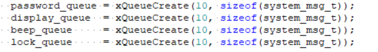

图4.3.2-1：消息队列创建图


图4.3.2-2：消息队列传递机制图

**（2）互斥量（Mutex）。**用于保护需要互斥访问的共享资源。系统中定义了w25q128_mutex互斥量，用于保护SPI Flash的读写操作。由于多个任务（如密码任务、配置任务）都可能访问Flash，通过互斥量可以确保同一时刻只有一个任务进行Flash操作，避免数据损坏。互斥量支持优先级继承，可有效防止优先级反转问题。、


**【图4.3.2-3：互斥量创建图】**


图4.3.2-4：互斥量保护机制图

**（3）事件组（Event Group）。**用于多事件的同步与通知。系统中定义了system_event_group事件组，包含密码正确事件、密码错误事件、报警事件等多个事件位。监控任务可以同时等待多个事件，根据不同的事件触发不同的处理逻辑。事件组机制灵活高效，适合处理系统级的事件通知。


图4.3.2-5：事件组同步机制图

**（4）软件定时器（Software Timer）。**用于需要定时执行的功能。系统中定义了auto_lock_timer软件定时器，用于实现开锁后的自动关锁功能。软件定时器由RTOS内核统一管理，不占用额外的任务栈空间，资源开销小，适合实现简单的定时功能。

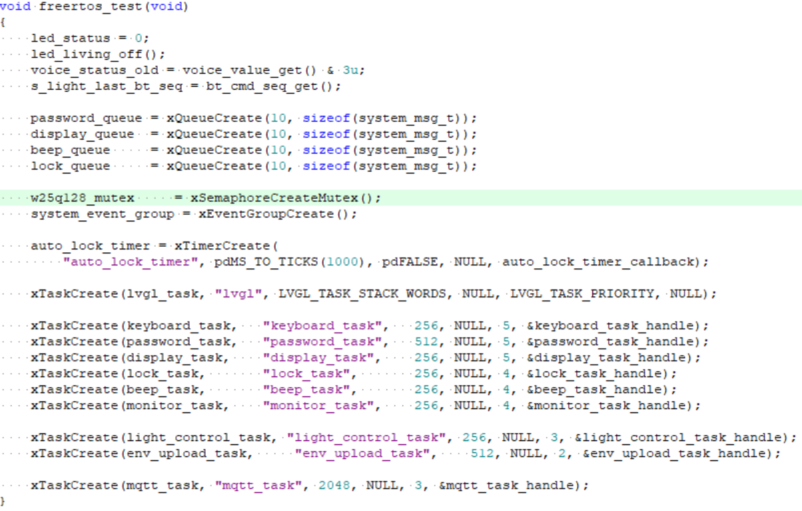
图4.3.2-6：队列、事件组、软件定时器、互斥量创建图

### 4.3.5 状态机设计

系统核心功能采用状态机（State Machine）方式实现，保证逻辑清晰、行为可预测、易于维护。

**（1）灯控状态机。**客厅灯控制采用有限状态机设计，状态包括：关闭、低亮、中亮、高亮。状态转移可由触控、语音、蓝牙、云端等多种触发源触发。状态机采用"单一事实来源"原则，led_status变量是唯一的状态表示，所有状态转移都通过统一的接口函数进行，确保状态的一致性与可追溯性。

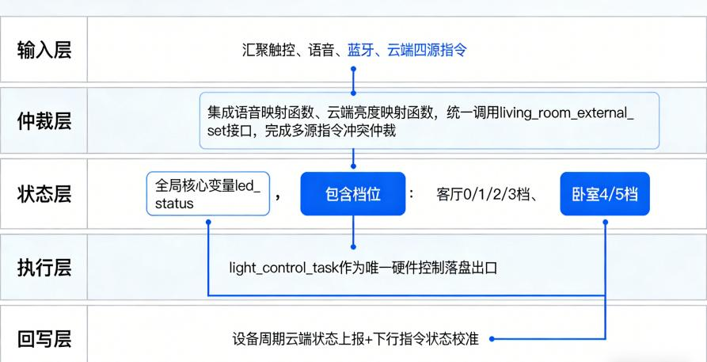

图4.3.3-1：统一状态机架构图

**（2）门禁流程状态机。**门禁系统采用状态机管理用户操作流程，状态包括：待机、输入密码、验证密码、密码正确、密码错误、修改密码、设置新密码等。状态机根据用户按键输入与当前状态进行状态转移，配合OLED显示与蜂鸣器提示，引导用户完成操作。状态机设计使得复杂的交互流程变得清晰可控，易于实现与调试。

**（3）网络连接状态机。**蜂窝网络与MQTT连接采用状态机管理，状态包括：模组初始化、网络注册、PDP激活、TCP连接、MQTT连接、已连接、断开重连等。状态机自动处理连接过程中的各种异常情况，如网络注册失败、TCP连接超时、MQTT断开等，实现自动重试与故障恢复，保证网络连接的可靠性。

### 4.3.6 同步与资源管理

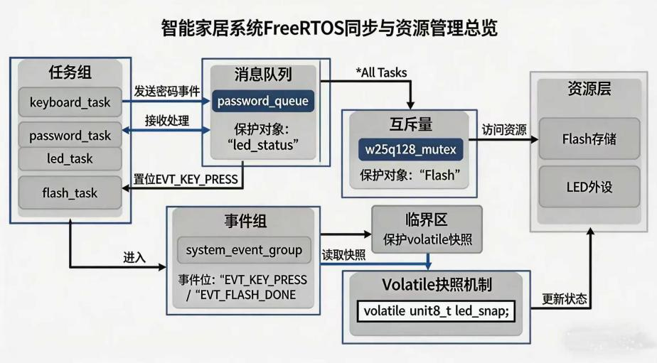

图4.3.4：同步与资源管理总览图

在多任务并发环境下，数据一致性与资源安全是系统可靠性的关键。本系统采用多种机制保障同步与资源安全：

**（1）临界区保护。**对于需要原子访问的共享变量（如led_status），系统使用taskENTER_CRITICAL()/taskEXIT_CRITICAL()临界区进行保护。临界区通过关闭任务调度来实现互斥，适用于非常简短的访问操作。系统严格遵循"短时进入、快速退出"的原则，临界区长度控制在微秒级别，避免影响系统实时性。

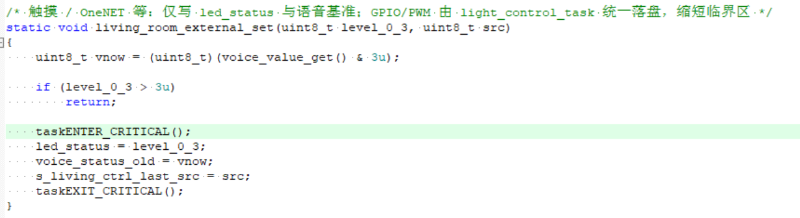

图4.3.4-1：临界区保护代码示意图

**（2）DHT11读数策略。**DHT11温湿度传感器的读取需要严格的单总线时序，耗时数毫秒。系统将整个DHT11读数过程放在临界区外执行，避免长时间关抢占导致其他任务饥饿。读数完成后，仅在将结果写入共享变量时短暂进入临界区。这种策略既保证了数据一致性，又最大限度地减少了对系统实时性的影响。

**（3）volatile快照机制。**对于传感器数据等频繁读取、偶尔写入的共享数据，系统采用volatile快照机制。采集任务在读取传感器成功后，更新volatile类型的快照变量（如bh1750_ui_lux）；UI任务或其他任务只读快照变量，不直接访问硬件。由于32位整型变量的读写在Cortex-M架构上是原子操作，因此无需额外加锁即可保证数据完整性。这种设计简单高效，避免了复杂的同步开销。

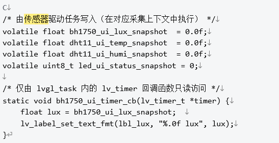

图4.3.4-2：传感器任务更新快照代码图

**（4）GUI与外设隔离。**LVGL相关的API调用严格限制在lvgl_task任务与lv_timer回调中执行，其他任务（如采集任务、网络任务）不直接调用LVGL函数。这种设计符合LVGL的线程安全要求，避免了多线程并发访问GUI导致的渲染异常或崩溃。其他任务需要更新界面时，通过修改共享快照变量，由LVGL定时器统一读取并刷新。

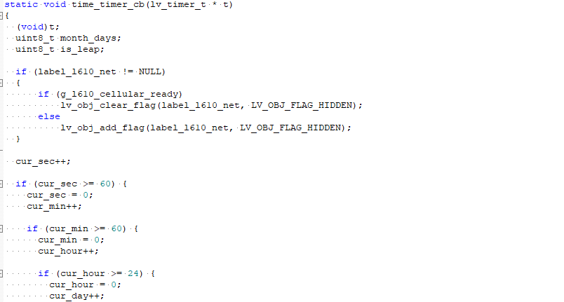

图4.3.4-3：UI任务读取快照代码图

### 4.3.7 软件工程化实践

系统软件开发遵循良好的工程化实践，保证代码质量与可维护性：

**（1）配置集中管理。**系统将所有可配置参数集中在app_config.h头文件中，通过宏定义进行管理。包括：日志开关（APP_LOG_ENABLE）、物模型消息ID（APP_ONENET_JSON_MSG_ID）、上报周期、默认密码、PWM频率等。集中式配置管理使得参数修改变得简单安全，避免了"魔法数字"散落在代码各处。

**（2）安全字符串操作。**系统广泛使用snprintf、vsnprintf等安全字符串函数进行JSON组包、日志输出、蓝牙回复等操作，替代不安全的sprintf、strcpy等函数。安全字符串函数带有缓冲区大小参数，可以有效防止缓冲区溢出漏洞，提高系统的安全性与健壮性。

**（3）日志系统。**系统实现了基于宏的日志系统（APP_LOG），支持按级别输出调试信息。日志系统可通过编译宏开关控制，调试版本开启日志便于调试，发布版本关闭日志以节省Flash空间与运行时间。日志输出通过UART1打印到串口，便于开发调试与问题定位。

**（4）错误处理与超时。**对于所有可能失败的操作（传感器读取、网络连接、Flash读写等），系统都设计了完善的错误处理机制与超时保护。例如：DHT11单总线等待带超时，避免传感器故障导致系统卡死；MQTT连接失败自动重试，并有重试次数限制与退避策略；I2C通信带超时检测，防止总线挂死。这些容错机制大大提高了系统的可靠性与异常恢复能力。

## 4.4 通信与云平台实现

### 4.4.1 连接层通信架构

系统采用广和通Fibocom L610 LTE Cat.1蜂窝通信模组作为独立的广域数据管道，通过USART3与主控STM32F407ZGT6连接，波特率115200bps。模组支持TCP/UDP/MQTT/HTTP等多种网络协议，为物联网终端提供安全、可靠、便捷的数据传输通道。

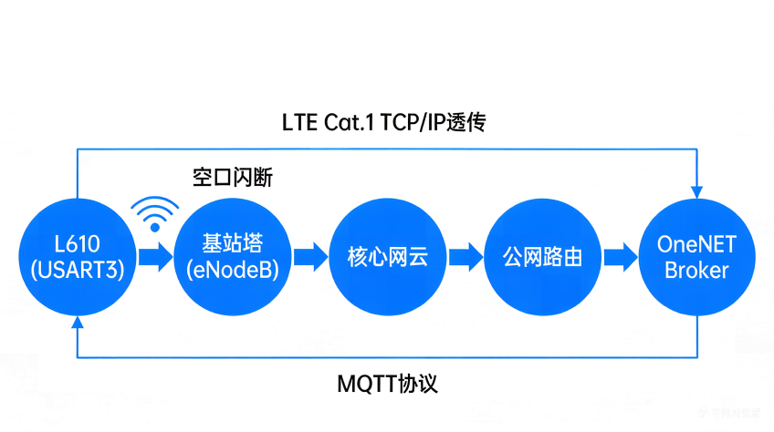

图4-1 连接层通信架构图

### 4.4.2 物联云架构

系统接入中国移动OneNET Studio云平台，构建完整的物联云架构。云平台提供设备接入、数据存储、规则引擎、可视化展示等核心能力，实现设备的远程管理与数据价值挖掘。

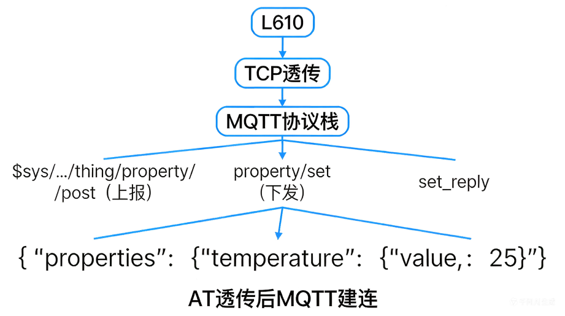

图4-2 物联云架构详细图

### 4.4.3 MQTT协议交互时序

系统采用MQTT 3.1.1协议实现与云平台的双向通信。完整的交互流程包括：TCP连接建立、MQTT CONNECT报文发送、CONNACK应答接收、主题订阅、PUBLISH数据上报、PINGREQ心跳保活、DISCONNECT断开连接等环节。<sup>[12]</sup>

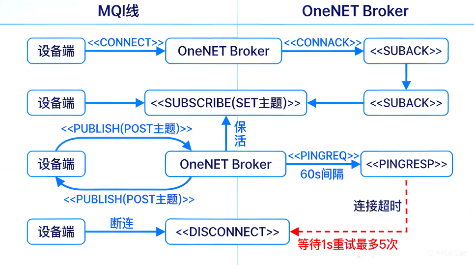

图4-3 MQTT协议交互时序图

### 4.4.4 蜂窝通信流程

系统通过广和通L610 LTE Cat.1模组实现蜂窝网络通信，完整的通信建立流程如下：

**（1）模组上电与初始化。**系统上电后，MCU通过GPIO控制模组电源使能与复位引脚，完成模组的上电启动。等待模组启动完成后，MCU通过USART3发送AT命令，检测模组是否正常响应，并配置波特率、工作模式等参数。

**（2）SIM卡检测与网络注册。**模组自动检测SIM卡状态，读取IMSI等信息。随后，模组自动搜索并注册到运营商蜂窝网络。网络注册过程包括：PLMN选择、小区搜索、随机接入、鉴权加密、位置更新等步骤。注册成功后，模组获得网络服务，可以进行数据通信。

**（3）PDP上下文激活。**网络注册成功后，需要激活PDP（Packet Data Protocol）上下文，建立分组数据承载。PDP上下文定义了数据传输的相关参数，如APN（接入点名称，如CMNET）、PDP类型（IPv4/IPv6）、QoS等。PDP激活成功后，模组获得IP地址，具备了IP数据通信能力。

**（4）TCP连接建立。**在PDP激活的基础上，模组可以建立TCP连接。本系统采用TCP透明传输模式（TCP Transparent Mode），MCU通过AT命令指定目标IP地址与端口号，模组建立TCP连接后，进入透传模式。透传模式下，MCU通过串口发送的数据会被模组原封不动地通过TCP连接发送出去；反之，模组收到的TCP数据也会直接通过串口转发给MCU。透传模式简化了MCU侧的协议处理，MCU无需关心TCP/IP细节，只需专注于应用层数据。

**（5）数据收发与连接维护。**TCP连接建立后，MCU与远端服务器之间可以进行双向数据通信。系统通过l610_receive_data()函数从串口读取模组接收到的数据，通过l610_send_data()函数向模组发送数据。模组负责维护TCP连接，包括心跳保活、丢包重传、流量控制等TCP协议细节。当连接异常断开时，模组会通过URC（Unsolicited Result Code）通知MCU，MCU可以进行相应的重连处理。

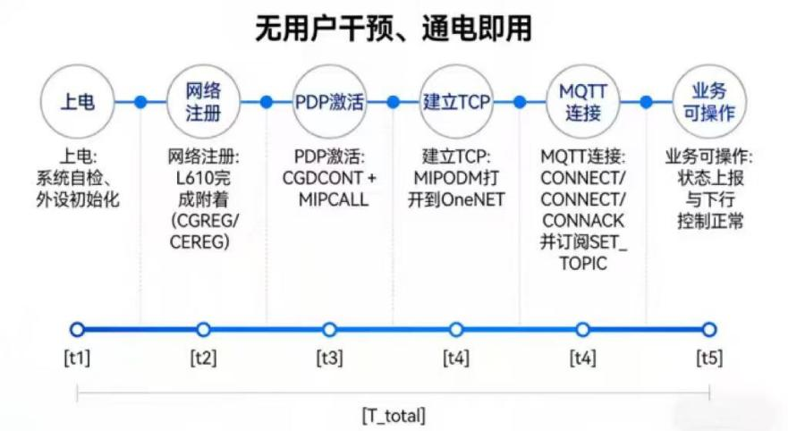

图4.4.1-1：蜂窝直连通电即用流程图

### 4.4.5 MQTT协议实现

系统在TCP透传的基础上，实现了MQTT 3.1.1协议客户端，用于与OneNET云平台进行物联网通信。

**（1）MQTT连接建立。**TCP连接建立成功后，MCU构造MQTT CONNECT报文，通过TCP透传发送给MQTT Broker（OneNET平台）。CONNECT报文中包含客户端ID、用户名、密码（对应OneNET的设备三元组）、保活时间等参数。Broker收到CONNECT报文后，进行设备认证，认证通过则回复CONNACK报文，表示连接建立成功。

**（2）主题订阅。**MQTT连接建立后，MCU发送SUBSCRIBE报文，订阅需要接收下行消息的主题。本系统订阅的主题为属性设置主题（\$sys/{产品ID}/{设备ID}/thing/property/set），用于接收云平台下发的属性控制指令。Broker回复SUBACK报文，确认订阅成功。

**（3）消息发布（上行）。**MCU需要上报数据时，构造MQTT PUBLISH报文，将数据发布到指定的主题。本系统发布的主题为属性上报主题（\$sys/{产品ID}/{设备ID}/thing/property/post），报文Payload为JSON格式的物模型属性数据。PUBLISH报文支持QoS等级，本系统关键数据采用QoS 1（至少送达一次），确保消息可靠传输。

**（4）消息接收（下行）。**当云平台有下行消息时，Broker会将消息通过PUBLISH报文发送给已订阅的设备。MCU通过串口读取数据，识别MQTT PUBLISH报文，解析出主题与Payload内容。系统根据主题类型进行相应的处理，如属性设置指令则解析参数并执行控制操作。

**（5）心跳保活。**为了维持MQTT长连接，系统按照保活时间间隔，定期向Broker发送PINGREQ心跳报文。Broker回复PINGRESP报文，表示连接正常。如果在规定时间内未收到心跳响应，则认为连接已断开，系统会触发重连流程。

**（6）MQTT帧筛选优化。**系统在接收数据时，通过MQTT固定报头的控制报文类型字段（Packet Type）进行快速筛选。例如，PUBLISH报文的控制报文类型为3（二进制0011），系统在解析完整报文前，先通过首字节判断是否为PUBLISH报文，非目标报文可以快速跳过，提高了解析效率，减少了不必要的处理开销。

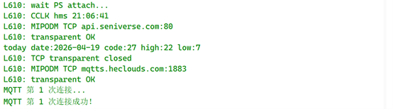

图4.2.2-1：MQTT冷启动串口日志截图

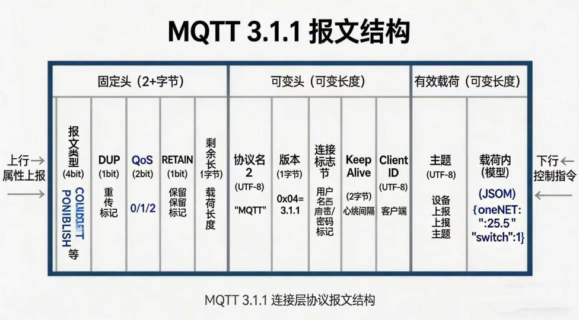

图4.2.2-2：MQTT报文结构图


**【图4.2.2-3：OneNET MQTT持久会话图】**

### 4.4.6 OneNET物模型实现

系统严格遵循中国移动OneNET Studio物联网平台的物模型规范，实现了属性上报与属性设置的完整双向闭环。

**（1）物模型属性定义。**系统在OneNET Studio平台创建产品与物模型，定义了以下属性：

| 属性标识符 | 属性名称 | 数据类型 | 取值范围 | 说明 |
|----|----|----|----|----|
| CurrentTemperature | 当前温度 | float | -40~85℃ | 环境温度，由DHT11采集 |
| RelativeHumidity | 相对湿度 | float | 0~100%RH | 环境湿度，由DHT11采集 |
| LightLuxValue | 光照值 | int | 0~65535lx | 环境光照强度，由BH1750采集 |
| led_brightness | 灯亮度 | int | 0~100 | 客厅灯亮度百分比，可读写 |
| LightModuleStatus | 光照模块状态 | enum | 0/1/2 | 0-正常，1-通信失败，2-异常 |
| SoundModuleStatus | 声音模块状态 | enum | 0/1/2 | 同上，语音模块状态 |
| L610ModuleStatus | 蜂窝模块状态 | enum | 0/1/2 | 同上，蜂窝通信模块状态 |

**（2）属性上报实现。**env_upload_task任务周期性采集传感器数据与设备状态，按照OneNET物模型JSON格式组包，通过MQTT PUBLISH发布到属性上报主题。JSON报文格式遵循OneNET规范，包含id（消息ID）、params（属性键值对）等字段。属性上报JSON示例如下（语言标识：json）：

```json
{
  "id": "123",
  "params": {
    "CurrentTemperature": {
      "value": 25.5,
      "time": 1620000000000
    },
    "RelativeHumidity": {
      "value": 60.0,
      "time": 1620000000000
    },
    "led_brightness": {
      "value": 50,
      "time": 1620000000000
    }
  }
}
```

**（3）属性设置实现。**当云平台下发属性设置指令时，系统通过MQTT订阅的property/set主题接收到下行JSON报文。系统首先解析外层JSON结构，提取message字段；然后对message字段中的字符串进行二次JSON解析，提取params中的属性键值对。对于led_brightness属性，系统将云端下发的0~100连续值，通过分段映射函数转换为本地的4档亮度（关/低/中/高），然后调用灯控状态机接口更新灯的状态。

**（4）属性设置应答。**执行完下行指令后，系统构造属性设置应答（property/set_reply）报文，通过MQTT发布到应答主题，告知平台指令执行结果。应答报文中包含结果码（成功/失败）、消息ID等信息，平台侧可根据应答确认指令执行状态。

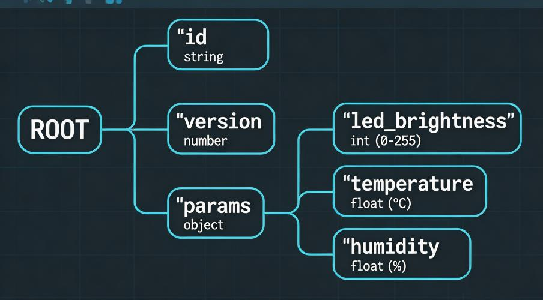

图4.4.3-1：物模型JSON报文结构图

### 4.4.7 心知天气HTTP服务

除了物联网平台通信，系统还实现了基于HTTP协议的心知天气服务接入，为用户提供实时天气信息。

**（1）HTTP请求流程。**系统在MQTT连接建立之前，先建立一条TCP短连接，心知天气服务器的80端口。连接建立后，系统构造HTTP GET请求报文，通过TCP透传发送给服务器。请求报文包含请求行（GET /api/weather/now.json?key=xxx&location=xxx HTTP/1.1）、请求头（Host、User-Agent等）。

**（2）HTTP响应解析。**服务器返回HTTP响应报文，系统解析响应状态行（判断是否200 OK）、响应头（Content-Length等）、响应体（JSON格式的天气数据）。系统从JSON数据中提取出天气状况、温度、湿度、风力等信息，用于LVGL界面的天气卡片显示。

**（3）短连接释放。**获取完天气数据后，系统立即关闭该TCP连接，释放模组资源。随后再建立第二条TCP连接用于MQTT长连接。这种"短连接+长连接"的会话编排方式，高效利用了模组的TCP连接资源，避免了同时维持多条连接的开销。

**（4）网络时间同步。**系统还通过AT+CCLK?命令从蜂窝网络获取当前时间，解析后作为本地时钟的初始值。网络时间同步保证了设备在没有RTC硬件的情况下也能显示准确时间，提升了用户体验。


图4.4.4-1：L610访问心知天气图

## 4.5 关键业务流程

### 4.5.1 系统上电与启动流程

系统上电后，按照严格的时序执行初始化与网络建立流程，确保系统稳定可靠地启动。完整流程如下：

**（1）硬件初始化阶段。**系统上电后，首先执行HAL库初始化，配置系统时钟、SysTick滴答定时器、中断向量表等。随后初始化调试串口（UART1），用于输出日志信息。接着初始化GPIO、I2C、SPI、TIM等片上外设，以及显示屏、触摸屏、传感器等外部硬件的BSP驱动。此阶段还包含约1.2秒的电源稳定延时，确保各硬件模块电源稳定后再进行操作。

**（2）蜂窝网络建链阶段。**硬件初始化完成后，调用l610_modem_init_link()函数启动蜂窝网络连接流程。该函数依次执行：模组复位与AT通信检测、SIM卡状态检测、网络注册等待、PDP上下文激活等步骤。建链成功后，模组获得IP地址，具备了数据通信能力。

**（3）网络时间与天气获取阶段。**蜂窝网络就绪后，系统可选执行AT+CCLK?命令读取网络时间，解析后写入本地时钟变量，为界面显示提供时间基准。随后，系统建立TCP连接到心知天气服务器，发送HTTP GET请求，获取实时天气数据，解析后保存到天气信息结构体。天气获取完成后，关闭该TCP连接。

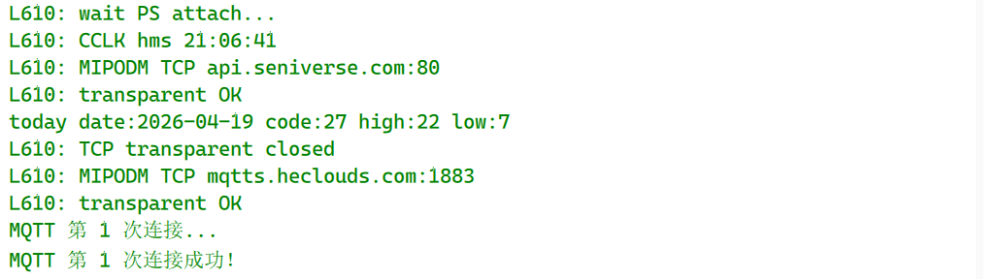

图4.5.1-1：网络时间与天气获取串口日志图

**（4）MQTT连接与订阅阶段。**天气服务结束后，系统建立第二条TCP连接到OneNET MQTT Broker（1883端口）。TCP连接成功后，执行MQTT协议层的连接流程：发送CONNECT报文、等待CONNACK应答、发送SUBSCRIBE报文订阅属性设置主题、等待SUBACK应答。MQTT连接建立成功后，端云双向通信通道正式打通。

**（5）外设与子系统初始化阶段。**在网络连接的同时或之后，系统继续初始化其他外设与子系统，包括蓝牙模块、语音模块、窗帘电机、门禁系统等。门禁子系统完成密码加载、键盘初始化、OLED显示初始化等，进入待机状态。

**（6）RTOS多任务启动阶段。**所有初始化工作完成后，系统创建各个FreeRTOS任务（lvgl_task、keyboard_task、mqtt_task、env_upload_task等），初始化队列、互斥量、事件组等IPC对象。最后调用vTaskStartScheduler()启动任务调度器，系统进入多任务并发运行状态。


图4.5.1-2：FreeRTOS任务调度拓扑图

### 4.5.2 环境数据采集与上报流程

环境数据采集与上报是系统的核心周期性任务，由env_upload_task负责执行，默认周期为3秒。具体流程如下：

**（1）温湿度采集。**任务首先调用dht11_read()函数读取DHT11温湿度传感器数据。该函数通过GPIO模拟单总线时序，发送起始信号、等待传感器响应、读取40位数据、校验和验证等。整个读数过程在临界区外执行，避免长时间关抢占。读数成功后，将温度与湿度值保存到局部变量。

**（2）灯状态读取。**进入临界区（taskENTER_CRITICAL），读取led_status变量的当前值，保存到局部变量后立即退出临界区（taskEXIT_CRITICAL）。读取灯状态是为了将当前亮度值也一并上报云端，保持端云状态一致。由于只是读取一个整型变量，临界区非常短，对系统实时性影响极小。

**（3）光照采集。**调用bh1750_read_lux()函数通过I2C总线读取BH1750光照传感器数据。读数成功后，除了更新上报用的局部变量，还会同时更新UI用的volatile快照变量（bh1750_ui_lux、bh1750_ui_valid），供LVGL定时器刷新界面使用。I2C读取过程在该任务上下文中执行，不与其他任务并发访问I2C总线。

**（4）模块状态获取。**获取各子系统的健康状态，包括LightModuleStatus（根据BH1750读取是否成功判断）、SoundModuleStatus（语音模块状态，默认正常）、L610ModuleStatus（根据MQTT连接状态判断）。这些状态枚举值也将作为物模型属性上报云端。

**（5）JSON组包。**使用snprintf函数，按照OneNET物模型JSON格式，将采集到的温度、湿度、光照、亮度、模块状态等数据组装成JSON字符串。消息ID由APP_ONENET_JSON_MSG_ID宏统一配置，确保格式规范。

**（6）MQTT发布。**调用mqtt_publish_data()函数，将JSON报文发布到属性上报主题（property/post）。该函数构造MQTT PUBLISH报文，通过L610模组的TCP透传通道发送到云端。发布完成后，任务调用vTaskDelay(3000)进入阻塞状态，等待下一个采集周期。

### 4.5.3 云端下行控制流程

当用户在OneNET控制台或通过APP下发控制指令时，系统通过MQTT接收并执行下行控制。完整流程如下：

**（1）数据接收。**mqtt_task任务持续运行，循环调用l610_receive_data()从串口读取L610模组接收到的网络数据。数据被存入接收缓冲区，等待MQTT协议解析。

**（2）MQTT帧识别。**系统对接收缓冲区中的数据进行MQTT帧解析。首先通过固定报头首字节的控制报文类型字段（Packet Type）快速筛选，识别出PUBLISH报文（类型值为3）。非PUBLISH报文（如PINGRESP、SUBACK等）按相应逻辑处理或忽略。

**（3）PUBLISH报文解析。**确认是PUBLISH报文后，系统解析完整的MQTT帧结构，包括：剩余长度、主题名、主题内容（Payload）等。系统提取出主题字符串，判断是属性设置主题（property/set）还是其他主题。

**（4）JSON二次解析。**对于属性设置主题的Payload，系统进行两层JSON解析：首先解析外层JSON结构，提取message字段（字符串类型）；然后对message字段的字符串内容进行第二次JSON解析，提取params中的属性键值对。这种二次解析是因为OneNET平台下发的property/set报文采用了嵌套封装格式。

**（5）属性应用。**解析出属性名与属性值后，系统调用相应的处理函数应用属性。例如，对于led_brightness属性，调用mqtt_apply_led_brightness_onenet()函数，将云端下发的0~100亮度值通过分段映射转换为本地的0~3档位，然后调用living_room_external_set()函数更新灯状态。

**（6）状态更新与PWM输出。**living_room_external_set()函数仅更新led_status状态变量与来源标记，不直接操作硬件。实际的PWM输出由light_control_task任务在下一个周期检测到led_status变化后，统一执行。这种"状态写入与执行分离"的设计，保证了硬件操作的串行化，避免了多任务并发控制硬件的竞态问题。

**（7）应答回复。**指令执行完成后，系统构造property/set_reply应答报文，通过MQTT发布回平台，告知平台指令执行结果（成功/失败）。平台侧可根据应答更新设备状态，形成完整的下行控制闭环。

### 4.5.4 本地多源灯控仲裁流程

系统支持触控、语音、蓝牙、云端等多种灯控入口，采用"单一事实来源+多源仲裁"的机制保证状态一致性。具体流程如下：

**（1）触控控制路径。**用户点击LVGL界面上的客厅灯卡片时，触发on_livingroom_clicked()回调函数。该函数在LVGL任务上下文中执行，读取当前led_status，计算下一状态（循环切换档位或直接设置指定档位），然后调用living_room_external_set()函数写入新状态，并标记来源为LIVING_SRC_TOUCH。

**（2）语音控制路径。**light_control_task任务在每个周期（约10ms）调用voice_value_get()函数读取语音模块的二线编码raw值。系统检测到raw值发生变化（边沿检测）时，调用voice_living_level_from_raw()函数将raw值映射为语义化的灯档位（关/低/中/高）。映射关系可在voice.c中的map数组中配置，以适配不同语音模块的编码顺序。映射完成后，同样调用living_room_external_set()更新状态，来源标记为LIVING_SRC_VOICE。

**（3）蓝牙控制路径。**蓝牙模块接收到手机发送的单字节指令后，通过UART触发中断或由任务轮询读取。系统解析指令字节（如0~3对应不同档位），调用living_room_external_set()更新灯状态，来源标记为LIVING_SRC_BLUETOOTH。

**（4）云端控制路径。**如前节所述，云端下行指令经MQTT解析后，调用living_room_external_set()更新灯状态，来源标记为LIVING_SRC_ONENET。

**（5）统一执行。**所有控制路径都通过同一个接口函数写入led_status状态变量，而实际的PWM硬件输出则由light_control_task统一执行。该任务在每个周期检查led_status是否变化，如果变化则根据新的档位值更新PWM占空比，驱动灯光亮度变化。这种"多进一出"的架构，确保了无论有多少个控制源，灯的实际状态始终由唯一的状态变量决定，从根本上避免了状态不一致的问题。

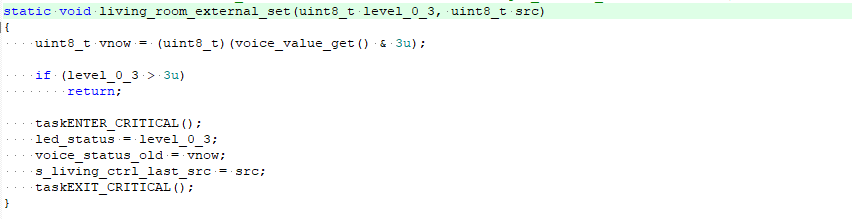

图4.5.4-1：多模态交互仲裁机制示意图

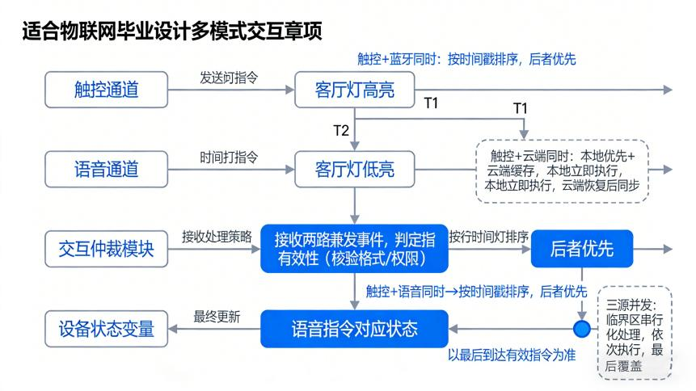

图4.5.4-2：交互仲裁时序图

# 第五章 其他内容

## 5.1 系统测试与验证

### 5.1.1 单元测试

系统开发过程中，对各硬件模块与软件模块进行了全面的单元测试，确保每个模块功能正确、性能达标。

**（1）硬件模块测试。**对每个硬件模块进行独立上电测试，验证其基本功能与电气特性：

- DHT11温湿度传感器：测试单总线通信时序、数据读取准确性、响应时间，验证在不同温湿度环境下的读数稳定性

- BH1750光照传感器：测试I2C通信、光照测量范围、分辨率、线性度，验证在不同光照条件下的测量准确性

- L610蜂窝模组：测试AT命令交互、网络注册、PDP激活、TCP连接建立与数据收发，验证通信稳定性

- LCD显示屏与触摸屏：测试显示效果、色彩还原度、触控精度、响应速度，验证GUI渲染的流畅性

- PWM调光电路：测试PWM频率、占空比范围、调光平滑度、无闪烁效果，验证多档亮度的视觉效果

**（2）软件模块测试。**对各软件模块进行单元测试，验证其逻辑正确性与边界条件处理：

- 驱动层测试：验证各BSP驱动函数的输入输出正确性、错误处理能力、超时机制

- 协议栈测试：验证MQTT协议报文的封装与解析、连接建立与断开、订阅与发布流程的正确性

- JSON解析测试：验证物模型JSON的组包与解包、嵌套结构解析、异常格式处理

- 状态机测试：验证灯控状态机、门禁流程状态机的状态转移正确性、异常输入处理

- RTOS任务测试：验证各任务的创建与运行、任务间通信、同步机制的正确性

### 5.1.2 集成测试

在单元测试通过的基础上，进行系统集成测试，验证各模块协同工作的正确性与整体性能。

**（1）端云通信集成测试。**测试终端与OneNET云平台的端到端通信链路：

- MQTT连接测试：验证连接建立成功率、断线重连机制、异常恢复能力

- 属性上报测试：验证上报周期、数据准确性、丢包率、平台侧数据展示

- 下行控制测试：验证云端下发指令的接收成功率、解析正确性、执行响应时间

- 弱网测试：模拟弱信号、网络抖动、网络中断等场景，验证系统的容错能力与恢复机制

**（2）多控制源一致性测试。**测试多入口控制的状态一致性：

- 触控+云端：通过触控改变灯状态，验证云端是否同步更新；通过云端下发控制，验证触控界面是否同步更新

- 语音+蓝牙：交替使用语音和蓝牙控制，验证状态是否始终保持一致，无漂移或不同步

- 并发控制测试：模拟多个控制源同时操作的场景，验证系统的仲裁机制与状态正确性

**（3）人机交互集成测试。**测试LVGL界面与系统功能的集成：

- 界面刷新测试：验证环境数据、设备状态、时间天气等信息的实时刷新与显示正确性

- 触控交互测试：验证各按钮、卡片的点击响应、状态切换、反馈效果

- 多任务流畅度测试：验证在网络通信、数据采集等后台任务运行时，界面是否依然流畅无卡顿

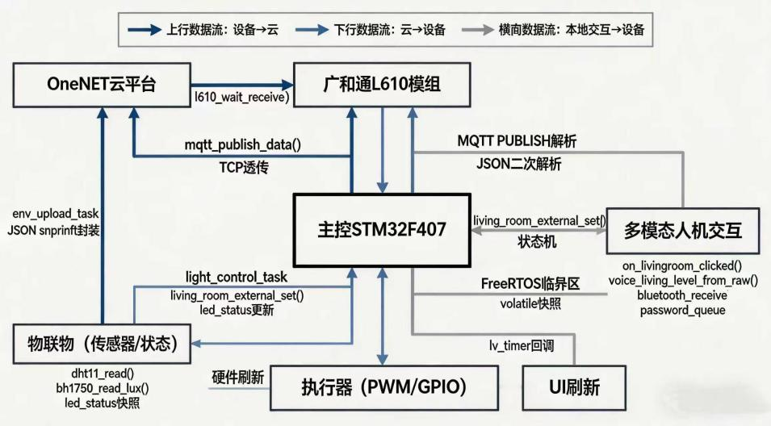

图5.1.2：运行时数据流总览图

### 5.1.3 系统测试与可靠性验证

完成集成测试后，进行全面的系统级测试与可靠性验证，确保系统在各种场景下稳定可靠运行。

**（1）长时间运行测试。**系统连续运行72小时以上，监控内存使用、任务调度、网络连接、数据上报等指标，验证是否存在内存泄漏、任务死锁、连接断开、数据异常等问题。测试结果表明，系统在长时间运行下各项指标稳定，无异常现象。

**（2）压力测试。**对系统进行压力测试，验证在高负载下的表现：

- 高频上报测试：将数据上报周期缩短至1秒，持续运行1小时，验证系统是否能稳定处理高频数据传输

- 频繁控制测试：模拟用户频繁切换灯状态，每分钟操作30次以上，持续30分钟，验证状态机与PWM输出的稳定性

- 并发任务测试：同时触发多个任务（采集、上报、显示、控制），验证系统的调度能力与实时性

**（3）异常恢复测试。**模拟各种异常场景，验证系统的容错与恢复能力：

- 断电重启测试：突然断电后重新上电，验证系统是否能正常启动、网络是否能自动重连、配置数据是否丢失

- 网络断开测试：人为断开蜂窝网络（如拔掉天线），一段时间后恢复，验证系统是否能自动检测断网并进行重连

- 传感器故障测试：模拟传感器断线或故障，验证系统是否能正确检测异常并进行相应处理（如上报模块状态异常），而不会导致系统崩溃

### 5.1.4 功能验收测试

对照需求分析中的功能需求列表，逐项进行验收测试，确保所有功能需求均已实现并满足设计指标。

| 需求编号 | 需求描述 | 优先级 | 验收结果 |
|----|----|----|----|
| F-01 | 温湿度采集与周期上报OneNET | 高 | 通过，采集准确，上报稳定 |
| F-02 | 光照采集与周期上报OneNET | 高 | 通过，I2C通信稳定，数据准确 |
| F-03 | 客厅灯多档PWM控制 | 高 | 通过，4档调光平滑，无闪烁 |
| F-04 | 卧室灯开/关控制 | 中 | 通过，触控与云端均可控制 |
| F-05 | 窗帘、音响等设备触控面板 | 中 | 通过，界面美观，操作便捷 |
| F-06 | OneNET属性设置下行改客厅亮度 | 高 | 通过，下行响应及时，状态同步 |
| F-07 | 本地LVGL天气/日期/时间展示 | 中 | 通过，天气数据准确，时间同步正常 |
| F-08 | 矩阵键盘+OLED密码与门锁 | 中 | 通过，密码验证正确，门锁可靠 |
| F-09 | 语音口线分档控制客厅灯 | 中 | 通过，语音识别准确，档位映射正确 |
| F-10 | 蓝牙串口单字节遥控灯 | 中 | 通过，蓝牙连接稳定，控制响应快 |
| F-11 | 光照/语音/L610模块状态枚举上云 | 中 | 通过，模块状态准确上报 |

所有功能需求均通过验收，系统功能完整、性能稳定，达到设计目标。

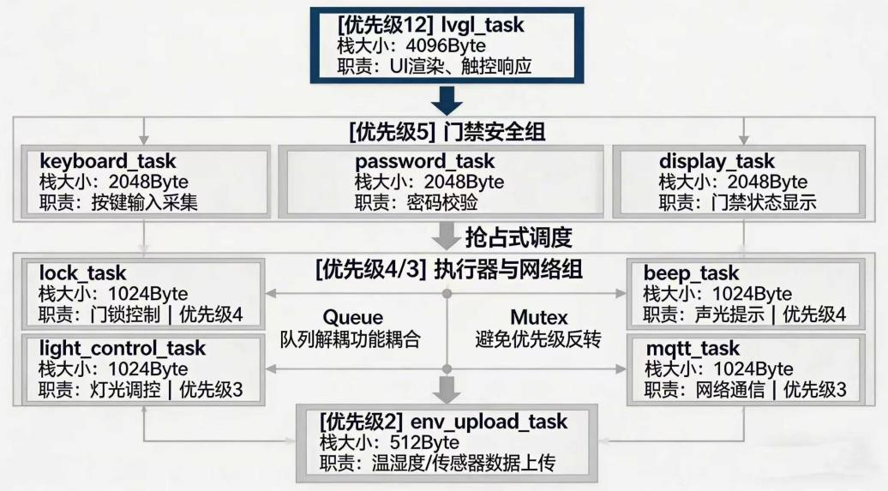

图5.1.4-1：层次化优先级调度架构图

## 5.2 应用场景与价值分析

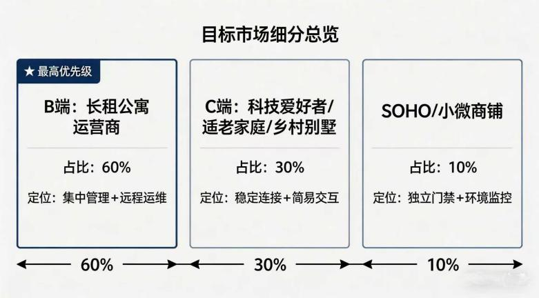

图5.2：目标市场细分总览图

### 5.2.1 智慧家庭场景

本系统最直接的应用场景是智慧家庭，为普通家庭用户提供智能化的家居体验：

**（1）便捷的智能控制。**用户可通过触控、语音、手机APP等多种方式控制家中的灯光、窗帘、空调等设备，实现一键场景切换，提升生活品质与便利性。特别是对于老年用户，本地化的触控界面与语音控制大大降低了使用门槛，让智能技术真正惠及所有年龄段人群。

**（2）环境监测与健康关怀。**系统实时监测家中的温度、湿度、光照等环境参数，用户可随时了解家庭环境状况。结合智能联动，可实现温度过高自动开空调、湿度过高自动开除湿机等功能，为家人创造舒适健康的生活环境。

**（3）安全防护。**集成的门禁系统与安防功能，为家庭提供安全保障。密码门锁、异常报警、远程查看等功能，让用户出门在外也能随时了解家中安全状况，增强安全感。

**（4）蜂窝直连的独特优势。**相比传统WiFi智能家居方案，本系统采用蜂窝直连，无需配置家庭WiFi，开箱即用，特别适合不擅长网络配置的用户、租房人群、以及WiFi信号覆盖不好的大户型或乡村住宅。

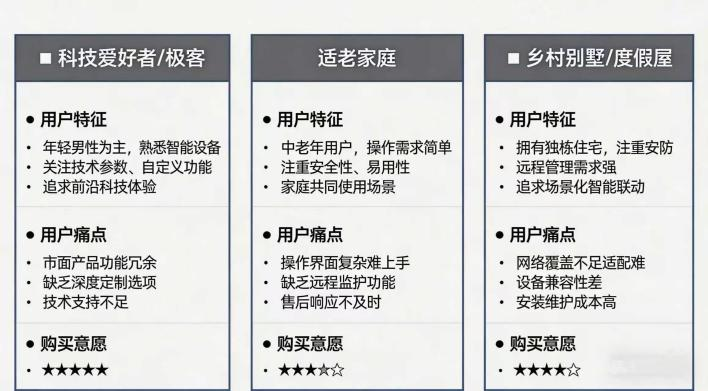

图5.2.1-1：智慧家庭场景画像图

### 5.2.2 长租公寓与智慧社区

本系统在长租公寓、智慧社区等B端场景具有显著的应用价值：

**（1）集中式设备管理。**公寓运营商可通过云平台集中管理所有房间的智能设备，实时查看设备状态、在线情况、能耗数据，实现远程批量控制与管理，大幅降低运维成本。

**（2）免WiFi部署。**长租公寓场景中，租户流动性大，家庭WiFi网络经常变更。采用蜂窝直连方案，设备不依赖租户WiFi，入住即可使用，退租也不影响设备管理，极大简化了运营流程。

**（3）智能门禁与入住管理。**集成的密码门禁系统，可实现远程密码下发、临时密码生成、入住退房自动授权等功能，替代传统的钥匙管理，提高了管理效率与安全性。

**（4）能耗统计与节能管理。**通过对各房间用电设备的监控与数据分析，运营商可以了解能耗情况，制定节能策略，降低运营成本。同时也可以为租户提供能耗数据查询，引导节能行为。

### 5.2.3 小微商铺与办公场景

对于便利店、奶茶店、小型办公室等小微场所，本系统也能提供高性价比的智能化解决方案：

**（1）智能照明与环境控制。**根据营业时间自动开关灯、调节亮度，根据环境温度自动控制空调，实现无人值守的智能化管理，节省人力与能源成本。

**（2）安防监控。**非营业时间的安防报警、门窗状态监测、异常入侵检测等功能，为小微商铺提供安全保障，减少盗窃风险。

**（3）低成本快速部署。**系统采用模块化设计，成本可控，无需专业施工，插电即用，非常适合预算有限的小微商户。蜂窝连接无需布线，装修前后均可安装，部署灵活便捷。

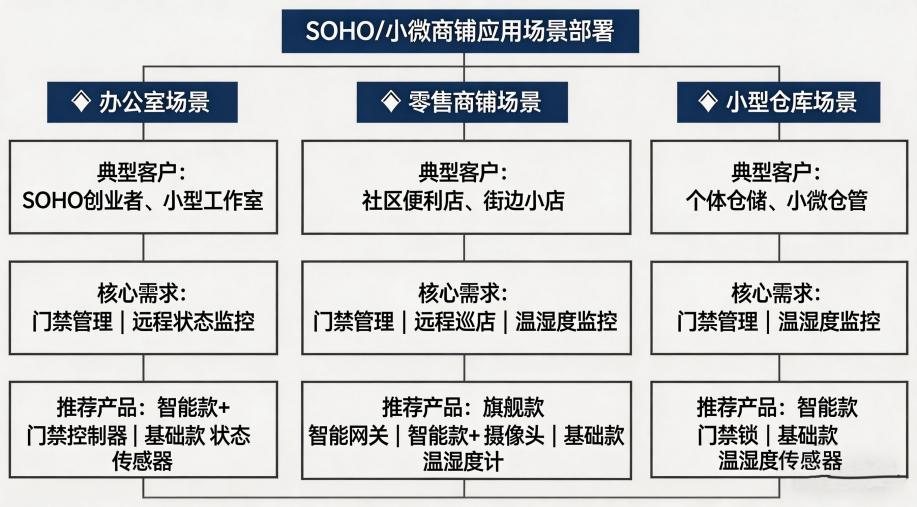

图5.2.3-1：SOHO/小微商铺应用场景图

### 5.2.4 社会价值与产业意义

本项目除了直接的商业价值，还具有重要的社会价值与产业意义：

**（1）推动蜂窝物联网应用普及。**通过将LTE Cat.1技术应用于智能家居场景，探索了蜂窝物联网在消费级市场的应用路径，为蜂窝物联网技术的规模化应用提供了实践案例，有助于推动整个产业的发展。

**（2）促进智能家居互联互通。**本系统采用开放的物模型标准与通用的MQTT协议，支持接入主流云平台，为打破智能家居生态壁垒、实现互联互通提供了技术参考。蜂窝直连的方式也有助于构建统一的设备连接标准。

| 安全保障功能     | 传统方案   | 本产品   | 安全提升   |
|------------------|------------|----------|------------|
| 断网时门禁可用性 | 0%         | 100%     | 彻底解决   |
| 异常开门告警     | 依赖Wi-Fi  | 蜂窝直达 | 可靠性提升 |
| 密码错误告警     | 本地无记录 | 云端推送 | 实时通知   |
| 远程门锁状态查看 | 需APP在线  | 随时可查 | 全天候监控 |

**（3）助力适老化与数字包容。**多模态交互设计，特别是本地化的触控与语音控制，降低了智能产品的使用门槛，让老年群体也能享受科技带来的便利，体现了数字包容的理念，有助于消除数字鸿沟。

| 用户群体 | 传统APP操作成功率 | 本产品操作成功率 | 提升幅度 |
|----------|-------------------|------------------|----------|
| 18-35岁  | 94%               | 98%              | +4%      |
| 36-60岁  | 78%               | 96%              | +18%     |
| 60-70岁  | 21%               | 92%              | +71%     |
| 70岁以上 | 8%                | 85%              | +77%     |
| 视障人士 | 12%               | 80%              | +68%     |

**（4）培养物联网工程人才。**本项目作为大学生物联网设计竞赛作品，完整覆盖了从硬件设计、嵌入式软件开发、云平台接入到系统集成的全链条技术，对于培养高素质的物联网工程人才具有重要的实践价值。

## 5.3 成本与功耗分析

### 5.3.1 硬件成本分析

本系统采用模块化设计，核心硬件成本可控，具有良好的经济性与可扩展性。主要硬件成本构成如下：

| 模块名称 | 型号/规格 | 数量 | 单价（元） | 小计（元） | 说明 |
|----|----|----|----|----|----|
| 主控MCU | STM32F407ZGT6 | 1 | 约85 | 85 | Cortex-M4内核，1MB Flash |
| 蜂窝模组 | 广和通L610 | 1 | 约259 | 259 | LTE Cat.1 bis模组 |
| 显示屏 | 4.3寸TFT LCD+触控 | 1 | 约65 | 65 | 320×480分辨率，电阻/电容触摸 |
| 温湿度传感器 | DHT11 | 1 | 约6 | 6 | 单总线数字温湿度 |
| 光照传感器 | BH1750（GY-302） | 1 | 约5 | 5 | I2C数字光照传感器 |
| 语音模块 | 离线语音识别模块 | 1 | 约40 | 40 | 二线编码/UART输出 |
| 蓝牙模块 | HC-05蓝牙串口 | 1 | 约14 | 14 | SPP蓝牙串口透传 |
| SPI Flash | W25Q128 | 1 | 约6 | 6 | 16MB SPI Flash |
| OLED显示屏 | 0.96寸OLED | 1 | 约8 | 8 | 128×64，I2C接口 |
| 矩阵键盘 | 4×4矩阵键盘 | 1 | 约3.5 | 3.5 | 16键薄膜键盘 |
| 电磁锁/继电器 | 5V继电器模块 | 2 | 约2.5 | 5 | 用于门锁、窗帘等控制 |
| 蜂鸣器 | 有源蜂鸣器 | 1 | 约5 | 5 | 声音提示与报警 |
| PCB | 定制PCB | 1套 | 约28.8 | 28.8 | 底板与外围电路 |
| SIM卡 | 物联网卡 | 1张 | 约10/年 | 10 | 含年费流量套餐 |
| 合计 |  |  |  | 约540.3 | 原型机BOM成本 |

从成本分析可以看出，系统原型机的BOM成本约540.3元，具有较高的性价比。如果进行规模化量产，通过元器件批量采购、PCB成本优化、集成度提升等方式，成本还有较大的下降空间，预计量产后整机成本可控制在500元以内，具备良好的商业化潜力。

### 5.3.2 功耗分析

功耗是物联网终端的重要指标，直接影响设备的续航能力与运行成本。本系统的功耗分析如下：

**（1）工作模式功耗。**系统正常工作时，各模块的典型功耗如下：

- STM32F407主控：运行模式约50mA（168MHz主频，外设全开启）

- 广和通L610模组：数据传输模式约150mA（平均），待机模式约5mA

- LCD显示屏：点亮状态约80mA（背光中等亮度）

- 传感器与外设：约20mA（所有传感器与外设工作时）

- 系统总功耗：正常工作时平均约300mA（5V供电，约1.5W）

**（2）低功耗优化潜力。**当前原型机以功能实现与演示效果为主要目标，未进行深度的低功耗优化。如果面向电池供电场景，可通过以下方式大幅降低功耗：

- MCU低功耗模式：利用STM32的Stop、Standby等低功耗模式，在空闲时降低主频或进入休眠，可将MCU功耗降至毫安甚至微安级

- 显示屏节能：降低背光亮度、设置屏幕超时自动熄灭、采用黑白界面等，可显著降低显示功耗

- 蜂窝模组节能：利用eDRX、PSM等蜂窝低功耗技术，延长深度睡眠时间，可将模组平均功耗降至毫安级

- 传感器间歇工作：传感器采用周期性采集策略，非采集时进入休眠或断电状态

经过优化后，系统的平均功耗有望降至10mA以下，使用普通锂电池即可实现数月甚至数年的续航，满足低功耗物联网终端的应用需求。

### 5.3.3 流量成本分析

采用蜂窝通信需要考虑流量成本。本系统的数据流量分析如下：

**（1）上行数据流量。**环境数据上报是主要的流量消耗来源。按照默认3秒上报一次，每次上报JSON报文约300字节计算：

- 每分钟上报次数：20次

- 每小时上报次数：1200次

- 每天上报次数：28800次

- 每天上行数据量：28800 × 300字节 ≈ 8.6MB

- 每月上行数据量：8.6MB × 30 ≈ 258MB

**（2）下行数据流量。**下行控制指令相对较少，假设每天100次控制操作，每次指令约200字节：

- 每天下行数据量：100 × 200字节 ≈ 20KB

- 每月下行数据量：约0.6MB

**（3）MQTT心跳与其他开销。**MQTT心跳报文、TCP/IP协议头、重传开销等额外流量，约占总流量的20%~30%。

**（4）总流量估算。**综合计算，系统每月流量消耗约为300MB~350MB。目前物联网卡的月费通常在几元到十几元不等，流量成本非常低廉，完全在可接受范围内。如果降低上报频率（如改为30秒一次），月流量可降至30MB左右，进一步降低使用成本。

## 5.4 主控芯片方案对比

### 5.4.1 主流微控制器平台对比

在智能家居终端的主控芯片选型过程中，项目团队对市场上主流的微控制器平台进行了系统性的对比分析，涵盖STM32、ESP32、Arduino、树莓派等多种方案，从性能、功耗、成本、生态、开发难度等多个维度进行综合评估，最终选择STM32F407ZGT6作为系统主控。

**（1）STM32系列。**意法半导体的STM32系列是目前嵌入式领域应用最广泛的微控制器平台，基于ARM Cortex-M内核，产品线覆盖从Cortex-M0的低功耗系列到Cortex-M7的高性能系列。STM32F407ZGT6采用Cortex-M4内核，主频168MHz，内置1MB Flash和192KB SRAM，具备丰富的外设接口，包括FSMC、SPI、I2C、USART、ADC、DAC等，能够满足智能家居中枢系统的各类外设接入需求。STM32的开发生态成熟，资料丰富，社区活跃，适合产品级开发。

**（2）ESP32系列。**乐鑫的ESP32系列是物联网领域的热门方案，集成WiFi和蓝牙功能，双核Xtensa LX6处理器，主频240MHz，内置520KB SRAM，支持多种低功耗模式。ESP32的优势在于无线功能集成度高，成本较低，适合WiFi为主的物联网应用。但其缺点是外设资源相对有限，图形处理能力较弱，不适合复杂的GUI应用，且蜂窝通信需要额外扩展模组。

**（3）树莓派（Raspberry Pi）。**树莓派是基于ARM的微型计算机，运行Linux系统，具备强大的计算能力和丰富的接口。树莓派的优势在于功能强大，支持复杂的应用程序开发，生态系统完善，适合原型验证和高端应用。但其缺点是功耗较高，成本较高，实时性较差，不适合对实时性要求严格的嵌入式控制应用，且体积较大，不适合小型化终端产品。

**（4）Arduino平台。**Arduino是开源电子原型平台，基于AVR或ARM微控制器，简单易用，适合初学者和快速原型开发。但其性能有限，资源较少，不适合复杂的多任务系统开发，且产品化程度较低。

### 5.4.2 选型决策与依据

综合对比分析后，本项目选择STM32F407ZGT6作为主控芯片，主要基于以下考量：

**第一，性能与资源匹配。**STM32F407ZGT6具备168MHz主频和192KB SRAM，能够满足FreeRTOS多任务调度、LVGL图形渲染、MQTT协议处理等复杂应用的资源需求。FSMC接口支持TFT LCD的快速刷新，保证了GUI的流畅性。

**第二，外设接口丰富。**该芯片具备多路USART、SPI、I2C、ADC等接口，能够同时接入蜂窝通信模组、多个传感器、触控屏、键盘、执行器等多种外设，满足系统的扩展性需求。

**第三，实时性与可靠性。**Cortex-M4内核具备确定性的实时响应能力，配合FreeRTOS实时操作系统，能够保证控制任务的实时性，满足智能家居控制的可靠性要求。

**第四，开发生态成熟。**STM32拥有完善的开发生态，包括标准外设库、HAL库、CubeMX配置工具等，开发资料丰富，社区活跃，便于问题排查和技术支持。

**第五，成本与功耗平衡。**STM32F407ZGT6在性能与成本之间取得了良好的平衡，既满足了系统的性能需求，又控制了硬件成本，适合产品化应用。

## 5.5 通信方案对比

### 5.5.1 主流物联网通信技术对比

物联网通信技术种类繁多，各有特点和适用场景。本项目对WiFi、蓝牙、Zigbee、NB-IoT、LTE Cat.1等主流通信技术进行了全面对比，从覆盖范围、传输速率、功耗、成本、可靠性等维度进行分析，为方案选型提供依据。

**（1）WiFi技术。**WiFi是目前智能家居最常用的通信方式，基于IEEE 802.11标准，传输速率高（可达数百Mbps），覆盖范围中等（室内约30-50米），支持IP网络直接接入。WiFi的优势在于普及率高，家庭网络基础设施完善，传输速率高，适合视频、音频等大数据量传输。但其缺点是功耗较高，配网复杂，覆盖范围有限，网络稳定性依赖家庭路由器，设备数量多时容易出现拥堵。

**（2）蓝牙技术。**蓝牙是短距离无线通信技术，经典蓝牙适合音频传输，蓝牙低功耗（BLE）适合物联网设备。蓝牙的优势是功耗低，成本低，手机普及率高，适合近距离控制和数据传输。但其缺点是覆盖范围短（通常10米左右），不支持直接接入互联网，需要网关或手机中转，不适合大规模设备组网。

**（3）Zigbee技术。**Zigbee是基于IEEE 802.15.4标准的低功耗局域网协议，专为低速率、低功耗的物联网应用设计。Zigbee支持网状组网，覆盖范围可通过节点扩展，功耗极低，适合电池供电的传感器设备。但其缺点是传输速率低（通常几十Kbps），需要网关接入互联网，生态相对封闭，不同品牌设备兼容性差。

**（4）NB-IoT技术。**NB-IoT（窄带物联网）是基于蜂窝网络的低功耗广域网技术，专为低速率、大连接的物联网应用设计。NB-IoT的优势是覆盖范围广（基于运营商蜂窝网络），功耗极低（电池可使用数年），连接数量大，适合水表、气表等低频次数据上报场景。但其缺点是传输速率低（通常几十Kbps），延迟高，不适合实时控制和大数据量传输，且模组成本相对较高。

**（5）LTE Cat.1技术。**LTE Cat.1是4G LTE的一个类别，属于中速率蜂窝物联网技术，下行速率可达10Mbps，上行可达5Mbps。LTE Cat.1的优势是覆盖范围广（基于运营商蜂窝网络），传输速率适中，延迟较低，支持TCP/IP协议，能够直接接入互联网，适合需要实时通信和中等数据量的物联网应用。其功耗和成本介于Cat.4和NB-IoT之间，是性价比很高的中速率物联网解决方案。

### 5.5.2 本方案选型依据

本项目选择LTE Cat.1作为主要通信方式，基于以下几方面的考虑：

**第一，覆盖范围与部署便捷性。**LTE Cat.1基于运营商蜂窝网络，覆盖范围广，只要有手机信号的地方就能使用，无需依赖家庭WiFi网络，设备部署即插即用，无需配网，特别适合长租公寓、老旧小区、乡村等WiFi基础设施薄弱的场景。

**第二，传输速率与实时性。**LTE Cat.1支持10Mbps下行和5Mbps上行速率，能够满足环境数据上报、远程控制指令传输、语音数据传输等智能家居应用的带宽需求，且网络延迟较低，能够保证远程控制的实时性。

**第三，可靠性与稳定性。**运营商蜂窝网络经过多年建设，可靠性和稳定性有保障，不会因为家庭路由器故障或网络拥堵而导致设备离线，保证了智能家居系统的可用性。

**第四，全时在线能力。**LTE Cat.1模组支持永久在线，能够随时接收云端下发的控制指令，实现真正的全时在线，这对于安防、门禁等需要实时响应的应用至关重要。

**第五，成本与功耗平衡。**随着技术成熟和规模应用，LTE Cat.1模组的成本已经下降到合理区间，功耗也得到了有效控制，在性能、成本、功耗之间取得了良好的平衡，适合智能家居等中速率物联网应用。

## 5.6 操作系统方案对比

### 5.6.1 嵌入式操作系统对比

在嵌入式系统开发中，操作系统的选择对系统性能、开发效率、可维护性都有重要影响。本项目对裸机编程、FreeRTOS、uC/OS、RT-Thread、Linux等多种方案进行了对比分析。

**（1）裸机编程。**裸机编程是指不使用操作系统，直接在硬件上编写应用程序，通过超级循环（while(1)）加中断的方式实现多任务。裸机编程的优势是开销小，效率高，实时性好，适合简单的单任务应用。但其缺点是多任务处理能力弱，代码复杂度高，可维护性差，不适合复杂的多任务系统开发。

**（2）FreeRTOS。**FreeRTOS是轻量级实时操作系统，开源免费，可裁剪，内核小巧（最小内核仅几千字节），支持多任务调度、信号量、消息队列、互斥量等机制。FreeRTOS的优势是轻量、高效、可靠，资料丰富，社区活跃，是目前应用最广泛的嵌入式RTOS之一。其缺点是功能相对简单，不支持文件系统、网络协议栈等高级功能，需要额外集成。

**（3）uC/OS系列。**uC/OS-II和uC/OS-III是经典的商业实时操作系统，功能完善，文档齐全，可靠性高，广泛应用于工业控制、医疗设备等领域。但其缺点是商业授权费用较高，开源版本功能受限，社区活跃度不如FreeRTOS。

**（4）RT-Thread。**RT-Thread是国产开源实时操作系统，功能丰富，包含内核、组件、软件包等多层次架构，支持文件系统、网络协议栈、GUI等多种组件。RT-Thread的优势是功能完善，生态丰富，中文资料多，适合国内开发者。但其社区规模和应用普及度相比FreeRTOS还有一定差距。

**（5）嵌入式Linux。**嵌入式Linux是功能完整的操作系统，支持多进程、多线程、文件系统、网络协议栈等丰富功能，适合复杂的高端应用。但其缺点是内核较大，对硬件资源要求高，启动速度慢，实时性较差，不适合资源受限的微控制器和对实时性要求严格的控制应用。

### 5.6.2 FreeRTOS选型理由

本项目选择FreeRTOS作为实时操作系统，主要基于以下理由：

**第一，轻量高效。**FreeRTOS内核小巧，资源占用低，能够在STM32F407的192KB SRAM中运行多个任务，同时保证系统的实时性和响应速度。

**第二，功能满足需求。**FreeRTOS提供的任务调度、消息队列、信号量、互斥量、事件组等机制，完全能够满足本项目的多任务并发和进程间通信需求。

**第三，成熟可靠。**FreeRTOS经过多年发展，已经在全球范围内得到广泛应用，其稳定性和可靠性得到了市场验证，适合产品级应用开发。

**第四，生态丰富。**FreeRTOS拥有庞大的用户社区和丰富的学习资源，遇到问题容易找到解决方案，降低了开发风险。

**第五，开源免费。**FreeRTOS采用MIT开源协议，可以免费用于商业项目，降低了项目的软件成本。

## 5.7 云平台方案对比

### 5.7.1 主流物联网云平台对比

物联网云平台是连接设备与应用的桥梁，选择合适的云平台对系统的功能、性能、成本都有重要影响。本项目对中国移动OneNET、阿里云IoT、腾讯云物联网、AWS IoT、华为云IoT等主流云平台进行了对比分析。

**（1）中国移动OneNET。**OneNET是中国移动推出的物联网云平台，支持多种协议接入，提供设备管理、数据存储、规则引擎、消息推送等功能。OneNET的优势是运营商背景，网络接入便利，针对国内市场优化，提供免费的基础版服务，适合中小规模项目和学生竞赛。其缺点是高级功能相对有限，生态系统相比互联网巨头还有差距。

**（2）阿里云IoT。**阿里云物联网平台是阿里巴巴推出的物联网云服务，功能强大，生态丰富，支持海量设备接入，提供设备管理、数据分析、边缘计算等多种服务。阿里云IoT的优势是功能完善，性能强大，与阿里云其他服务（如大数据、AI等）深度集成，适合企业级大规模应用。其缺点是成本相对较高，学习曲线较陡。

**（3）腾讯云物联网。**腾讯云物联网平台是腾讯推出的物联网服务，依托腾讯的社交生态，提供设备连接、设备管理、数据存储等功能。腾讯云的优势是与微信生态结合紧密，支持小程序控制，适合面向C端用户的智能家居应用。其缺点是物联网领域的积累相对阿里云较少。

**（4）AWS IoT。**AWS IoT是亚马逊推出的物联网服务，功能强大，全球部署，适合国际化项目。AWS IoT的优势是功能完善，安全性高，全球覆盖，与AWS其他云服务深度集成。其缺点是国内访问速度较慢，成本较高，中文资料相对较少。

**（5）华为云IoT。**华为云物联网平台是华为推出的物联网服务，在通信领域有深厚积累，支持多种协议，提供端边云协同解决方案。华为云的优势是通信技术积累深厚，5G+IoT方案领先，适合企业级应用。其缺点是消费级生态相对较弱。

### 5.7.2 OneNET平台选型理由

本项目选择中国移动OneNET Studio作为云平台，主要基于以下考虑：

**第一，与通信方案匹配。**本项目采用广和通L610 LTE Cat.1蜂窝通信方案，中国移动作为运营商，OneNET平台与蜂窝网络的结合更加紧密，接入更加便捷稳定。

**第二，成本友好。**OneNET提供免费的基础版服务，对于学生竞赛和原型开发非常友好，能够有效控制项目成本。

**第三，功能满足需求。**OneNET Studio提供的物模型、设备管理、数据存储、规则引擎、可视化等功能，完全能够满足本项目的需求。

**第四，中文支持好。**OneNET是国内平台，文档和界面都是中文，便于学习和开发，适合学生团队使用。

**第五，竞赛适配。**OneNET在全国大学生物联网设计竞赛等赛事中被广泛使用，有丰富的案例和参考资料，便于团队学习和参考。

## 5.8 技术优化方向

### 5.8.1 硬件性能优化

本项目作为智能家居中枢系统的原型实现，已经验证了蜂窝物联、端边云协同、多源控制仲裁等核心技术方案的可行性。面向未来，系统仍有广阔的优化和扩展空间。本章将从技术优化、功能扩展、产品化演进、产业应用等多个维度，探讨系统未来的发展方向和优化路径。

在硬件层面，未来可以从以下几个方面进行优化升级：

**（1）主控芯片升级。**当前采用的STM32F407ZGT6虽然能够满足基本需求，但随着功能的不断扩展，对算力和内存的需求也会增加。未来可以考虑升级到性能更强的STM32H7系列或STM32MP1系列，前者主频可达480MHz，具备更强的DSP和FPU性能，后者采用Cortex-A7+Cortex-M4双核架构，支持Linux和RTOS双系统，能够运行更复杂的应用程序和AI算法。

**（2）通信模组升级。**当前采用的LTE Cat.1模组能够满足中速率数据传输需求，但随着5G网络的普及和应用场景的扩展，未来可以考虑升级到5G RedCap模组或LTE Cat.4模组，获得更高的传输速率和更低的延迟，支持视频通话、高清监控等更高带宽的应用。同时，可以考虑集成eSIM功能，进一步简化设备部署流程。

**（3）显示与交互升级。**当前采用的3.2寸TFT LCD分辨率为320×240，显示效果和触控体验还有提升空间。未来可以考虑升级到更高分辨率的IPS屏幕，如480×320或800×480，提升显示清晰度和色彩表现。同时，可以考虑增加电容式触摸屏，提升触控体验和灵敏度。

**（4）电源管理优化。**当前系统采用直流供电，未来可以考虑增加电池供电模块，支持断电续航功能，保证在停电情况下系统仍能正常工作一段时间，特别是安防、门禁等关键功能。同时，可以优化电源管理策略，支持低功耗模式，降低系统待机功耗。

### 5.8.2 软件性能优化

在软件层面，未来可以从以下几个方面进行优化：

**（1）系统启动速度优化。**当前系统冷启动时间约为13秒，其中蜂窝模组联网占用了大部分时间。未来可以通过优化启动流程、采用快速联网技术、增加状态缓存等方式，缩短系统启动时间，提升用户体验。例如，可以采用模组快速唤醒技术，利用之前的网络上下文快速恢复连接。

**（2）内存使用优化。**当前系统的SRAM资源相对紧张，特别是LVGL图形渲染和MQTT协议处理都需要较多内存。未来可以通过优化内存分配策略、采用内存池技术、减少不必要的内存拷贝等方式，提高内存使用效率，为后续功能扩展预留空间。

**（3）通信效率优化。**当前系统采用3秒一次的数据上报周期，未来可以根据数据变化情况采用自适应上报策略，数据变化快时增加上报频率，数据稳定时降低上报频率，在保证数据实时性的同时，减少流量消耗和系统负载。同时，可以采用数据压缩技术，进一步减少数据传输量。

**（4）GUI性能优化。**当前LVGL界面刷新周期为200ms，基本能够满足需求，但随着界面复杂度的增加，可能会出现卡顿现象。未来可以通过优化LVGL配置、采用硬件加速、减少不必要的重绘等方式，提升GUI的流畅度和响应速度。

### 5.8.3 安全性增强

安全性是物联网系统的重要考量，未来可以从以下几个方面增强系统安全性：

**（1）设备身份认证。**当前系统主要通过MQTT用户名密码进行身份认证，安全性有待提升。未来可以考虑采用X.509数字证书认证方式，实现双向身份认证，确保设备和云平台的身份可信。同时，可以增加设备唯一标识和硬件指纹，防止设备伪造和克隆。

**（2）数据传输加密。**当前系统MQTT通信支持TLS加密，但默认可能未启用。未来应默认启用TLS 1.2或更高版本的加密传输，确保数据在传输过程中的机密性和完整性。同时，对于敏感数据如门锁密码等，应在应用层进行额外加密处理。

**（3）固件安全升级。**未来系统应支持OTA（空中下载）固件升级功能，方便远程修复bug和更新功能。同时，固件升级过程必须安全可靠，包括固件签名验证、版本检查、断点续传、失败回滚等机制，防止升级失败导致设备变砖，防止恶意固件注入。

**（4）访问控制与权限管理。**未来系统应增加用户权限管理功能，不同用户拥有不同的操作权限，例如管理员可以添加设备和用户，普通用户只能控制设备，访客只能查看状态。同时，应记录操作日志，便于安全审计和问题追溯。

## 5.9 功能扩展方向

### 5.9.1 设备接入扩展

当前系统已经接入了温湿度、光照等传感器和灯光、门锁等执行器，未来可以进一步扩展支持更多类型的设备：

**（1）更多传感器类型。**可以增加空气质量传感器（PM2.5、CO2、VOC等）、人体红外传感器、门窗磁传感器、水浸传感器、烟雾传感器、燃气传感器等，实现更全面的环境监测和安防功能。这些传感器可以通过有线或无线方式接入系统。

**（2）更多执行器类型。**可以增加窗帘电机、空调控制、电视控制、扫地机器人、智能插座、智能开关等更多类型的执行设备，实现更丰富的家居控制功能。对于红外遥控设备，可以通过增加红外发射模块实现学习和控制。

**（3）无线协议支持。**当前系统主要通过有线方式连接设备，未来可以增加对蓝牙、Zigbee、LoRa等无线协议的支持，方便接入更多无线设备，减少布线，提高部署灵活性。可以通过外接无线模组的方式扩展，保持主控的简洁性。

**（4）第三方生态接入。**未来可以考虑接入米家、华为HiLink、苹果HomeKit等主流智能家居生态，实现与其他品牌智能设备的互联互通，提升系统的兼容性和用户价值。可以通过云端API对接或本地协议转换的方式实现。

### 5.9.2 智能功能增强

当前系统的智能化程度还比较基础，主要实现了远程控制和简单联动，未来可以向更智能的方向发展：

**（1）场景智能联动。**当前系统支持简单的场景联动，未来可以实现更复杂的场景自动化。例如，根据用户的生活习惯自动调节家居环境，早上起床时自动打开窗帘、播放音乐、播报天气；晚上回家时自动开灯、调节空调温度；睡觉时自动关闭灯光、开启安防模式。

**（2）AI语音交互升级。**当前的语音控制功能比较基础，只能识别简单的指令。未来可以集成更先进的语音识别和自然语言处理技术，支持更自然的语音交互，能够理解复杂的语义和上下文，实现真正的智能对话。同时，可以增加语音合成功能，实现语音播报和提醒。

**（3）人脸识别与安防。**未来可以增加摄像头和人脸识别功能，实现智能门禁、访客识别、异常人员告警等安防功能。同时，可以实现老人跌倒检测、儿童活动监测等关怀功能，提升家庭安全保障能力。

**（4）用户行为学习与预测。**系统可以通过学习用户的使用习惯和行为模式，预测用户的需求，主动提供服务，实现从"人控物"到"物服务人"的转变。例如，根据用户的作息规律自动调节室内环境，根据天气情况自动提醒用户关窗等。

**5.9.3 服务与应用扩展**

除了设备控制功能，未来系统还可以扩展更多的服务和应用：

**（1）健康管理服务。**结合可穿戴设备和健康传感器，系统可以提供健康监测和管理服务，如心率监测、睡眠监测、运动记录等，并根据健康数据提供个性化的健康建议。对于老年用户，可以提供健康异常告警和紧急呼叫功能。

**（2）家庭能源管理。**系统可以监测家庭各设备的用电情况，统计用电量和电费，分析用电习惯，提供节能建议，帮助用户降低能源消耗和用电成本。同时，可以根据电价信息自动调节设备运行时间，实现智能用电。

**（3）社区服务接入。**系统可以接入社区服务平台，提供物业缴费、报修、快递通知、社区公告等服务，成为智慧社区的入口终端。同时，可以对接周边商家，提供在线购物、家政服务、外卖点餐等生活服务。

**（4）多媒体娱乐功能。**可以增加音乐播放、网络电台、有声读物等多媒体娱乐功能，让智能家居中枢同时成为家庭娱乐中心。配合语音控制，用户可以通过语音指令播放音乐、查询信息、设置提醒等。

# 第六章 参考文献

1.  朱伟弟.AI和机器人会在人类未来的道路上挖坑吗?[J].单片机与嵌入式系统应用,2018,18(6):86-87.用,2018,18(6):86-87.刘云浩. 物联网导论[M]. 第3版. 北京: 科学出版社, 2017.

2.  李媛媛.大咖说|2024年中国智能门锁行业技术深度分析与未来发展[J].五金科技,2024,52(6):21-26.

3.  邱琼.“十四五”我国电子商务发展趋势研判与政策思路[J].商业经济研究,2021,(3):5-8

4.  高性能Wi-Fi方案让智能家居中枢和网关更快更广联接[J].世界电子元器件,2019,(12):32-34.

5.  IDC. 中国智能家居设备市场季度跟踪报告 (2025)[R].2025.

6.  中国电子报.2G/3G 退网背景下 NB-IoT 与 LTE Cat.1 产业发展路径 [J].2020.

7.  STMicroelectronics.AN4868 STM32 多任务 LVGL 并发访问应用笔记 [EB/OL].ST 官网，2023.

8.  2025 中国智能家居隐私安全白皮书 [R]. 中国家电研究院，2025.

9.  刘云浩。物联网导论 (第 3 版)[M]. 北京：科学出版社，2017.

10. ST AN4868 应用笔记.STM32 多任务 LVGL 并发方案 [EB/OL].2023.

11. LVGL 官方 V8.3 多线程规范 [EB/OL].lvgl.io,2024.

12. 中国移动.OneNET MQTT 接入指南 [EB/OL].2025.

13. 广和通MC905 NB-IoT模组正式发布,开启NB-IoT 2.0时代![J].世界电子元器件,2020,(8):32-32.

14. STM32扩展软件简化物联网终端安全功能部署[J].单片机与嵌入式系统应用,2018,18(7):95-95.
